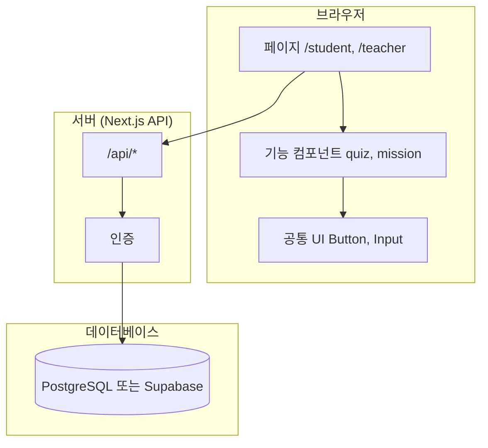
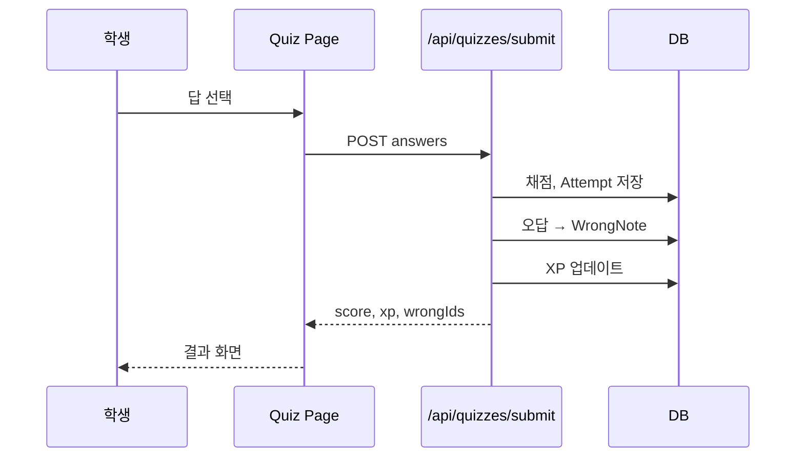

# 학습 — 아키텍처

> **제품 이름: 학습.** 코드·리포는 `haksup-*`.  
> **언제 쓰나?** 파일을 어디에 둘지, API·데이터 구조 설계할 때  
> **초보자 팁**: 폴더 이름만 맞춰도 Claude Code가 일관되게 코드를 만듭니다.

## 1. 아키텍처 개요



### 1.1 핵심 결정 (1차 웹)

| 항목 | 선택 | 이유 |
|------|------|------|
| 렌더링 | Next.js App Router (교사 앱) | 교사용 데스크톱 UI |
| 공통 DB | Supabase PostgreSQL + Anonymous Auth + Realtime | 교사·학생 앱 단일 진실 공급원 |
| 로컬 캐시 | localStorage | env 없을 때 프로토타입 유지 · 원격 upsert와 병행 |
| 동기화 모듈 | `loopin-web/src/lib/sync/*` | 세션·반·과제·Enrollment·진도 |
| 스키마 | `loopin-web/supabase/migrations/001_haksup_sync.sql` + `002_assignment_delete_policies.sql` | profiles~answers + RLS + `enroll_with_invite_code` (002는 과제 삭제 RLS 정책 추가) |
| 환경변수 | `NEXT_PUBLIC_SUPABASE_URL` / `NEXT_PUBLIC_SUPABASE_ANON_KEY` | `.env.local` (예: `.env.example`) |

> **리포지토리 범위**: `loopin-web`(이 리포)은 **교사 앱만** 구현한다. 학생 앱(`/student/*`, 학생용 퀴즈 플로우)은 **별도 리포 `loopin-webapp`** 에서, 같은 Supabase 스키마 규칙을 공유하며 개발된다 (`loopin-web/AGENTS.md` 참조). 아래 2절 폴더 구조는 **제품 전체(1차 웹) 기준 설계**이며, `/login`, `/signup`, `/student/*`, `/api/*`는 이 리포(`loopin-web`)에는 **없다** — 실제로 존재하는 라우트는 `/teacher/*`뿐이다 (현황은 pages.md 1.1 참조).

---

## 2. 폴더 구조

```
loopin-web/
├── public/
│   └── logo/
├── src/
│   ├── app/                          # Next.js 라우트 (pages.md와 1:1)
│   │   ├── page.tsx                  # /
│   │   ├── login/page.tsx
│   │   ├── signup/page.tsx
│   │   ├── student/
│   │   │   ├── layout.tsx            # Student 레이아웃
│   │   │   ├── page.tsx              # 대시보드
│   │   │   ├── mission/page.tsx
│   │   │   ├── quiz/[id]/page.tsx
│   │   │   ├── quiz/[id]/result/page.tsx
│   │   │   └── wrong-notes/page.tsx
│   │   ├── teacher/
│   │   │   ├── layout.tsx
│   │   │   ├── page.tsx
│   │   │   ├── classes/
│   │   │   ├── assignments/
│   │   │   └── settings/page.tsx
│   │   └── api/                      # REST API
│   │       ├── auth/
│   │       ├── quizzes/
│   │       ├── assignments/
│   │       └── classes/
│   ├── components/
│   │   ├── ui/                       # Button, Input, Card...
│   │   ├── layout/                   # StudentNav, TeacherNav
│   │   └── features/
│   │       ├── quiz/                 # QuizOption, QuestionCard
│   │       ├── mission/              # MissionCard
│   │       ├── gamification/         # XPBar, LevelBadge
│   │       ├── assignment/           # AssignmentForm
│   │       └── class/                # ClassCard, StudentTable
│   ├── hooks/                        # useQuiz, useAuth
│   ├── lib/
│   │   ├── supabase.ts
│   │   ├── api.ts
│   │   └── utils.ts
│   ├── types/                        # user.ts, quiz.ts, assignment.ts
│   └── styles/
│       └── tokens.css                # design.md 변수
├── docs/                             # 이 MD 파일들 (또는 프로젝트 루트)
└── package.json
```

> **현재 실제 구조와의 차이**: `loopin-web/src/app`에는 위 트리 중 `teacher/`만 존재한다 (`login/`, `signup/`, `student/`, `api/`는 없음 — 위 1.1 참고). 실제 `components/`도 `ui/`·`layout/`·`features/*` 하위분류 없이 `components/figma/`(SVG 오버레이) + `components/teacher/`(패널·모달 단일 평면 폴더) 구조다. `hooks/`, `types/`, `styles/tokens.css`도 아직 없다 — 색상은 각 컴포넌트에 Tailwind 임의값(`bg-[#1AA7F2]` 등)으로 하드코딩돼 있고, 상태는 `src/lib/*.ts` 함수 + 컴포넌트 로컬 state로 관리한다 (design.md §9 참조).

### 2.1 초보자용 폴더 규칙

| 넣을 곳 | 예시 |
|---------|------|
| 새 **페이지** | `src/app/student/xxx/page.tsx` |
| **퀴즈만** 쓰는 UI | `src/components/features/quiz/` |
| **여러 곳** 쓰는 버튼 | `src/components/ui/` |
| API 호출 함수 | `src/lib/api.ts` |
| 타입 정의 | `src/types/quiz.ts` |

---

## 3. 역할 (Role) 기반 접근

```typescript
// types/user.ts
type UserRole = 'student' | 'teacher';

interface User {
  id: string;
  role: UserRole;
  name: string;
  email: string;
  grade?: number;      // 학생만
  schoolName?: string; // 교사만
}
```

| 보호 | 방법 |
|------|------|
| `/student/*` | middleware: role === 'student' (계획 — 별도 리포 `loopin-webapp`) |
| `/teacher/*` | middleware: role === 'teacher' (계획 — 현재 미구현) |
| API | 서버에서 userId·role 검증 (계획 — 현재 미구현) |

> **현재 상태**: 위 역할 가드는 아직 구현되지 않았다. `loopin-web`에는 로그인 페이지·`middleware.ts`·`types/user.ts`가 없다. 지금은 화면 진입 시 `src/lib/sync/teacher-session.ts`의 `ensureTeacherSession()`이 Supabase **Anonymous Auth**로 조용히 로그인하고 `profiles.role = 'teacher'`를 upsert하는 방식이며, 명시적 로그인/비번/역할 선택 UI는 없다.

---

## 4. 핵심 API (1차 계획 — 아직 미구현)

> `loopin-web`에는 `src/app/api/*` 라우트가 **없다**. 아래 표는 1차 웹 전체를 위해 계획했던 REST 형태이며, 실제로는 클라이언트가 `@supabase/supabase-js`로 Supabase를 **직접 호출**하거나 `src/lib/*.ts` 모듈을 거쳐 **localStorage**를 읽고 쓰는 local-first 방식으로 구현되어 있다 (동기화는 `src/lib/sync/*`가 best-effort로 처리, `loopin-web/AGENTS.md` 참조). 커스텀 API 레이어가 필요해지면 아래를 참고해 만든다.

| Method | Path | 설명 |
|--------|------|------|
| GET | `/api/student/missions` | 오늘의 미션 |
| GET | `/api/quizzes/:id` | 퀴즈 문항 |
| POST | `/api/quizzes/:id/submit` | 제출·채점 |
| GET | `/api/student/wrong-notes` | 오답노트 |
| GET | `/api/teacher/classes` | 학급 목록 |
| POST | `/api/teacher/assignments` | 과제 생성 |
| GET | `/api/teacher/assignments/:id` | 제출 현황 |

---

## 5. 퀴즈 제출 데이터 흐름



---

## 6. 환경 변수

| 변수 | 설명 |
|------|------|
| `NEXT_PUBLIC_SUPABASE_URL` | Supabase URL |
| `NEXT_PUBLIC_SUPABASE_ANON_KEY` | 공개 키 |
| `SUPABASE_SERVICE_ROLE_KEY` | 서버 전용 (비밀) — **계획**, 현재 `.env.example`·코드 어디에도 없음 (서버 API 없음 · Anonymous Auth + anon key만 사용 중) |

`.env.local`은 git에 올리지 않음. `.env.example`만 커밋 (현재 `.env.example`엔 위 URL·ANON_KEY 2개만 있음).

---

## 7. 배포

| 환경 | URL | 용도 |
|------|-----|------|
| local | localhost:3000 | 개발 |
| production | haksup.com (예정) | 실서비스 |

배포: Vercel + Supabase
