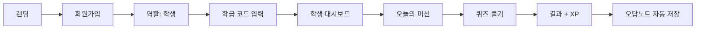
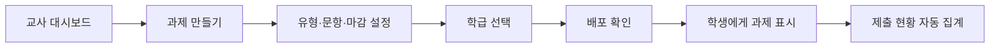

# 루핀 — UI/UX 명세

> **언제 쓰나?** 화면에서 버튼 누르면 어디로 가는지, 로딩/에러 시 뭐가 보이는지 정할 때  
> **누가 쓰나?** 나(기획), Claude Code에게 "이 플로우대로 구현해줘" 할 때  
> **버튼 이동**: §2.3 — 버튼 추가·변경 시 **항상** 그 표를 같이 고친다 (`.cursor/rules/uiux-button-destinations.mdc`)

## 1. UX 원칙

| 원칙 | 설명 | 루핀 적용 |
|------|------|-----------|
| **재미있게** | 학습이 게임처럼 느껴져야 한다 | XP, 레벨, 미션, 즉각 피드백 |
| **짧게** | 한 번에 5~15분 집중 | 세트 단위 퀴즈, 진행률 바 |
| **선생님은 간단하게** | 클릭 3번 이내로 과제 출제 | 템플릿, 자동 채점, 대시보드 요약 |
| **내신에 맞게** | 중학 교과·내신 유형 중심 | 단어/문법/독해 유형 명시 |
| **실수해도 괜찮게** | 오답은 학습 기회 | 오답노트, 다시 풀기, 비난 없는 문구 |
| **스크롤 최소화** | 웬만하면 스크롤 없이 한 화면에 | 레이아웃·정보량 조절 우선 |

### 1.1 스크롤 정책

| 규칙 | 내용 |
|------|------|
| **기본** | **웬만한 상황에서는 스크롤을 쓰지 않는다** — 한 화면에 맞게 배치 |
| **허용** | 부득이한 경우(긴 목록·모달 예외 등)에만 스크롤 가능 |
| **스크롤바** | 스크롤이 있어도 **스크롤바는 보이지 않게** 한다 (`scrollbar` hidden) |
| **학교 설정** | 스크롤 **금지** — 기본 정보·색상·미리보기가 **한 화면에 전부 보이게** |

### 1.2 가독성 · 글자 선명도

| 규칙 | 내용 |
|------|------|
| **흐림 금지** | 버튼·라벨·본문 글자가 **절대 흐리게·뿌옇게** 보이면 안 된다 |
| **대비** | 배경 대비가 낮은 희미한 회색만으로 액션 글을 쓰지 않는다. 보조 텍스트 최소 `#6B7280`, 중요 액션은 `#15171A` + **bold** |
| **비활성** | disabled여도 `opacity`로 흐리게 만들지 않는다. 색만 조금 낮추되 **또렷하게 읽히게** |
| **잘림 금지** | 오버레이가 SVG를 가릴 때 **글자·아이콘이 반쯤 잘려 보이지 않게** 배경으로 완전히 덮는다 |
| **편안함** | 사람들이 편하게 보도록 크기·굵기·대비를 우선한다 |

### 1.3 정렬

| 규칙 | 내용 |
|------|------|
| **항상 똑바로** | 같은 행의 버튼·라벨·입력·아이콘은 **항상 수평·수직으로 똑바로** 맞춘다 |
| **한 줄 페어** | 되돌리기·저장처럼 옆나란히 둔 액션은 **같은 top·같은 height** 로 묶는다 |
| **잘림 없음** | 배지·글자·버튼이 반쯤 잘리거나 삐뚤어지지 않게 중앙 정렬한다 |
| **검수** | UI를 고친 뒤에는 가로·세로 정렬을 **다시 확인**한다 |

### 1.4 한국어 글자 간격 (자간)

교사 UI에서 한국어 제목·안내가 **붙어 보이거나 답답하면** 맞춤법 문제가 아니라 **자간이 너무 좁은 것**이다.

| 규칙 | 내용 |
|------|------|
| **좁히지 말 것** | 한국어 제목·본문에 `tracking-tight` / 음수 자간 **금지** — 띄어쓴 칸이 사라지거나 “간격이 하다 만” 것처럼 보인다 |
| **제목 자간** | 화면 큰 제목(`h1` 급)은 **`tracking-[0.04em]`** 정도를 기본으로 둔다 |
| **안내 자간** | 제목 아래 회색 안내는 **`tracking-[0.02em]`** + `leading-relaxed` |
| **검수** | 카피 문구만 보지 말고, **글자 사이가 답답하지 않은지** 화면에서 확인한다 |

**이 화면 카피 · 간격 (확정)**

| 위치 | 문구 | 간격 |
|------|------|------|
| 사용자 지정 과제 제출 · 제목 | `사용자 지정 과제 제출` | `tracking-[0.04em]` |
| 사용자 지정 과제 제출 · 안내 | `자동화 시스템으로 쉽고 빠르게 직접 문제를 만들 수 있어요.` | `tracking-[0.02em]` |

---

## 2. 정보 구조 (IA)

### 2.1 사이트맵

```
루핀 웹
├── 공개
│   ├── 랜딩 (/)
│   ├── 로그인 (/login)
│   └── 회원가입 (/signup) — 역할 선택 (학생/교사)
│
├── 학생 영역 (/student/*)
│   ├── 대시보드 (/student)
│   ├── 오늘의 미션 (/student/mission)
│   ├── 퀴즈 (/student/quiz/:id)
│   ├── 퀴즈 결과 (/student/quiz/:id/result)
│   ├── 오답노트 (/student/wrong-notes)
│   └── 내 프로필 (/student/profile)
│
└── 교사 영역 (/teacher/*)
    ├── 캘린더 (/teacher) ← 교사 첫 화면
    ├── 문제 제출 (/teacher/problems) ← 문제 관리 기본
    ├── 사용자 지정 과제 제출 (/teacher/problems/saved)
    ├── 학교 설정 (/teacher/school-settings) ← 사이드바 상단 로고
    ├── 내 설정 (/teacher/settings) ← 사이드바 하단 「설정」
    └── 반 (/teacher/classes/[id]?tab=…)
        └── 홈 · 과제 · 학생 · 설정
```

### 2.2 네비게이션

**학생 — 모바일**

| 위치 | 항목 | 링크 |
|------|------|------|
| 하단 탭 | 홈 | `/student` |
| 하단 탭 | 미션 | `/student/mission` |
| 하단 탭 | 오답노트 | `/student/wrong-notes` |
| 하단 탭 | 프로필 | `/student/profile` |

**학생 — 데스크톱**

| 위치 | 항목 | 링크 |
|------|------|------|
| 좌측 사이드바 | 홈, 미션, 오답노트, 프로필 | 동일 |

**교사 — 공통**

| 위치 | 항목 | 링크 |
|------|------|------|
| 좌측 사이드바 | 학교 로고 / 학교명 영역 | `/teacher/school-settings` |
| 좌측 사이드바 | **{이름} 선생님** | *(이동 없음 · 라벨 · 이름은 내 설정에서 수정)* |
| 좌측 사이드바 | **캘린더** (첫 화면) | `/teacher` |
| 좌측 사이드바 | **문제 관리** (라벨) | *(이동 없음)* |
| 좌측 사이드바 | **문제 제출** | `/teacher/problems` (**기본**) |
| 좌측 사이드바 | **사용자 지정 과제 제출** | `/teacher/problems/saved` |
| 좌측 사이드바 | **담당 반** 항목 | `/teacher/classes/[id]` (**항상 홈**) |
| 좌측 사이드바 | **+ 새 반 추가** | 페이지 이동 없음 → **새 반 만들기** 모달 |
| 좌측 사이드바 | **설정** (하단) | `/teacher/settings` (**내 설정**) |

### 2.3 버튼·이동 맵 (구현된 교사 UI)

> **규칙**: 버튼을 추가·변경하면 이 표를 **반드시 같이 갱신**한다.  
> (Cursor 규칙: `.cursor/rules/uiux-button-destinations.mdc`)

#### 공통 사이드바 (전 교사 화면)

| 버튼 / 클릭 | 결과 (어디로) |
|-------------|----------------|
| 학교 로고 · 학교명 | `/teacher/school-settings` |
| 선생님 이름 | 이동 없음 · 학교명 **아래 두 번째 줄** 라벨 **「{이름} 선생님」** (내 설정에서 수정) |
| 캘린더 | `/teacher` |
| **문제 관리** (라벨) | 이동 없음 |
| **문제 제출** | `/teacher/problems` (**문제 관리 기본 화면**) |
| **사용자 지정 과제 제출** | `/teacher/problems/saved` |
| 담당 반 학년 토글 (`중1` / `중2` / `중3`) | 해당 학년 반이 **있을 때만** 표시 · 펼치기·접기 · 열림/닫힘 **localStorage 유지** · **기본 전부 접힘** (이동 없음) |
| 담당 반 (반 이름) | `/teacher/classes/[id]` · **항상 홈** (이전 탭 유지 안 함) |
| + 새 반 추가 | **새 반 만들기** 모달 오픈 (URL 유지) |
| **설정** (사이드바 하단) | `/teacher/settings` (**내 설정** · `TeacherSidebarFooter`) |
| 내 설정 · **선생님 이름** 입력 | 이동 없음 · draft만 변경 (사이드바 미반영) |
| 내 설정 · **되돌리기** | draft를 저장본으로 복구 (이동 없음) |
| 내 설정 · **저장** | 교사 이름 저장 · 사이드바 「{이름} 선생님」 반영 (`MySettingsPanel`) |
| 내 설정 · 칭찬 캘린더 **?** | 호버/포커스 시 학생 화면 예시 팝오버 (`praise-calendar-example.svg`) · 이동 없음 |
| 내 설정 · **로그아웃** | `/login` (`MySettingsPanel`) |
| 캘린더 일정 카드 **짧게 클릭** | **수업 추가와 동일한 팝업** · 클릭한 반·날짜·시작/종료 시간으로 채움 · 정규 수업은 저장 시 요일·시간표 갱신 · 추가 수업은 해당 1건 수정 |
| 캘린더 일정 카드 **길게 누르기(100ms) 후 드래그** | 카드가 살짝 떠오른 뒤 이동 · 5분 단위 스냅 · 정규 수업은 해당 반 요일·시간, 추가 수업은 해당 1건의 날짜·시간 갱신 · localStorage 저장 (이동 없음) |
| 캘린더 빈 칸 클릭 | **수업 추가** 모달 · 클릭한 **날짜·시간**을 기본값으로 채움 |
| 수업 추가 모달 · 수업 추가 | 선택한 반에 해당 날짜만의 수업 저장 → 주간·월간·오늘 수업 반영 (이동 없음) |
| 수업 수정 모달 · 저장 | 정규: 반 요일·시간 갱신 · 추가 수업: 정보 갱신 → 캘린더 반영 (이동 없음) |
| 수업 수정 모달 · 삭제 | 빨간 테두리 「삭제」 버튼 · 추가 수업 삭제 또는 정규 해당 요일 제거 → 캘린더 반영 (이동 없음) |
| 수업 추가/수정 모달 · 취소·닫기·딤·Esc | 모달 닫힘 · 저장 안 함 |
| 캘린더 `<` / `>` (주간) | **이전 주** / **다음 주** (주차 라벨·요일 헤더 갱신) |
| 캘린더 `<` / `>` (월간) | **이전 달** / **다음 달** |
| 주간 | 주간 캘린더 보기 |
| 월간 | 월간 캘린더 보기 |
| 월간 · `+N개 더보기` | 해당 날짜 **수업 목록 팝오버** 열림 (이동 없음) · 다시 클릭·바깥·Esc로 닫힘 |
| 월간 더보기 팝오버 · 수업 칩 | 빈 칸과 **동일한 수업 추가/수정 팝업** · 클릭한 반·날짜·시간으로 채움 |
| 월간 더보기 팝오버 · 닫기 | 팝오버 닫힘 (이동 없음) |
| 학사일정 관리 | **학사일정 관리** 모달 오픈 (`CalendarAcademicButton`) |
| 학사일정 관리 · 휴일 추가/수정 | 목록에 반영 (저장 전 draft · 이동 없음) |
| 학사일정 관리 · 휴일 삭제 | 목록에서 제거 (저장 전 draft · 이동 없음) |
| 학사일정 관리 · `공휴일에는 정규 수업을 제외해요` | 체크 시 공휴일 정규 수업 제외(기본 체크) · 해제 시 공휴일에도 정규 수업 자동 생성 |
| 학사일정 관리 · 저장 | localStorage `loopin-calendar-academic-schedule` 저장 → 주간·월간·오늘 수업·다음 수업 반영 · 모달 닫힘 |
| 학사일정 관리 · 취소·닫기·딤·Esc | 모달 닫힘 · 저장 안 함 |

#### 캘린더 홈 `/teacher`

| 항목 | 내용 |
|------|------|
| **보기** | **주간** · **월간** 토글 (`CalendarViewToggle`) · 왼쪽 **학사일정 관리** (`CalendarAcademicButton`) |
| **일정 소스** | ① 담당 반 `days` + 시간 → **수업 기간(`periods`) 안의 날짜만** 자동 표시 ② 빈 칸에서 만든 **추가 수업**(`loopin-calendar-one-off-lessons`)은 지정 날짜에만 표시 · 기간 없으면 정규 수업 미표시 · 종강일 미입력 시 **개강일 다음 해 2월 말까지** 표시 · **학사 휴일**(학교 등록)과 **공휴일**(기본)에는 정규 수업 미생성 · 공휴일 포함은 학사일정 관리 체크박스로 변경 · **추가 수업은 휴일에도 유지** |
| **카드** | 반 **캘린더 색·바·글씨** + **반 이름** + (있으면) **메모** + 시작 시간 칩 (`CalendarEventsOverlay`) |
| **범례** | 우상단 점+이름 = **생성된 담당 반만** · **오른쪽 정렬** (`CalendarClassLegend`). SVG 월화수목금·데모 범례는 가림 |
| **주차** | `<` `>` 주 이동 · 라벨 가운데 · `left` 고정 · **주간 폭 `weekWidth=340`** (라벨 잘림 없이 간격 축소) (`CalendarPeriodNav`) |
| **요일 헤더** | 월간과 동일 회색 바(`rounded-[14px] #F7F7F7`) · 월~일 · 날짜는 바 아래 각 열 중앙 |
| **오른쪽 오늘 사이드바** | 상단 **열기/닫기 아이콘 삭제** · 사이드바 **「캘린더」 행·주간 네비와 같은 높이**(top 128 · h 44)에 앱 카드 스타일로 `오늘 │ 6월 25일 [목]`을 **한 줄 표시** · 「오늘 수업」은 정규 수업 + 해당 날짜의 추가 수업을 합쳐 표시하고 없으면 **「오늘은 수업이 없어요」** · 「과제 제출」 내역이 없으면 **「새로운 과제 제출이 없어요」** 빈 상태 카드 (`CalendarTodaySidebarHeader`) |
| **공휴일·휴일** | 대한민국 공휴일 + **학교 휴일**을 **빨간색 날짜**로 표시 (일요일은 검은색) · 주간은 날짜에 휴일명 툴팁, 월간은 날짜 옆에 휴일명 표시 · 학교 휴일명이 있으면 공휴일명보다 우선 |
| **학사일정 관리** | 하루 또는 기간 휴일 등록·수정·삭제 · `공휴일에는 정규 수업을 제외해요` 체크(기본 체크) · 등록 휴일에는 정규 시간표 수업 자동 생성 안 함 · 일회성 추가 수업은 유지 (`CalendarAcademicScheduleModal`) |
| **데모** | SVG 박힌 샘플 일정·색 바는 **그리드 전체 화이트 덮개**로 제거 · 오른쪽 사이드바 데모 수업·제출물도 실제 데이터/빈 상태 UI로 덮음 |
| **시간축** | **06:00–22:00** (수업 피커와 동일) · 뷰포트는 기존 그리드 높이 · **세로 스크롤** · **스크롤바 숨김** (`CalendarEventsOverlay`) · 첫 로드는 09시 부근 |
| **카드 제스처** | **짧게 클릭** → 빈 칸과 동일한 수업 팝업(반·날짜·시간 채움) · **100ms 길게 누르기** → 카드가 떠오르며 이동 준비 · 그 상태로 드래그 후 5분 단위 스냅. 정규 카드는 반 설정 일정, 추가 수업 카드는 해당 1건만 이동 |
| **빈 칸 클릭** | 수업 추가 모달(해당 날짜·시간 preset) |
| **타이틀** | 주간·월간 동일 (`CalendarPageHeader`) · 「캘린더」30px · 설명 14px |
| **월간** | 폭을 오른쪽 사이드 앞까지 제한 · **월~일** 요일 바 · 반 범례는 상단 우측에 격리 · **오늘 칸**은 주간과 동일 연한 회색 음영(`rgba(17,23,26,0.035)`) · 오늘 수업 칩은 주간과 동일 회색 글로우(`0 0 20px rgba(176,176,176,0.3)`) · 수업 칩은 **주간과 동일한 왼쪽 풀하이트 색상 바**(`colors.bar`) + **반 이름** + (있으면 **메모**, 없으면 **시작–종료 시간**) · 셀당 **최대 2개**만 표시하고 초과 시 **`+N개 더보기`** · 더보기 클릭 시 날짜·전체 수업 목록 **팝오버** (우측·하단 셀은 안쪽으로 정렬) · 팝오버 수업 클릭 시 빈 칸과 동일 수업 팝업 · 바깥 클릭·Esc로 닫힘 · 셀 내부 스크롤 없음 · `<` `>` 달 이동은 `left` 고정 · **월간 폭 `monthWidth`(대폭 축소)** 로 화살표 간격 최소화 (`CalendarPeriodNav`) |

#### 수업 추가 팝업

| 항목 | 내용 |
|------|------|
| **용도** | 빈 칸에서는 **추가 수업** 생성 · 기존 카드에서는 **같은 UI**로 수정 (`OneOffLessonModal`) |
| **진입** | 주간/월간 **빈 칸** 또는 **이미 있는 수업 카드** 클릭 |
| **기존 수업 클릭** | 빈 칸과 동일 팝업 · 반·날짜·시작/종료가 클릭한 수업 값으로 채워짐 |
| **반 선택** | 담당 반을 색 점·이름·체크가 있는 카드로 선택 (필수) · 반이 하나면 자동 선택 · 반이 없으면 생성 안내 및 추가 버튼 비활성 |
| **날짜·시간** | 클릭한 날짜와 5분 단위 시간대를 기본값으로 입력 · 팝업에서 수정 가능 · 종료 시간은 시작 시간보다 늦어야 함 |
| **추가 입력** | **메모**(선택) — 추가·수정·정규 모두 · 힌트는 「(선택)」만 · 플레이스홀더 「비워두면 반 이름만 표시」 · **담당 반 홈 「메모」와 동일 값** |
| **저장·표시** | 추가 수업 → `loopin-calendar-one-off-lessons.title` · 정규 → 반 요일별 `dayLessonMeta.title` · 주간·월간·오늘 수업·**홈 메모** 즉시 반영 · 카드에는 **반 이름 → 메모** 순으로 표시 |
| **수정·삭제** | 추가·정규 모두 빨간 테두리 「삭제」 버튼 (취소와 같은 높이·모서리) |

#### 새 반 만들기 모달

| 버튼 / 클릭 | 결과 |
|-------------|------|
| 만들기 | 반 저장 → **새 반 만들기** 모달 닫힘 → **수업 기간 설정** 모달 자동 오픈 (`ClassPeriodModal` · 빈 입력 · 스크린샷과 동일 레이아웃) · **필수** — `dismissible={false}`: 취소 버튼 없음, 딤 클릭·Esc로 안 닫힘, 안내 문구("캘린더에 반영하려면 수업 기간을 설정해야 해요") 표시 · 수업 이름+개강일 입력 후 확인해야만 닫힘 → 캘린더 반영 |
| 저장 (수정 모드) | 반 정보 갱신 → 모달 닫힘 |
| 취소 · 딤 · Esc | 모달 닫힘 · 저장 안 함 |

#### 문제 제출 `/teacher/problems`

| 항목 | 내용 |
|------|------|
| **진입** | 사이드바 **문제 제출** · **문제 관리 기본값** |
| **화면** | Figma 에셋 `problems-list.svg` + 공통 사이드바 · **「문제 관리」제목** · 본문 배경 **흰색**(`#FFFFFF`, 사이드바 제외) |
| **사이드바** | 「문제 관리」라벨 + **문제 제출** 행 활성 (`AssignedClassesPanel`) |
| **본문** | HTML **문제 관리** 제목·안내 + 새 문제 세트 폼 인라인 (`ProblemsCreateForm`) · 본문 배경 **흰색**(`#FFFFFF`, 사이드바 제외) · 모달 SVG 스케일 **미사용** · 본문 스크롤 |
| **1 교과서 범위** | **중1 · NE능률(김) · 단원 선택** 커스텀 드롭다운(최대 5개·스크롤) · **중1/중2는 출판사·저자별 교과서 10종**, **중3은 `YBM(송)` 1종만** 표시 · **1–8단원** · 각 드롭다운 **가로폭 고정**(학년 96 · 교과서 170 · 단원 140) — 전체 너비로 늘어나지 않음 |
| **2 받는 반** | **교과서 범위**에서 선택한 학년(중1~중3)에 맞게 사이드바 **담당 반**(`loadTeacherClasses`)을 필터링 · 「과제를 받을 반을 선택해 주세요. 여러 반을 선택할 수 있어요.」 안내 + 우측 `n개 반 선택` · 반 색 점·이름·**체크박스가 있는 선택 카드**로 다중 선택 · 선택 시 파란 테두리·연한 파란 배경·체크 표시 · 반이 없으면 「해당하는 반이 없어요. 반 설정에서 학년을 지정해 주세요.」 |
| **3 문제 구성** | 단원 지정 **전** 유형 선택만 · 지정 **후** 단어·문장·문법 목록 **최대 4줄** + **펼치기** · 유형 선택 아래 **구분선** · **전체 선택** + `n / m 선택` · **구분선** · 항목 목록 · 항목 **클릭·드래그 선택/해제** · 제목 옆 `(선택수/전체개 출제)` · 게이지 바 **없음** · 유형·항목 선택 **기본값 = 전체 선택** · 유형 「전체」= 유형 전부 선택/해제 · 유형 선택 행 **맨 오른쪽**에 **+ 단어/본문/문법 추가** · **짝맞추기·음성 짝맞추기 선택 시 단어 4개 미만이면 제출 불가** · **문법** 영어 문장의 `wrongPart`(틀린 부분)는 **빨간 글씨** `#EF4444`로 표시 |
| **문제은행 데이터** | `loopin-web/src/data/problem-bank.json` · 엑셀 시트 `단어(데모)`/`단어`/`문장`/`문법` → `scripts/import-problem-bank.mjs` · 현재 **중3 · YBM(송) · 5단원** · 교사가 직접 추가한 항목은 `loopin-custom-problem-bank`(localStorage)에 단원별로 저장되어 은행 목록·과제 스냅샷에 합쳐짐 |
| **저장·부여** | 제출하기 검증 통과 후 **과제 부여 모달**에서 반별 **수업·마감 시간**을 고른 뒤 확정 · 과제 본문은 `loopin-problem-sets`에 조인용으로 저장하되 **`hiddenFromLibrary: true`** 로 「사용자 지정 과제 제출」목록에는 **표시하지 않음**(그 영역은 별도 설정 예정) · 반별 부여는 `loopin-class-assignments`에 `{ problemSetId, classId, lessonDate, deadlineTime }`로 저장 · **과제 내기**로 라이브러리에서 재진입한 경우에만 기존 세트·목록 노출 유지 |

| 버튼 / 클릭 | 결과 |
|-------------|------|
| 학년 / 교과서 / 단원 선택 | 드롭다운 값 선택 (이동 없음) |
| 받는 반 칩 | 반 다중 선택·해제 (이동 없음) |
| 단어/문장/문법 항목 행 | 클릭 또는 **드래그**로 출제 항목 선택·해제 · 첫 항목 기준으로 연속 적용 · `(n/m개 출제)` 갱신 (이동 없음) |
| 단어/문장/문법 항목 **수정** | **단어/본문/문법 수정** 팝업 · 기존 값 채움 · 저장 시 같은 id로 `loopin-custom-problem-bank`에 덮어씀(교과서 JSON 원본은 유지) · 목록·미리보기·과제 스냅샷에 반영 (이동 없음) |
| 단어/문장/문법 항목 **미리보기** | `PreviewModal` · 체크한 유형을 **가로로 나란히** 표시 · 폰 프레임 `min(760px,97vh-104px)` · **단어**는 유형이 많으면 **좌우 스크롤**(스크롤바 숨김) · 본문 A/B/C·문법은 **학생 웹앱과 동일 UI** · **단어 음성 짝맞추기**는 왼쪽 오디오 타일+뜻 매칭 · 선택형 등 생성 불가 유형은 섹션 생략 (이동 없음) |
| 단어/문장/문법 **전체 선택** | 유형 선택 아래 구분선 사이 · **전체 선택** 옆 `n / m 선택` · 해당 섹션 항목 전부 선택·해제 (이동 없음) |
| 단어 유형 선택 (전체/짝맞추기/음성 짝맞추기/3지선다/예문 빈칸) | 「전체」= 단어 유형 전부 선택·해제 / 개별 토글 (이동 없음) |
| 문장 유형 선택 (전체/청크배열/번역 배열/영작) | 「전체」= 문장 유형 전부 선택·해제 / 개별 토글 (이동 없음) |
| 문법 유형 선택 (전체/OX문제/선택형 문제) | 「전체」= 문법 유형 전부 선택·해제 / 개별 토글 (이동 없음) |
| **+ 단어 추가** (유형 선택 행 오른쪽) | 단원 선택 후 **단어 추가** 팝업 · 저장 시 해당 단원 목록에 추가·자동 선택 (이동 없음) · 단원 미선택 시 비활성 |
| **+ 본문 추가** (유형 선택 행 오른쪽) | 단원 선택 후 **본문 추가** 팝업 · 영어·한글·청크(`/`) · 저장 시 문장 목록에 추가·자동 선택 (이동 없음) |
| **+ 문법 추가** (유형 선택 행 오른쪽) | 단원 선택 후 **문법 추가** 팝업 · O/X · **X일 때만** 틀린 부분·선택지 표시 · 저장 시 문법 목록에 추가·자동 선택 (이동 없음) |
| 단어/본문/문법 추가 팝업 · 추가 | 형식 검증 통과 시에만 `loopin-custom-problem-bank`에 저장 → 목록 반영 · 실패 시 빨간 안내로 이유 표시 · 팝업 유지 (이동 없음) |
| 본문 추가/수정 팝업 · **자동 나눔** (영어/한글 청크) | 위 영어·한글 예문을 `/` 청크로 채워 넣음 · 예문이 비어 있으면 안내 (이동 없음) |
| 단어/본문/문법 추가 팝업 · 취소 / × / Esc / 딤 | 팝업 닫힘 · 저장 안 함 (이동 없음) |
| 제출하기 | 단원·받는 반·출제 문제 검증 → **짝맞추기·음성 짝맞추기 선택 + 단어 1~3개면 제출 불가(4개 이상 필요)** → **과제 부여 모달** 오픈 · 이 시점에는 저장·부여 없음 (이동 없음) |
| 과제 부여 모달 · 반 칩 | 해당 반의 수업 선택 상태로 포커스 (이동 없음) |
| 과제 부여 모달 · 이전 달 / 다음 달 | 월간 수업 캘린더의 표시 월 전환 (이동 없음) |
| 과제 부여 모달 · 월간 캘린더 | **스크롤 없음** · 6주 그리드가 모달 가운데 영역에 맞춤 · 셀당 수업 칩 최대 2개(+N) · 칩 라벨 `반이름 시작시각` |
| 과제 부여 모달 · 월간 캘린더 수업 칩 | 해당 반의 수업일 확정 · 정규·추가 수업을 반 색으로 표시 · 마감 기본값은 수업일·수업 종료 시각 (이동 없음) |
| 과제 부여 모달 · 하단 마감 카드 | **선택한 수업** · 왼쪽 바+칩에 `반 · 날짜`, 옆에 `시작~종료` 시간 · 「직접 설정」/「다음 수업 전까지」 토글 · **직접 설정** 시 마감 날짜·마감 시간 2열 입력 · **다음 수업 전까지** 시 연한 파랑 카드에 **자동 마감** 날짜·시간 강조 + 수업→다음 수업 타임라인 + 안내 문구 |
| 과제 부여 모달 · 마감 「직접 설정」/「다음 수업 전까지」 토글 | **직접 설정**: 마감 날짜(수업일 이후로 자유 지정)+`ClassTimePicker` 시간(5분 단위) · **다음 수업 전까지**: 같은 반의 다음 예정 수업 날짜·시작 시각으로 자동 설정 · 다음 수업이 없으면 에러 안내 후 부여 불가 (이동 없음) |
| 과제 부여 모달 · 취소 / Esc | 모달 닫기 · 저장·부여 없음 (이동 없음) |
| 과제 부여 모달 · 과제 부여 | 모든 선택 반에 수업·마감이 채워지면 과제 데이터 저장(`hiddenFromLibrary`) + 반별 부여 기록 · **사용자 지정 과제 제출 목록에는 추가하지 않음** · 모달 닫기 (이동 없음) |

#### 사용자 지정 과제 제출 `/teacher/problems/saved`

| 항목 | 내용 |
|------|------|
| **진입** | 사이드바 **사용자 지정 과제 제출** |
| **참고 에셋** | `assets/저장된 문제 세트.svg` (본문만 · 사이드바 무시) |
| **화면** | Figma 배경 `problems-list.svg` + 공통 사이드바 · 제목 **「사용자 지정 과제 제출」**(`tracking-[0.04em]`) · 안내 **「자동화 시스템으로 쉽고 빠르게 직접 문제를 만들 수 있어요.」**(`tracking-[0.02em]`) · 본문 배경 **흰색** · `tracking-tight` **미사용** |
| **사이드바** | 「문제 관리」라벨 + **사용자 지정 과제 제출** 행 활성 (`AssignedClassesPanel`) |
| **본문** | 상단 **가로 폴더 바** (전체 → 구분선 → **중1·중2·중3** → 구분선 → **★ 즐겨찾기** · 개수는 `(n)` 표기) + 같은 줄 우측 **최근 수정순/이름순** · 아래 카드 그리드 (`SavedProblemSetsPanel`) · **과제 만들기** 점선 카드 → 문장 기반 자동 문제 생성 팝업 |
| **데이터** | 목록은 `hiddenFromLibrary`가 아닌 세트만 표시 · **문제 제출로 부여한 과제는 여기 카드로 쌓이지 않음**(별도 설정 예정) · 카드 이름은 **`학년 · 교과서 · 단원`** 형태 · 카드에 **단어·문장·문법별 개수와 총 문제 수**, 부여한 반 수·저장일 표시 |

##### 문장 기반 자동 문제 생성 팝업 (`CustomAssignmentCreateModal`)

| 항목 | 내용 |
|------|------|
| **입력** | **영어 문장** + **문장 뜻**(수동 입력, AI 미사용) → **문장으로 나누기** · 영어·한글 문장 수·순서를 맞춤 |
| **단어** | 문장별 클릭 가능한 단어 버튼 · 다중 선택 · 다시 클릭 시 필수 단어·분석 결과 제거 |
| **3 단어유형** | 엑셀 표 **단어(원형) / 단어 뜻 / 예문 / 예문 뜻** · 활용형(예: woke)은 **동사원형(wake)**으로 자동 변환 · 예문 뜻은 입력한 문장 뜻 · 셀 수정 |
| **4 문장유형** | 엑셀 표 **문장 / 문장 뜻 / 청크 배열 / 한글 뜻 청크 배열** · 문장 뜻·한글 청크는 입력값 기반 · 구나 단위 나눔(`phrase-chunks.ts`) · 셀 수정 |
| **분석** | `sentence-problem-service.ts` 목업·**캐시** · **문장/단어 뜻 AI 호출 없음** · 로딩 · 실패 시 **다시 시도** |
| **5** | 문제 유형을 문제 제출과 같은 **체크박스** UI로 선택 (단어: 전체·짝맞추기·음성 짝맞추기·3지선다·예문 빈칸 / 문장: 전체·청크배열·번역 배열·영작) · 카드형 클릭 UI 없음 |
| **6 받는 반** | 유형·필수 단어가 준비되면 표시 · 문제 제출 화면과 동일한 반 칩 다중 선택 (`loadTeacherClasses`) |
| **제출** | **제출하기** → 문제 세트를 **사용자 지정 과제 제출** 목록에 저장(`hiddenFromLibrary: false`, `customDraft`) → **과제 부여** → 확인 시 `buildContentSnapshot`이 단어·문장·유형으로 학생용 스냅샷 생성·부여 · 과제 부여 취소해도 목록 카드는 유지 |

| 버튼 / 클릭 | 결과 |
|-------------|------|
| 폴더 (전체 / 중1 / 중2 / 중3 / ★ 즐겨찾기) | 목록 필터 (이동 없음) |
| 최근 수정순 / 이름순 | 정렬 전환 (이동 없음) |
| 문제 세트 카드 ★ | 즐겨찾기 추가·해제 → 즐겨찾기 폴더 개수·목록 즉시 반영 (이동 없음) |
| 문제 세트 카드 **과제 내기** | **문장 과제** 세트 → 문장 기반 생성 팝업(`CustomAssignmentCreateModal`)에 저장본 불러와 열기 · 그 외 → `/teacher/problems?problemSetId=[ID]` |
| 문제 세트 카드 **세트 이름 수정** (연필 아이콘 · ★ 왼쪽) | 카드에서 이름 입력 모드 → 저장 시 이름·수정일 반영 (이동 없음) |
| 문제 세트 카드 **삭제** | **삭제 확인 모달** → **사용자 지정 과제 제출 목록에서만 숨김**(`hiddenFromLibrary`) · 원격 `problem_sets` 행은 **삭제하지 않음**(cascade로 과제 부여가 지워지지 않게) · **반 과제 탭·학생 부여 과제는 유지** · 실패 시 모달에 에러 문구 유지 + 재시도 가능 (이동 없음) |
| **과제 만들기** (점선 카드) | **문장 기반 자동 문제 생성** 팝업 (`CustomAssignmentCreateModal`) · 영어·문장 뜻 입력 → 단어 클릭(필수 단어) → 단어 분석 목업(캐시) · 필드 수정 · 유형·받는 반 선택 후 제출 (이동 없음) |
| 팝업 **문장으로 나누기** | 영어·문장 뜻을 문장 단위로 분리해 2단계 표시 (이동 없음) |
| 팝업 단어 클릭 | 필수 단어 선택/해제 · 선택 시 단어 분석 실행 (이동 없음) |
| 팝업 **받는 반** 칩 | 반 선택/해제 (이동 없음) |
| 팝업 **제출하기** | **사용자 지정 과제 제출** 목록에 세트 저장 → **과제 부여** 팝업 (`AssignAssignmentModal`) 열림 (이동 없음) |
| 과제 부여 **취소** / 닫기 | 과제 부여 팝업만 닫기 · 목록에 저장된 세트는 유지 · 문장 생성 팝업 유지 (이동 없음) |
| 과제 부여 **과제 부여** | 선택 수업에 과제 부여 · 생성 팝업까지 닫기 (이동 없음) |

#### 학교 설정 `/teacher/school-settings`

| 버튼 / 클릭 | 결과 |
|-------------|------|
| 되돌리기 | draft를 저장본으로 복구 (이동 없음) |
| 저장 | brand localStorage 저장 → 사이드바 반영 (이동 없음) |
| 프로필 문구/사진 · 색 스와치 | draft만 변경 (저장 전 사이드바 미반영) |

#### 내 설정 `/teacher/settings`

| 항목 | 내용 |
|------|------|
| **진입** | 사이드바 하단 **설정** |
| **화면** | 헤더「설정」+ 설명 + 우상단 되돌리기·저장 · **내 정보·칭찬 캘린더·계정 카드**는 영역 가운데에서 **세로로 쌓임** (`MySettingsPanel`) · 배경 `#F3F4F5` · 흰 카드 `rounded-[16px]` + 약한 그림자 · 학교 설정과 같은 입력/버튼 톤 · 공통 사이드바 |
| **내 정보 카드** | 「내 정보」+ **선생님 이름** 입력(draft) · 우상단 **되돌리기·저장** · **저장 시에만** 사이드바에 「{이름} 선생님」 반영 · localStorage `loopin-teacher-profile` |
| **칭찬 캘린더 카드** | 「통과 기준 점수」 입력(0~100, 연한 초록 필드 박스) · 카드 **우측 상단 `?`** · **호버/포커스** 시 `assets/praise-calendar-example.svg` 학생 화면 예시 팝오버 |
| **계정 카드** | 「계정」+ 안내 + **로그아웃** 버튼(호버 시 연한 빨강) → `/login` |
| **사이드바** | 설정 행 활성 강조 (`TeacherSidebarFooter`) |

#### 반 화면 탭 `/teacher/classes/[id]`

| 버튼 / 클릭 | 결과 |
|-------------|------|
| 홈 | `/teacher/classes/[id]` |
| 과제 | `/teacher/classes/[id]?tab=assignments` |
| 학생 | `/teacher/classes/[id]?tab=students` |
| 설정 | `/teacher/classes/[id]?tab=settings` |

#### 반 · 학생 탭

| 항목 | 내용 |
|------|------|
| **레이아웃** | 참고 이미지 스타일 「학생 관리」 제목 + 안내 문구 (`ClassStudentsPanel`) — **+ 학생 추가**·**학생 일괄 등록** 버튼 삭제됨(2026-07-22) |
| **학습 상태 기준** | 해석이 모호한 학습 활발/주의를 사용하지 않고 **완료**(초록 `#10B981`) · **진행중**(주황 `#F59E0B`) · **미학습**(빨강 `#EF4444`) 3단계 |
| **요약 카드** | 전체 학생(파랑) · **평균 점수**(보라, 학생별 가장 최근 완료 시도 점수의 평균) · 완료(초록) · 진행중(주황) · 미학습(빨강) 5개 — 학습 데이터 연동 전 평균 점수 `—`, 전체=미학습, 완료·진행중=0명 |
| **필터·검색** | 칩 「전체 / ● 완료 / ● 진행중 / ● 미학습」(개수 표기) + 우측 **학생 이름 검색** + 정렬 셀렉트(**최근 학습순 / 이름순**) |
| **학생 표** | 이름(색 아바타 · **클릭/연필로 이름 수정**) → 바로 옆 **학습 현황**(완료/진행중/미학습 배지) → **평균 정답률**(**첫 시도**와 **최근 시도**를 2줄로 구분) → **제출률** → 마지막 학습 → **메모** → 관리(⋮) · 값 열은 고정폭으로 좌측에 모아 배치 · 별도 점수 변동 열 **없음** |
| **평균 정답률 기준** | 첫 시도 = 각 완료 학습의 최초 시도 정답률 평균 · 최근 시도 = 각 완료 학습의 가장 최근 재도전 정답률 평균 |
| **정렬** | 평균 정답률·제출률·마지막 학습의 값/빈 표시(`-`, `—`)는 각 열의 **가운데 정렬** |
| **데이터 미연동 상태** | 평균 정답률 `첫 시도 — / 최근 시도 —` · 제출률 `0%` · 미학습(빨강) · 마지막 학습 `- / 학습 기록 없음` |

| 버튼 / 클릭 | 결과 |
|-------------|------|
| 필터 칩 (전체/완료/진행중/미학습) | 목록 필터 (이동 없음) |
| 학생 이름 검색 | 이름 부분 일치 필터 (이동 없음) |
| 정렬: 최근 학습순 / 이름순 | 최근 학습 시각 또는 한글 이름 오름차순으로 목록 정렬 · 학습 데이터 연동 전 최근 학습순은 등록 순서 유지 (이동 없음) |
| 학생 이름 클릭 · 연필 · ⋮ → 이름 수정 | 인라인 입력 · Enter/blur 저장 · Esc 취소 · 빈 이름 불가 · `loopin-class-students:[classId]`에 반영 · 동기화 시에도 교사 수정 이름 유지 (이동 없음) |
| 학생 행 메모 입력 | 학생별 메모를 `loopin-class-students:[classId]`에 즉시 저장 (이동 없음) |
| 학생 행 ⋮ → 학생 삭제 | ⋮ 메뉴 열기 · **메뉴 밖 클릭 시 닫힘** · 학생 삭제 시 목록에서 제거·저장 (이동 없음) |
| 모달 추가 | 학생 저장 → 모달 닫힘 |
| 모달 취소 · 딤 · Esc | 모달 닫힘 |

#### 반 · 홈 — 다음 수업 / 메모

| 버튼 / 클릭 | 결과 |
|-------------|------|
| 메모 입력 · **적용** | 내용이 바뀌면 **적용** 버튼 표시 · 클릭 또는 Enter로 저장 · Esc로 되돌리기 · 저장 후 칸이 반 색 틴트+체크(**적용됨**→**저장됨**)로 바뀜 · 캘린더 **메모**와 동일 값 (`dayLessonMeta` / `OneOffLesson.title`) (이동 없음) |

#### 반 · 홈 — 학생 현황

| 버튼 / 클릭 | 결과 |
|-------------|------|
| 전체 보기 | `/teacher/classes/[id]?tab=students` |
| 학생 행 | *(표시만 · 이동 없음)* |

#### 반 · 홈 — 과제 현황

| 버튼 / 클릭 | 결과 |
|-------------|------|
| 전체 보기 | `/teacher/classes/[id]?tab=assignments` |
| 과제 행 | *(추후 · 부여 기능 정리 후)* |

#### 반 · 홈 — 반 정보

| 버튼 / 클릭 | 결과 |
|-------------|------|
| 초대 코드 복사 | 저장된 영구 6자리 `inviteCode`를 클립보드 복사 (이동 없음) · Supabase 연동 시 동일 코드로 학생 즉시 가입 |

#### 반 · 설정 탭

| 버튼 / 클릭 | 결과 |
|-------------|------|
| 되돌리기 | 폼을 저장본으로 복구 (이동 없음) |
| 저장 | 반 정보·요일·시간·기간 localStorage 저장 (이동 없음) |
| 수업 기간 + 추가 / 수정 | **수업 기간 설정** 모달 |
| 수업 기간 행 삭제 | 목록에서만 제거 (저장 전까지 반영 보류) |
| 수업 기간 모달 확인 | 목록에 반영 → 모달 닫힘 |
| 수업 기간 모달 취소 · 딤 · Esc | 모달 닫힘 |
| 반 삭제 | **삭제 확인** 모달 |
| 삭제하기 (확인) | 반·학생 데이터 삭제 → **`/teacher`** (캘린더) |
| 취소 (확인 모달) | 모달 닫힘 · 삭제 안 함 |

#### 라우트 요약 (교사 · 현재)

| URL | 화면 |
|-----|------|
| `/` | → `/teacher` 리다이렉트 |
| `/teacher` | 캘린더 홈 |
| `/teacher/problems` | 문제 제출 (문제 관리 기본) |
| `/teacher/problems/saved` | 사용자 지정 과제 제출 |
| `/teacher/school-settings` | 학교 설정 |
| `/teacher/settings` | **내 설정** |
| `/teacher/classes/[id]` | 반 홈 |
| `/teacher/classes/[id]?tab=assignments` | 반 과제 |
| `/teacher/classes/[id]?tab=students` | 반 학생 |
| `/teacher/classes/[id]?tab=settings` | 반 설정 |

---

### 2.4 교사 사이드바 (공통 레이아웃)

**사이드바를 고칠 때는 반드시 모든 교사 화면에 동일하게 적용한다.**  
한 화면만 수정하는 것은 금지. 대상: `calendar-home` · `class-home` · `school-settings` · `my-settings` (+ 이후 추가되는 교사 화면).

구현: `TeacherFigmaFrame` + `AssignedClassesPanel` (동적 담당 반).

#### 타이포 · 굵기

| 요소 | 스펙 |
|------|------|
| **학교명 / 선생님명 / 메뉴 / 담당 반 이름** | **font-bold (굵게)** |
| **섹션 라벨** (문제 관리 · 담당 반) | 11px, `#B8B4AB`, semibold, letter-spacing 0.08em |
| **+ 새 반 추가** | 13px, `#9A958C`, medium · **점선 보더 카드(`rx=14`) · 가운데 정렬** · hover 시 **블루 보더+틴트+떠오름**(`#1AA7F2`/`#F0F9FE`) · press scale |

#### 크기 정의 (기준 에셋: `class-home.svg`)

| 요소 | 스펙 |
|------|------|
| **사이드바 너비** | **238.93px** (약 239px) — 화면마다 다르면 안 됨 |
| **사이드바 높이** | **973px** (아트보드와 동일) |
| **배경** | `#F8F8F7` |
| **사이드바 스타일** | **그룹 카드** — 회색 바탕(`#F8F8F7`) 위에 섹션별 흰 카드(`rounded 14` · `#ECEAE4` 보더 · 약한 그림자)로 칸 구분: ① 캘린더 ② 문제 관리 ③ 담당 반 ④ 설정. 카드형 행은 **hover 시 1px 떠오름 + 그림자**, **클릭 시 scale 0.98** 프레스 피드백 · **활성 행은 블루 틴트**(`#EAF6FE`/`#F2FAFF`) + 아이콘·텍스트 블루 (`SidebarSurface`) |
| **드롭 섀도 필터** | `x=-30`, `y=-21.35`, `width=298.93`, `height=1033`, blur 15, dy 8.65 |
| **학교 로고** | `38 × 38`, `rx=12`, 좌상단 — **브랜드 8색** 배경 + **문구(2자)** 또는 **사진** · 약한 그림자 (카드 없음) |
| **학교명** | 설정한 학교 이름, 15px **bold** — 전 화면 동일 · 아래 선생님 이름과 한 블록 |
| **아바타** | **없음** (선생님 행 왼쪽 네모칸 제거) |
| **선생님 이름** | **별도 행 없음** — 학교 로고 블록 안에서 **학교명 아래 두 번째 줄**로 붙음: **「{이름} 선생님」** 11.5px 회색(`#8A867D`) · 이름은 내 설정에서 **저장** 후 반영 (`SidebarBrandHeader`) |
| **메뉴 아이콘** | 캘린더·문제 제출(종이비행기)·사용자 지정 과제 제출(폴더)·설정 — 17~18px 라인 아이콘 · 활성 시 `#1AA7F2`, 비활성 `#8A867D` |
| **캘린더 행** | **독립 카드형 행** — 활성 시 블루 틴트 카드(`#F2FAFF` · 블루 보더·그림자) · hover 떠오름 · press scale (설정 행도 동일) |
| **담당 반 표시** | 한 카드 안에 학년 블록(사이 헤어라인 `#F2F0EB`) · 반 이름 앞 **8px 색 점 + 은은한 색 halo** · 활성 반은 **블루 틴트 필**(`#EAF6FE` · 텍스트 `#127DB8`) |
| **메뉴 항목 / 문제 관리** | 굵은 글자 · 크기 화면마다 다르게 그리지 말 것 |

#### 클릭 · 네비

| 요소 | 동작 |
|------|------|
| 학교 로고 | → `/teacher/school-settings` |
| **캘린더** | → `/teacher` (캘린더 홈, **교사 첫 화면**) |
| **문제 관리** (라벨) | 이동 없음 |
| **문제 제출** | → `/teacher/problems` |
| **사용자 지정 과제 제출** | → `/teacher/problems/saved` |
| **담당 반 · 학년 토글** (`중1` / `중2` / `중3`) | 반이 있는 학년만 표시 · 펼치기·접기 · 상태 유지 · **기본 전부 접힘** (이동 없음) |
| **담당 반 · (생성된 반)** | → `/teacher/classes/[id]` (반 홈) |
| **+ 새 반 추가** | 가운데 **새 반 만들기** 팝업 오픈 (**모든 화면**에서 동일) |
| **설정** (하단) | → `/teacher/settings` (**내 설정**) |

#### 담당 반 · 초기 / 생성 후

| 상태 | 사이드바 표시 |
|------|----------------|
| **초기 (반 없음)** | `담당 반` 아래 학년 토글 **없음** · **+ 새 반 추가만** |
| **반 생성 후** | 해당 학년 토글만 표시(반 0개 학년 숨김) · **기본 전부 접힘** · 사용자가 연/닫은 상태는 `loopin-sidebar-open-grades`로 유지 · 클릭 시 반 홈 — **전 화면 사이드바에 동기** |

#### 반 색상 팔레트 (8색)

새 반 만들기에서 **테마 1개 선택** → 아래 4값이 함께 저장된다.

| # | 반 색상 | 캘린더 | 캘린더 바 | 캘린더 글씨 |
|---|---------|--------|-----------|-------------|
| 1 | `#FF373A` | `#FEE7E7` | `#F16163` | `#C52B2B` |
| 2 | `#FFD552` | `#FEF9E7` | `#F1CF61` | `#A99A12` |
| 3 | `#A4D24C` | `#F2FEE7` | `#A4D24C` | `#6AA912` |
| 4 | `#48ECD3` | `#E7FEFE` | `#5FCCD7` | `#128DA9` |
| 5 | `#1AA7F2` | `#E7F5FE` | `#4C91D2` | `#1274A9` |
| 6 | `#554CD2` | `#E7E8FE` | `#4C5ED2` | `#1247A9` |
| 7 | `#934CD2` | `#F1E7FE` | `#824CD2` | `#4212A9` |
| 8 | `#D24CA8` | `#FEE7F7` | `#D24CAC` | `#A91279` |

사이드바 아이콘은 **반 색상** 행을 사용.

#### 새 반 만들기 팝업

| 항목 | 내용 |
|------|------|
| 위치 | 화면 **가운데** 큰 모달 (~560px) + 딤 |
| 반 이름 | 필수 |
| 학년 | 선택 (중1~중3) |
| **색상** | **8색** 스와치 (위 팔레트) |
| **수업 요일** | 월~일, **중복 선택 가능** (필수 1개 이상) |
| **수업 시간** | **요일 시간 통일** *또는* **요일마다 따로**. 피커: **오전 6시 ~ 오후 10시** · **5분**. 시 **06–11→오전**, **12·01–10→오후** 자동 |
| 완료 | 저장 → 팝업 닫힘 → **모든 교사 화면** 사이드바 `담당 반`에 반영 |
| 닫기 | 취소 / 딤 클릭 / Esc |

#### 동기화 규칙

1. 사이드바 변경 시 **전 교사 화면**을 함께 고친다 (금지: 캘린더만, 반 홈만 등 부분 수정).  
2. 정적 SVG 기준: `assets/class-home.svg` 사이드바 — 다른 SVG는 ID만 맞춰 복사.  
3. **담당 반 목록·새 반 추가**는 동적 UI (`AssignedClassesPanel`)로 **전 화면 공유**.  
4. **학교 로고·학교명**은 `SchoolBrand` + `SidebarBrandHeader`로 **전 화면 공유**.  
5. 화면별 활성 행 하이라이트만 SVG/오버레이에 추가 가능.  

#### 학교 설정 · 기본 정보 (`/teacher/school-settings`)

| 항목 | 내용 |
|------|------|
| **레이아웃** | **스크롤 없음** — 미리보기·기본 정보·브랜드 색이 한 화면에 다 보임 |
| **학교 이름** | 사이드바 상단 · 안내 문구에 표시 |
| **프로필** | **1줄** 배치 (배지 · 문구/사진 · 입력 · 「최대 2자」). 비우면 **색만** |
| **브랜드 색상** | **8색 스와치만** — 색 이름만 표시 (hex·설명 문구 없음) |
| **사이드바 미리보기** | 제목 + 미리보기만 (부가 설명 문구 없음) · draft 즉시 반영 |
| **실제 사이드바** | **저장하기 전까지 변경되지 않음** (저장된 값만 표시) |
| **되돌리기 / 저장** | 우상단 **한 줄 페어** · 같은 높이·정렬 · 변경 있을 때만 활성 · 글자 또렷 |


#### 반 화면 탭 (`/teacher/classes/[id]`)

| 항목 | 내용 |
|------|------|
| **상단** | 생성한 **반 이름 + 반 색** (`ClassPageHeader`) · **전 탭 동일** `contentLeft=324.375` (`CLASS_LAYOUT`) · 메타「학생 N명」 |
| **탭** | 홈 · 과제 · 학생 · 설정 — **전 탭 동일 좌표** · **탭 아래 전탭 공통 구분선**(`tabsBaseline`) + 콘텐츠와 간격 · SVG 데모 탭·가로선 가림 (`ClassTabsBar`) |
| **에셋** | 홈 **`class-home.svg` (개편안)** · 과제 `class-assignments` · 학생 `class-students` · 설정 `class-settings` |
| **홈** | 개편안 · 사이드 회색(`gutterGrayEnd`)과 콘텐츠 사이 **흰 이격** · 헤더·탭은 `contentLeft` (`ClassHomeOverlay`) |
| **홈 히어로** | 배경·왼쪽 바·우측 통계를 모두 **담당 반 색**으로 통일 (`colors.calendar`/`bar`/`text`) · **차시 개념 제거** · **다음 수업**은 오늘 기준 **정규 수업과 캘린더에서 수동 추가한 수업을 합쳐 가장 이른 일정** 표시(`getNextClassOccurrence`) · 학사 휴일·(기본) 공휴일의 정규 수업은 건너뜀 · **메모** 입력란: 수정 시 **적용** 버튼 · 저장 후 반 색 틴트+체크(**적용됨/저장됨**) · 캘린더 **메모**와 **동일 저장소**(정규 `dayLessonMeta.title` / 추가 `OneOffLesson.title`) · 통계(수강·미완료)는 반 색 계열 배경+숫자 |
| **홈 학생 현황** | 등록된 반 학생만 표시 · **최대 4명** · 없으면 「아직 등록된 학생이 없어요」 · 오른쪽 배지: **완료**(부여 과제 전부 완료) / **진행중**(미완료·마감 전) / **미학습**(미완료·마감 후) / 과제 없으면 **과제없음** · 「전체 보기」→ `?tab=students` (`ClassHomeOverlay`) |
| **홈 과제 현황** | SVG 데모 과제·하단 배너 **삭제** · 해당 반에 부여된 과제 **최대 3개**(이름 + **수업일 ≫ 마감일**(다음 수업 전까지면 마감일·안내) + 문제 수) · 없으면 「아직 부여한 과제가 없어요」 · 「전체 보기」→ `?tab=assignments` (`ClassHomeOverlay`) |
| **홈 반 정보** | 주간 시간표·개강일·학년·초대 코드를 **각각 네모칸(보더 카드)** 으로 구분 · 값은 반 설정값 · 「펼치기」 라벨 없음 (`ClassHomeOverlay`) |
| **사이드바** | 전 교사 화면과 **동일** · 반 화면은 회색 띠 + 흰 갭으로 콘텐츠와 분리 (`TeacherSidebarChrome`) |

#### 반 과제 탭 (`?tab=assignments`)

| 항목 | 내용 |
|------|------|
| **레이아웃** | **선택 과제 상세·학습 현황** 후 **과제 결과** 구역 · **상단 과제 헤더**에 **부여한 과제 드롭다운**(수업일 배지·마감·문항 요약과 같은 줄/바로 아래) · 이어서 현황 카드·학생 표 · 과제 결과 요약 카드·문제 표 (`ClassAssignmentsPanel`) |
| **과제 선택** | 문제 제출에서 **해당 반에 실제 부여한 기록**(`loopin-class-assignments`)만 드롭다운에 표시 · **최근 부여순**(`assignedAt` 내림차순) · 라벨 **`과제 이름 · n문제`** · 반 학생이 모두 완료면 **`(완료)`** 초록 표기 · 부가 줄 **수업일 ≫ 마감일/시간** · 첫(최신) 과제 기본 선택 · 항목 **호버 시 ×** 로 이 반의 부여만 취소(문제 세트 유지) |
| **과제 상세** | 이름·**수업일 ≫ 마감일** 배지·**`단어 n · 문장 n · 문법 n · 총 n문제`** |
| **현황 요약** | 배정 학생 · 완료(**숫자는 검정 `#15171A`** + **카드 배경만 회색 `#F6F6F6`로 강조**, 나머지 3개는 흰 배경) · 평균 점수 · 문항 수 4개 카드 (참고 이미지 스타일 · 큰 숫자 + 하단 보조 문구) |
| **학생별 학습 현황** | 제목 아래 **학생 이름 검색**(둥근 입력) + 우측 상태 칩 **전체 / 미학습 / 진행중 / 완료**(각 개수 표기 · 전체 선택 시 진한 배경 `#1F2A37` · 상태별 파스텔 배경) · 해당 반 **학생 탭 등록 학생만** · 학생·**학습 현황·진행률·정답률·점수 변화·과제 제출 시간·오답 시험지** · 학습 현황은 **완료**(초록) / **진행중**(주황) / **미학습**(빨강) · **정답률** = 최근 시도 `correctCount/answeredCount` · **점수 변화**는 첫 완료 시도 → 최근 완료 시도 (예: `65 → 80 (+15)` · 한 번만 있으면 점수만 · 없으면 `—`) · Supabase `attempts` 연동 |
| **오답 출력** | 학생 행 맨 오른쪽 **오답 시험지 출력**(1줄, 아웃라인 버튼) + 검색·필터 칩과 **같은 줄 우측 끝** **학생 개별 오답 시험지 한 번에 출력**(파랑 `#2F80ED` 알약 버튼) · **진행중/완료** 학생만 활성 · 클릭 시 **오답 시험지 팝업**(미리보기 + **PDF / HWPX** 선택 · 인쇄·다운로드) |
| **과제 결과** | 학생 표 아래 · 요약 카드 4개(동일 높이 · 둥근 사각 아이콘 + 라벨 12px · 값 26px tabular · 보조 12px) · 평균 정답률(파랑) / 미학습(빨강 느낌표) / 70% 미만(앰버 하락) / 오답만 다시 출제(초록 + **만들기** `#1AA7F2`) · 데이터 없으면 값 `—`·회색 · **전체 / 단어 / 문장 / 문법** 탭 · 문제 표 · 「정답률 100% 문제 숨기기」 |
| **문제별 정답률 표** | 체크박스·분류 배지·문제 텍스트·정답률 게이지+% · **문제 행 클릭** → 유형별 정답률 + 맞힌/틀린 학생 팝업 · 정답률 = `answers.is_correct` 비율 · 답 없으면 `—` |
| **빈 상태** | 「아직 부여한 과제가 없어요」 + 문제 관리에서 제출 안내 |

| 버튼 / 클릭 | 결과 |
|-------------|------|
| **부여한 과제 드롭다운** | 목록 열기/닫기 (이동 없음) |
| **이름 수정하기** | 간단한 팝업에서 **과제 이름만** 수정 · 저장 시 `loopin-problem-sets` 제목 갱신 (이동 없음) |
| **삭제하기** | **부여 취소 팝업** · 제목 **이 과제 부여를 취소할까요?** · 메타 칩(학년·교재·단원 / 마감) · **닫기** / **과제 취소하기** → 확인 시 이 반의 해당 과제 부여만 취소 (문제 세트 유지) (이동 없음) |
| 드롭다운 **과제 항목** | 선택 과제 상세·학습 현황·과제 결과 갱신 (이동 없음) |
| 드롭다운 과제 항목 **×** (호버) | **부여 취소 팝업** → **원격(Supabase) 삭제가 성공해야** 로컬 목록에서도 제거(`loopin-class-assignments` + `class_assignments`) · 실패 시 모달에 에러 문구 유지 + 재시도 가능 · 문제 세트·다른 반 부여는 유지 · 선택 중이던 과제가 삭제되면 다음 항목으로 자동 전환 (이동 없음) |
| 부여 취소 팝업 **닫기** | 팝업 닫힘 · 부여 유지 (이동 없음) |
| 부여 취소 팝업 **과제 취소하기** | 이 반의 해당 과제 부여만 취소 · 문제 세트 유지 (이동 없음) |
| **전체 / 미학습 / 진행중 / 완료** 칩 | 학생별 학습 현황 표 필터 (이동 없음) |
| **학생 이름 검색** | 이름 부분 일치 필터 (이동 없음) |
| 학생별 **오답 시험지 출력** | **오답 시험지 팝업** · 해당 학생의 선택 과제 오답만 모아 미리보기 · **PDF(인쇄/PDF 저장)** 또는 **HWPX(한글)** 선택 후 출력 · 미학습이면 비활성 (이동 없음) |
| **학생 개별 오답 시험지 한 번에 출력** | **오답 시험지 팝업** · 진행중·완료 학생별 오답 시험지를 페이지로 묶어 미리보기·출력 · 파랑 `#2F80ED` 알약 · 제출 학생 없으면 비활성 (이동 없음) |
| 오답 시험지 팝업 **PDF / HWPX** | 내보내기 형식 전환 · 미리보기 갱신 없음(동일 내용) (이동 없음) |
| 오답 시험지 팝업 **인쇄 / PDF로 저장** | 새 창 인쇄 대화상자 · 「PDF로 저장」 가능 (이동 없음) |
| 오답 시험지 팝업 **HWPX 다운로드** | `.hwpx` 파일 다운로드 (이동 없음) |
| 오답 시험지 팝업 **닫기** / × / Esc / 딤 | 팝업 닫힘 (이동 없음) |
| **전체 / 단어 / 문장 / 문법** 탭 | 전체 또는 해당 분류 문제 표시 · 탭에 평균 정답률 표시 (이동 없음) |
| 문제 행 클릭(빈칸·텍스트·정답률) | **문항 상세 팝업** · 종합 % · 유형별 게이지+% · 맞힌/틀린 학생 칩 · 딤·Esc·×·「확인」으로 닫힘 (이동 없음) |
| 문항 상세 **확인** / × | 팝업 닫힘 (이동 없음) |
| 문제 행 체크박스 | 문제 선택·해제 → 하단 「n개 선택됨」 갱신 (이동 없음) |
| **오답만 다시 출제 · 만들기** | 정답률 100% 미만 문항으로 복습 세트 생성 → **과제 부여** 팝업 → 확인 시 해당 반에 앱 과제 부여 (이동 없음) |
| **선택한 문제 오답만 다시 출제** | 체크한 문항으로 복습 세트 생성 → **과제 부여** 팝업 → 앱에서 다시 풀기 (선택 없으면 비활성) |
| 정답률 100% 문제 숨기기 | 선택한 분류 안에서 100% 문항 숨김 (이동 없음) |
| **정렬: 정답률 낮은/높은 순** 버튼 | 클릭 시 낮은 순 ↔ 높은 순 토글 (이동 없음) |

#### 반 설정 탭 (`?tab=settings`)

| 항목 | 내용 |
|------|------|
| **레이아웃** | 설정 박스 = 탭 **밑줄·세로선**과 동일 (`left 324.375` · `width 929.875` · 탭 라인 아래~하단). **되돌리기·저장** 상단 우측, **반 삭제** 하단 |
| **필드 순서** | 반 이름 → 색상 → 학년 → **수업 기간** → **수업 요일 · 수업 시간** |
| **수업 기간** | **여러 개** 등록 가능. 목록 행(이름 · 개강 ≫ 종강) + **수정** / **삭제**. 항상 **「+ 추가」** → 팝업 |
| **수업 기간 팝업** | **수업 이름**(필수, 플레이스홀더 「예: 1학기, 보충수업」) → **개강일 · 종강일**. 연·월 셀렉트 + 일 격자 캘린더. 종강일을 비우면 **개강일 다음 해 2월 말까지 캘린더에 표시**. 확인/취소 · 딤 · Esc |
| **수업 요일·시간** | 새 반 만들기와 **동일** (`ClassScheduleFields`) — 5분 단위 · 01/02→오후 |
| **반 삭제** | 박스 **하단** 「반 삭제」 → **앱 내 확인 모달** → 담당 반에서 제거 · 캘린더로 이동 |
| **제외** | hex 입력, 담당 교사 섹션, **설명** 필드, 설정 화면 인라인 날짜 UI |

> **첫 화면**: `calendar-home.svg` @ `/teacher` (`/`도 여기로 리다이렉트)

---

## 3. 사용자 플로우

### 3.1 학생: 첫 방문 ~ 첫 퀴즈



| 단계 | 화면 | 사용자 액션 | 시스템 반응 |
|------|------|-------------|-------------|
| 1 | 랜딩 | "시작하기" | 회원가입으로 |
| 2 | 회원가입 | 학생 선택, 정보 입력 | 계정 생성 |
| 3 | 학급 연결 | 선생님 코드 6자리 입력 | 학급 소속 |
| 4 | 대시보드 | "오늘의 미션" 탭 | 미션 목록 |
| 5 | 퀴즈 | 답 선택, 다음 | 즉시 정오 피드백 |
| 6 | 결과 | "오답 보기" / "홈으로" | XP 반영, 오답 저장 |

### 3.2 교사: 과제 출제



| 단계 | 화면 | 사용자 액션 | 시스템 반응 |
|------|------|-------------|-------------|
| 1 | 대시보드 | "새 과제" | 과제 만들기 폼 |
| 2 | 과제 만들기 | 단어 퀴즈, 20문제, 마감일 | 미리보기 |
| 3 | 학급 선택 | 2학년 1반 체크 | - |
| 4 | 배포 | "배포하기" | 학생 대시보드에 표시 |
| 5 | 과제 상세 | 제출률 확인 | 자동 채점 결과 |

### 3.3 인증

| 플로우 | 경로 | 비고 |
|--------|------|------|
| 로그인 | `/login` → 역할별 홈 | 학생 `/student`, 교사 `/teacher` |
| 회원가입 | `/signup` → 역할 선택 | 학생: 학급 코드 / 교사: 학교 정보 |
| 로그아웃 | 어디서나 | `/login`으로 |

---

## 4. 화면별 UX

### 4.1 학생 대시보드 (`/student`)

**목적**: 오늘 뭘 할지 한눈에, 동기 부여 (XP, 레벨)

| 영역 | 내용 |
|------|------|
| 상단 | 인사말, 레벨, XP 바 |
| 메인 | 오늘의 미션 카드 (과제 + 자율 학습) |
| 하단 | 최근 퀴즈 점수, 연속 학습 일수 |

**상태**

| 상태 | UI |
|------|-----|
| Loading | 카드 스켈레톤 |
| Empty | "아직 미션이 없어요. 선생님 과제를 기다려 보세요!" |
| Error | "불러오지 못했어요" + 재시도 |

### 4.2 퀴즈 (`/student/quiz/:id`)

**목적**: 집중해서 문제 풀기

| 요소 | 동작 |
|------|------|
| 진행률 | 상단 N/20 바 |
| 문제 | 지문 + 선택지 4개 |
| 제한 시간 | 있으면 카운트다운 (선택) |
| 정답 | 초록 + 짧은 효과음/애니 (과하지 않게) |
| 오답 | 빨강 + 정답 표시 → 오답노트 저장 |

**빈 상태 없음** — 항상 문제 세트가 있어야 진입

### 4.3 퀴즈 결과

| 요소 | 내용 |
|------|------|
| 점수 | 크게 표시 (예: 85점) |
| XP 획득 | "+50 XP" 애니메이션 |
| 틀린 문제 | 목록 + "오답노트에서 다시 풀기" |
| CTA | "홈으로" / "한 번 더" |

### 4.4 교사 대시보드 (`/teacher`)

**목적**: 학급·과제 현황 한눈에

| 영역 | 내용 |
|------|------|
| 요약 카드 | 담당 학급 수, 이번 주 과제, 평균 제출률 |
| 학급 목록 | 반별 제출률, 평균 점수 |
| 빠른 액션 | "새 과제", "학급 추가" |

### 4.5 과제 만들기 (`/teacher/assignments/new`)

**목적**: 3단계 이내로 과제 배포

| 단계 | 입력 |
|------|------|
| 1 | 과제명, 유형(단어/문법), 문항 수 |
| 2 | 마감일, 학급 선택 |
| 3 | 확인 → 배포 |

**폼 에러**

| 필드 | 메시지 |
|------|--------|
| 과제명 비움 | "과제 이름을 입력해 주세요" |
| 학급 미선택 | "배포할 학급을 선택해 주세요" |
| 마감일 과거 | "마감일은 오늘 이후로 설정해 주세요" |

---

## 5. 인터랙션 패턴

| 패턴 | 동작 | 피드백 |
|------|------|--------|
| 퀴즈 선택지 탭 | 선택 → 0.3초 후 정오 표시 | 색 + 체크/엑스 아이콘 |
| 과제 배포 | 확인 모달 → API | "배포되었습니다" 토스트 |
| XP 획득 | 결과 화면 | 숫자 카운트업 |
| 레벨업 | XP 임계 도달 | 짧은 축하 모달 (1회) |

---

## 6. 반응형

| 화면 | Mobile | Desktop |
|------|--------|---------|
| 학생 네비 | 하단 탭 4개 | 좌측 사이드바 |
| 퀴즈 | 전체 화면, 큰 버튼 | 중앙 640px 카드 |
| 교사 테이블 | 카드 리스트로 변환 | 테이블 |

**터치**: 선택지 최소 높이 48px

---

## 7. 접근성

- 퀴즈 선택지: `role="button"`, Enter로 선택
- 정오 피드백: 색 + 아이콘 + "정답입니다" / "오답입니다" 텍스트
- 교사 대시보드 표: 스크린 리더용 `caption`

---

## 8. 마이크로카피 (톤)

**톤**: 친근하고 격려하는, 중학생 눈높이. 반말/존댓말은 **존댓말** 기본.

| 상황 | 문구 |
|------|------|
| 퀴즈 정답 | "정답이에요! 잘했어요" |
| 퀴즈 오답 | "아쉬워요. 정답은 OOO예요" |
| 미션 완료 | "오늘 미션 완료! 내일도 화이팅" |
| 과제 배포 (교사) | "과제가 배포되었습니다" |
| 빈 오답노트 | "틀린 문제가 없어요. 완벽해요!" |
| 연속 학습 | "🔥 3일 연속 학습 중!" |

---

## 9. UX 체크리스트

- [ ] 학생이 로그인 후 30초 안에 퀴즈 시작 가능?
- [ ] 교사가 과제 출제 3클릭 이내?
- [ ] 퀴즈 로딩/제출/에러 상태 있음?
- [ ] 모바일에서 퀴즈 풀기 편함?
- [ ] 버튼·라벨 글자가 흐리거나 뿌옇지 않고 **또렷하게** 읽히는가?
- [ ] 버튼·라벨·입력·액션 페어가 **가로·세로로 똑바로** 정렬돼 있는가?
