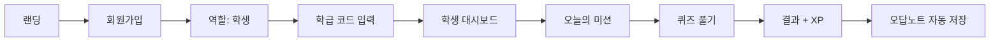
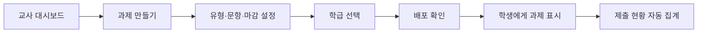

# 학습 — UI/UX 명세

> **제품 이름: 학습.** 코드·리포는 `haksup-*`.  
> **언제 쓰나?** 화면에서 버튼 누르면 어디로 가는지, 로딩/에러 시 뭐가 보이는지 정할 때  
> **누가 쓰나?** 나(기획), Claude Code에게 "이 플로우대로 구현해줘" 할 때  
> **버튼 이동**: §2.3 — 버튼 추가·변경 시 **항상** 그 표를 같이 고친다 (`.cursor/rules/uiux-button-destinations.mdc`)

## 1. UX 원칙

| 원칙 | 설명 | 학습 적용 |
|------|------|-----------|
| **재미있게** | 학습이 게임처럼 느껴져야 한다 | XP, 레벨, 미션, 즉각 피드백 |
| **짧게** | 한 번에 5~15분 집중 | 세트 단위 퀴즈, 진행률 바 |
| **선생님은 간단하게** | 클릭 3번 이내로 과제 출제 | 템플릿, 자동 채점, 대시보드 요약 |
| **내신에 맞게** | 중학 교과·내신 유형 중심 | 단어/문법/독해 유형 명시 |
| **실수해도 괜찮게** | 오답은 학습 기회 | 오답노트, 다시 풀기, 비난 없는 문구 |
| **스크롤 최소화** | 웬만하면 스크롤 없이 한 화면에 | 레이아웃·정보량 조절 우선 |

### 1.1 스크롤 정책

| 규칙 | 내용 |
|------|------|
| **기본** | **웬만한 상황에서는 스크롤을 쓰지 않는다** — 한 화면에 맞게 배치 |
| **허용** | 부득이한 경우(긴 목록·모달 예외 등)에만 스크롤 가능 |
| **스크롤바** | 스크롤이 있어도 **스크롤바는 보이지 않게** 한다 (`scrollbar` hidden) · **예외: 문제 제출 교과서 범위** 학년·교과서·단원 드롭다운 목록은 **스크롤바를 보이게** 한다 |
| **학교 설정** | 스크롤 **금지** — 기본 정보·색상·미리보기가 **한 화면에 전부 보이게** |

### 1.2 가독성 · 글자 선명도

| 규칙 | 내용 |
|------|------|
| **흐림 금지** | 버튼·라벨·본문 글자가 **절대 흐리게·뿌옇게** 보이면 안 된다 |
| **대비** | 배경 대비가 낮은 희미한 회색만으로 액션 글을 쓰지 않는다. 보조 텍스트 최소 `#6B7280`, 중요 액션은 `#15171A` + **bold** |
| **비활성** | disabled여도 `opacity`로 흐리게 만들지 않는다. 색만 조금 낮추되 **또렷하게 읽히게** |
| **잘림 금지** | 오버레이가 SVG를 가릴 때 **글자·아이콘이 반쯤 잘려 보이지 않게** 배경으로 완전히 덮는다 |
| **편안함** | 사람들이 편하게 보도록 크기·굵기·대비를 우선한다 |

### 1.3 정렬

| 규칙 | 내용 |
|------|------|
| **항상 똑바로** | 같은 행의 버튼·라벨·입력·아이콘은 **항상 수평·수직으로 똑바로** 맞춘다 |
| **한 줄 페어** | 되돌리기·저장처럼 옆나란히 둔 액션은 **같은 top·같은 height** 로 묶는다 |
| **잘림 없음** | 배지·글자·버튼이 반쯤 잘리거나 삐뚤어지지 않게 중앙 정렬한다 |
| **검수** | UI를 고친 뒤에는 가로·세로 정렬을 **다시 확인**한다 |

### 1.4 한국어 글자 간격 (자간)

교사 UI에서 한국어 제목·안내가 **붙어 보이거나 답답하면** 맞춤법 문제가 아니라 **자간이 너무 좁은 것**이다.

| 규칙 | 내용 |
|------|------|
| **좁히지 말 것** | 한국어 제목·본문에 `tracking-tight` / 음수 자간 **금지** — 띄어쓴 칸이 사라지거나 “간격이 하다 만” 것처럼 보인다 |
| **제목 자간** | 화면 큰 제목(`h1` 급)은 **`tracking-[0.04em]`** 정도를 기본으로 둔다 |
| **안내 자간** | 제목 아래 회색 안내는 **`tracking-[0.02em]`** + `leading-relaxed` |
| **검수** | 카피 문구만 보지 말고, **글자 사이가 답답하지 않은지** 화면에서 확인한다 |

**이 화면 카피 · 간격 (확정)**

| 위치 | 문구 | 간격 |
|------|------|------|
| 사용자 지정 과제 제출 · 제목 | `사용자 지정 과제 제출` | `tracking-[0.04em]` |
| 사용자 지정 과제 제출 · 안내 | `자동화 시스템으로 쉽고 빠르게 직접 문제를 만들 수 있어요.` | `tracking-[0.02em]` |

---

## 2. 정보 구조 (IA)

### 2.1 사이트맵

```
학습 웹
├── 공개
│   ├── 랜딩 (/) → `/login`
│   ├── 로그인 (/login) ← **교사 웹 첫 화면**
│   └── 회원가입 (/signup) — 역할 선택 (학생/교사) · 교사 웹은 `/login` 탭으로 처리
│
├── 학생 영역 (/student/*)
│   ├── 대시보드 (/student)
│   ├── 오늘의 미션 (/student/mission)
│   ├── 퀴즈 (/student/quiz/:id)
│   ├── 퀴즈 결과 (/student/quiz/:id/result)
│   ├── 오답노트 (/student/wrong-notes)
│   └── 내 프로필 (/student/profile)
│
└── 교사 영역 (/teacher/*)
    ├── 캘린더 (/teacher) ← 로그인 후 교사 홈
    ├── 문제 제출 (/teacher/problems) ← 문제 관리 기본
    ├── 과제 부여 (/teacher/problems/assign) ← 제출하기 후 초안 화면
    ├── 사용자 지정 과제 제출 (/teacher/problems/saved)
    ├── 학교 설정 (/teacher/school-settings) ← 사이드바 상단 로고
    ├── 내 설정 (/teacher/settings) ← 사이드바 하단 「설정」
    └── 반 (/teacher/classes/[id]?tab=…)
        └── 홈 · 과제 · 학생 · 설정
```

### 2.2 네비게이션

**학생 — 모바일**

| 위치 | 항목 | 링크 |
|------|------|------|
| 하단 탭 | 홈 | `/student` |
| 하단 탭 | 미션 | `/student/mission` |
| 하단 탭 | 오답노트 | `/student/wrong-notes` |
| 하단 탭 | 프로필 | `/student/profile` |

**학생 — 데스크톱**

| 위치 | 항목 | 링크 |
|------|------|------|
| 좌측 사이드바 | 홈, 미션, 오답노트, 프로필 | 동일 |

**교사 — 공통**

| 위치 | 항목 | 링크 |
|------|------|------|
| 좌측 사이드바 | 학교 로고 / 학교명 영역 | `/teacher/school-settings` |
| 좌측 사이드바 | **{이름} 선생님** | *(이동 없음 · 라벨 · 이름은 내 설정에서 수정)* |
| 좌측 사이드바 | **캘린더** (첫 화면) | `/teacher` |
| 좌측 사이드바 | **문제 관리** (라벨) | *(이동 없음)* |
| 좌측 사이드바 | **문제 제출** | `/teacher/problems` (**기본**) |
| 좌측 사이드바 | **사용자 지정 과제 제출** | `/teacher/problems/saved` |
| 좌측 사이드바 | **담당 반** 항목 | `/teacher/classes/[id]` (**항상 홈**) |
| 좌측 사이드바 | **+ 새 반 추가** | 페이지 이동 없음 → **새 반 만들기** 모달 |
| 좌측 사이드바 | **부가기능** (라벨) | *(이동 없음)* |
| 좌측 사이드바 | **단어장 만들기** | 이동 없음 · **추후에 추가될 예정입니다.** 팝업 |
| 좌측 사이드바 | **설정** (하단) | `/teacher/settings` (**내 설정**) |

### 2.3 버튼·이동 맵 (구현된 교사 UI)

> **규칙**: 버튼을 추가·변경하면 이 표를 **반드시 같이 갱신**한다.  
> (Cursor 규칙: `.cursor/rules/uiux-button-destinations.mdc`)

#### 로그인 `/login` (교사 웹 첫 화면)

> **소셜 로그인만 받는다.** 이메일·비밀번호 폼과 회원가입 탭은 2026-08-27에 걷어냈다 —
> 소셜은 가입과 로그인이 나뉘지 않아 회원가입 탭이 통째로 중복이었고, 비밀번호를
> 우리가 보관할 이유도 없다.

| 버튼 / 클릭 | 결과 |
|-------------|------|
| `/` 진입 | `/login`으로 리다이렉트 |
| 이미 로그인된 채로 `/login` | `/teacher`로 보냄 |
| **카카오로 시작하기** | 카카오 OAuth → `/auth/callback` → 이 계정 데이터 불러오기 → `/teacher` · provider 미설정이면 빨간 안내(이동 없음) |
| **구글로 시작하기** | 구글 OAuth → `/auth/callback` → 이 계정 데이터 불러오기 → `/teacher` · 위와 동일 |
| **Apple로 시작하기** | Apple OAuth → `/auth/callback` → 이 계정 데이터 불러오기 → `/teacher` · 위와 동일 |
| **데모 로그인 (개발용)** | `/teacher` · 익명 세션 · **개발 서버에서만 보인다** (`NEXT_PUBLIC_ALLOW_DEMO_LOGIN=true`면 배포본에도 노출) |
| `/teacher/*` 비로그인 | `/login`으로 보냄 |

#### 소셜 로그인 콜백 `/auth/callback`

| 상황 | 결과 |
|------|------|
| 세션 확인 성공 · 교사(또는 프로필 없음) | `ensureTeacherProfile` → 이 계정 반·과제·설정을 서버에서 불러온 뒤 `/teacher` |
| 세션 확인 성공 · **학생 계정** | 로그아웃 후 「학생용 계정이에요. 선생님 계정으로 로그인해 주세요.」 |
| 세션 확인 실패(20회) | 「로그인을 마치지 못했어요」 + 사유·단계 표시 |
| **로그인으로 돌아가기** | `/login` |

> 두 앱이 같은 Supabase 프로젝트를 쓰고 `profiles.role`은 하나뿐이라, 학생 계정이
> 교사 웹에 들어오면 반·과제 데이터가 뒤엉킨다. 그래서 콜백에서 역할을 확인한다.
>
> **다른 브라우저·다른 컴퓨터**에서도 같은 교사 계정으로 로그인하면 반·문제집·과제·학교 설정이 다시 채워진다 (`hydrateTeacherWorkspace`). 서버에 한 번도 안 올라간 로컬만의 내용은 그 기기에만 있다.

#### 공통 사이드바 (전 교사 화면)

| 버튼 / 클릭 | 결과 (어디로) |
|-------------|----------------|
| 학교 로고 · 학교명 | `/teacher/school-settings` |
| 선생님 이름 | 이동 없음 · 학교명 **아래 두 번째 줄** 라벨 **「{이름} 선생님」** (내 설정에서 수정) |
| 캘린더 | `/teacher` |
| **문제 관리** (라벨) | 이동 없음 |
| **문제 제출** | `/teacher/problems` (**문제 관리 기본 화면**) |
| **사용자 지정 과제 제출** | `/teacher/problems/saved` |
| 담당 반 학년 토글 (`중1` / `중2` / `중3` / **학년 혼합**) | 해당 학년 반이 **있을 때만** 표시 · 학년을 고르지 않았거나 **학년 혼합**인 반은 **학년 혼합** 토글 · 펼치기·접기 · 열림/닫힘 **localStorage 유지** · **기본 전부 접힘** (이동 없음) |
| 담당 반 (반 이름) | `/teacher/classes/[id]` · **항상 홈** (이전 탭 유지 안 함) |
| + 새 반 추가 | **새 반 만들기** 모달 오픈 (URL 유지) |
| **부가기능** (라벨) | 이동 없음 |
| **단어장 만들기** | 이동 없음 · **추후에 추가될 예정입니다.** 팝업 (확인으로 닫힘) · `/teacher/vocab` 직접 진입 시에도 같은 안내 |
| **설정** (사이드바 하단) | `/teacher/settings` (**내 설정** · `TeacherSidebarFooter`) |
| 내 설정 · **선생님 이름** 입력 | 이동 없음 · draft만 변경 (사이드바 미반영) |
| 내 설정 · **되돌리기** | draft를 저장본으로 복구 (이동 없음) |
| 내 설정 · **저장** | 교사 이름 저장 · 사이드바 「{이름} 선생님」 반영 (`MySettingsPanel`) |
| 내 설정 · 칭찬 캘린더 **?** | 호버/포커스 시 학생 화면 예시 팝오버 (`praise-calendar-example.svg`) · 이동 없음 |
| 내 설정 · **로그아웃** | 세션 종료 후 `/login` (`MySettingsPanel`) · **같은 브라우저 같은 계정**이면 반·기록은 그대로 · **다른 계정**으로 다시 로그인하면 그 계정 데이터로 교체 |
| 캘린더 일정 카드 **짧게 클릭** | **수업 추가와 동일한 팝업** · 클릭한 반·날짜·시작/종료 시간으로 채움 · 정규 수업은 저장 시 요일·시간표 갱신 · 추가 수업은 해당 1건 수정 |
| 캘린더 일정 카드 **길게 누르기(100ms) 후 드래그** | 카드가 살짝 떠오른 뒤 이동 · 5분 단위 스냅 · 정규 수업은 해당 반 요일·시간, 추가 수업은 해당 1건의 날짜·시간 갱신 · localStorage 저장 (이동 없음) |
| 캘린더 빈 칸 클릭 | **수업 추가** 모달 · 클릭한 **날짜·시간**을 기본값으로 채움 |
| 수업 추가 모달 · 수업 추가 | 선택한 반에 해당 날짜만의 수업 저장 → 주간·월간·오늘 수업 반영 (이동 없음) |
| 수업 수정 모달 · 저장 | 정규: 반 요일·시간 갱신 · 추가 수업: 정보 갱신 → 캘린더 반영 (이동 없음) |
| 수업 수정 모달 · 삭제 | 빨간 테두리 「삭제」 버튼 · 추가 수업 삭제 또는 정규 해당 요일 제거 → 캘린더 반영 (이동 없음) |
| 수업 추가/수정 모달 · × · 취소 · Esc | 모달 닫힘 · 저장 안 함 |
| 캘린더 `<` / `>` (주간) | **이전 주** / **다음 주** (주차 라벨·요일 헤더 갱신) |
| 캘린더 `<` / `>` (월간) | **이전 달** / **다음 달** |
| 오늘 사이드바 · **과제 제출 카드** | `/teacher/classes/{classId}?tab=assignments` · **반마다 가장 최근에 부여한 과제 하나** · 개인 오답 재출제 제외 |
| 주간 | 주간 캘린더 보기 |
| 월간 | 월간 캘린더 보기 |
| 월간 · `+N개 더보기` | 해당 날짜 **수업 목록 팝오버** 열림 (이동 없음) · 다시 클릭·바깥·Esc로 닫힘 |
| 월간 더보기 팝오버 · 수업 칩 | 빈 칸과 **동일한 수업 추가/수정 팝업** · 클릭한 반·날짜·시간으로 채움 |
| 월간 더보기 팝오버 · 닫기 | 팝오버 닫힘 (이동 없음) |
| 학사일정 관리 | **학사일정 관리** 모달 오픈 (`CalendarAcademicButton`) |
| 학사일정 관리 · 휴일 추가/수정 | 목록에 반영 (저장 전 draft · 이동 없음) |
| 학사일정 관리 · 휴일 삭제 | 목록에서 제거 (저장 전 draft · 이동 없음) |
| 학사일정 관리 · `공휴일에는 정규 수업을 제외해요` | 체크 시 공휴일 정규 수업 제외(기본 체크) · 해제 시 공휴일에도 정규 수업 자동 생성 |
| 학사일정 관리 · 저장 | localStorage `haksup-calendar-academic-schedule` 저장 → 주간·월간·오늘 수업·다음 수업 반영 · 모달 닫힘 |
| 학사일정 관리 · × · 취소 · 닫기 · Esc | 모달 닫힘 · 저장 안 함 |

#### 캘린더 홈 `/teacher`

| 항목 | 내용 |
|------|------|
| **보기** | **주간** · **월간** 토글 (`CalendarViewToggle`) · 왼쪽 **학사일정 관리** (`CalendarAcademicButton`) |
| **일정 소스** | ① 담당 반 `days` + 시간 → **수업 기간(`periods`) 안의 날짜만** 자동 표시 ② 빈 칸에서 만든 **추가 수업**(`haksup-calendar-one-off-lessons`)은 지정 날짜에만 표시 · 기간 없으면 정규 수업 미표시 · 종강일 미입력 시 **개강일 다음 해 2월 말까지** 표시 · **학사 휴일**(학교 등록)과 **공휴일**(기본)에는 정규 수업 미생성 · 공휴일 포함은 학사일정 관리 체크박스로 변경 · **추가 수업은 휴일에도 유지** |
| **카드** | 반 **캘린더 색·바·글씨** + **반 이름** + (있으면) **메모** + 시작 시간 칩 (`CalendarEventsOverlay`) |
| **범례** | 우상단 점+이름 = **생성된 담당 반만** · **오른쪽 정렬** (`CalendarClassLegend`). SVG 월화수목금·데모 범례는 가림 |
| **주차** | `<` `>` 주 이동 · 라벨 가운데 · `left` 고정 · **주간 폭 `weekWidth=340`** (라벨 잘림 없이 간격 축소) (`CalendarPeriodNav`) |
| **요일 헤더** | 월간과 동일 회색 바(`rounded-[14px] #F7F7F7`) · 월~일 · 날짜는 바 아래 각 열 중앙 |
| **오른쪽 오늘 사이드바** | 상단 **열기/닫기 아이콘 삭제** · 사이드바 **「캘린더」 행·주간 네비와 같은 높이**(top 128 · h 44)에 앱 카드 스타일로 `오늘 │ 6월 25일 [목]`을 **한 줄 표시** · 「오늘 수업」은 정규 수업 + 해당 날짜의 추가 수업을 합쳐 표시하고 없으면 **「오늘은 수업이 없어요」** · 「과제 제출」은 **반마다 가장 최근에 부여한 과제 하나**를 카드로 표시(반 색·반 이름·문제집 제목·수업일≫마감) · 없으면 **「새로운 과제 제출이 없어요」** 빈 상태 카드 · 개인 오답 재출제는 제외 (`CalendarTodaySidebarHeader`) |
| **공휴일·휴일** | 대한민국 공휴일 + **학교 휴일**을 **빨간색 날짜**로 표시 (일요일은 검은색) · 주간은 날짜에 휴일명 툴팁, 월간은 날짜 옆에 휴일명 표시 · 학교 휴일명이 있으면 공휴일명보다 우선 |
| **학사일정 관리** | 하루 또는 기간 휴일 등록·수정·삭제 · `공휴일에는 정규 수업을 제외해요` 체크(기본 체크) · 등록 휴일에는 정규 시간표 수업 자동 생성 안 함 · 일회성 추가 수업은 유지 (`CalendarAcademicScheduleModal`) |
| **데모** | SVG 박힌 샘플 일정·색 바는 **그리드 전체 화이트 덮개**로 제거 · 오른쪽 사이드바 데모 수업·제출물도 실제 데이터/빈 상태 UI로 덮음 |
| **시간축** | **06:00–22:00** (수업 피커와 동일) · 뷰포트는 기존 그리드 높이 · **세로 스크롤** · **스크롤바 숨김** (`CalendarEventsOverlay`) · 첫 로드는 09시 부근 |
| **카드 제스처** | **짧게 클릭** → 빈 칸과 동일한 수업 팝업(반·날짜·시간 채움) · **100ms 길게 누르기** → 카드가 떠오르며 이동 준비 · 그 상태로 드래그 후 5분 단위 스냅. 정규 카드는 반 설정 일정, 추가 수업 카드는 해당 1건만 이동 |
| **빈 칸 클릭** | 수업 추가 모달(해당 날짜·시간 preset) |
| **타이틀** | 주간·월간 동일 (`CalendarPageHeader`) · 「캘린더」30px · 설명 14px |
| **월간** | 폭을 오른쪽 사이드 앞까지 제한 · **월~일** 요일 바 · 반 범례는 상단 우측에 격리 · **오늘 칸**은 주간과 동일 연한 회색 음영(`rgba(17,23,26,0.035)`) · 오늘 수업 칩은 주간과 동일 회색 글로우(`0 0 20px rgba(176,176,176,0.3)`) · 수업 칩은 **주간과 동일한 왼쪽 풀하이트 색상 바**(`colors.bar`) + **반 이름** + (있으면 **메모**, 없으면 **시작–종료 시간**) · 셀당 **최대 2개**만 표시하고 초과 시 **`+N개 더보기`** · 더보기 클릭 시 날짜·전체 수업 목록 **팝오버** (우측·하단 셀은 안쪽으로 정렬) · 팝오버 수업 클릭 시 빈 칸과 동일 수업 팝업 · 바깥 클릭·Esc로 닫힘 · 셀 내부 스크롤 없음 · `<` `>` 달 이동은 `left` 고정 · **월간 폭 `monthWidth`(대폭 축소)** 로 화살표 간격 최소화 (`CalendarPeriodNav`) |

#### 시작 가이드

| 버튼 / 클릭 | 결과 |
|-------------|------|
| **시작하기** | 인사 카드 닫힘 → **새 반 추가** 버튼을 짚어 줌 (`StartGuidePanel`) |
| **나중에** / **×** | 인사 카드 닫힘 · 가이드는 우하단 배지로 접힘 |
| **반 만들러 가기** (과제 안내 중 · 받는 반 없음) | `/teacher`로 이동 → **반 만들기** 안내를 다시 짚음 |
| **초대 코드 복사** | 초대 코드를 클립보드 복사 (이동 없음) · 성공 시 버튼이 「복사됨」으로 바뀌고 화면 하단에 「클립보드에 복사되었습니다」 안내 (약 2초) |

#### 수업 추가 팝업

| 항목 | 내용 |
|------|------|
| **용도** | 빈 칸에서는 **추가 수업** 생성 · 기존 카드에서는 **같은 UI**로 수정 (`OneOffLessonModal`) |
| **진입** | 주간/월간 **빈 칸** 또는 **이미 있는 수업 카드** 클릭 |
| **기존 수업 클릭** | 빈 칸과 동일 팝업 · 반·날짜·시작/종료가 클릭한 수업 값으로 채워짐 |
| **반 선택** | 담당 반을 색 점·이름·체크가 있는 카드로 선택 (필수) · 반이 하나면 자동 선택 · 반이 없으면 생성 안내 및 추가 버튼 비활성 |
| **날짜·시간** | 클릭한 날짜와 5분 단위 시간대를 기본값으로 입력 · 팝업에서 수정 가능 · **시작 ≥ 종료**이면 저장 불가 · 「종료 시간은 시작 시간보다 늦어야 해요. 다시 설정해 주세요」 |
| **추가 입력** | **메모**(선택) — 추가·수정·정규 모두 · 힌트는 「(선택)」만 · 플레이스홀더 「비워두면 반 이름만 표시」 · **담당 반 홈 「메모」와 동일 값** |
| **저장·표시** | 추가 수업 → `haksup-calendar-one-off-lessons.title` · 정규 → 반 요일별 `dayLessonMeta.title` · 주간·월간·오늘 수업·**홈 메모** 즉시 반영 · 카드에는 **반 이름 → 메모** 순으로 표시 |
| **수정·삭제** | 추가·정규 모두 빨간 테두리 「삭제」 버튼 (취소와 같은 높이·모서리) |

#### 새 반 만들기 모달

| 버튼 / 클릭 | 결과 |
|-------------|------|
| 만들기 | 학년·이름·요일이 비어 있으면 각각 「학년 설정이 필요합니다」 / 「반 이름을 입력해 주세요」 / 「수업 요일을 하나 이상 선택해 주세요」(이동 없음) · **시작 ≥ 종료**이면 「종료 시간은 시작 시간보다 늦어야 해요. 다시 설정해 주세요」(이동 없음) · 통과하면 **새 반 만들기** 모달 닫힘 → **수업 기간 설정** 모달 · **이 시점에는 담당 반·캘린더에 반영하지 않음** · 기간명+개강일 입력 후 **확인**해야 반이 저장되고 캘린더에 나타남 |
| 수업 기간 · **확인** | 반 + 수업 기간을 함께 저장 → 담당 반 목록·캘린더 반영 · 모달 닫힘 |
| 수업 기간 · **× / 취소 / Esc** | 모달 닫힘 · **반 생성 취소**(반영 없음) |
| **×** (새 반 만들기) | 모달 닫힘 · 저장 안 함 |
| 저장 (수정 모드) | **저장**을 눌러야 반 정보 갱신 → 모달 닫힘 |
| 취소 · Esc | 모달 닫힘 · 저장 안 함 |

#### 문제 제출 `/teacher/problems`

| 항목 | 내용 |
|------|------|
| **진입** | 사이드바 **문제 제출** · **문제 관리 기본값** |
| **화면** | Figma 에셋 `problems-list.svg` + 공통 사이드바 · **「문제 관리」제목** · 본문 배경 **흰색**(`#FFFFFF`, 사이드바 제외) |
| **사이드바** | 「문제 관리」라벨 + **문제 제출** 행 활성 (`AssignedClassesPanel`) |
| **본문** | HTML **문제 관리** 제목·안내 + 새 문제 세트 폼 인라인 (`ProblemsCreateForm`) · 본문 배경 **흰색**(`#FFFFFF`, 사이드바 제외) · 모달 SVG 스케일 **미사용** · 본문 스크롤 |
| **1 교과서 범위** | **중1 · NE능률(김) · 단원 선택** 커스텀 드롭다운(최대 5개·스크롤, **스크롤바 표시**) · **중1/중2는 출판사·저자별 교과서 10종**, **중3은 `YBM(송)` 1종만** 표시 · **1–8단원** · 각 드롭다운 **가로폭 고정**(학년 96 · 교과서 170 · 단원 140) — 전체 너비로 늘어나지 않음 |
| **2 받는 반** | **교과서 범위**에서 선택한 학년(중1~중3)에 맞게 사이드바 **담당 반**(`loadTeacherClasses`)을 필터링 · 「과제를 받을 반을 선택해 주세요. 여러 반을 선택할 수 있어요.」 안내 + 우측 `n개 반 선택` · 반 색 점·이름·**체크박스가 있는 선택 카드**로 다중 선택 · 선택 시 파란 테두리·연한 파란 배경·체크 표시 · **반이 하나도 없으면** 「아직 만든 반이 없어요. 왼쪽 「새 반 추가」로 반을 먼저 만들어 주세요.」 · **학년만 안 맞으면** 「「중1」에 해당하는 반이 없어요. 위에서 학년을 바꾸면 반이 나타납니다.」 · 화면을 열 때 교과서 학년은 **담당 반 학년**을 따른다(항상 중1로 열면 중2·중3 반이 목록에서 빠짐) |
| **3 본문** | 사용자 지정 과제와 같이 **본문 / 본문 뜻** 두 칸 · 단원 선택 **전**에는 비활성 · **문장으로 나누기** 시 (1) 본문에 나온 **단원 저장 단어**(기초단어 체크가 **꺼져 있어도 기초단어 포함**)를 고르고, 그 단어가 나온 **본문 문장·뜻**을 예문 칸에 채움(`upsertCustomWord`, 원본 JSON은 유지) — 표제어의 `~` 는 **없어도 되고** 있으면 아무 단어 (`draw ~ attention to` → `draw attention to` / `drew my attention to`) · 맨 뒤 `…` / `...` 도 `~`와 같다 (`take ~ out of …` → `took some eggs out of`) · `'A'` / `'B'` / `A` / `B` 는 그 자리에 단어가 있어야 같은 표현으로 본다 (`keep A from B` → `keep kids from playing`) · 자리 안 단어는 **쉼표로 나열해도** 된다 (`Put A and B` → `Put plastic, paper, food waste, and glass`) · `one's`는 **소유격 아무 것** (`brush one's teeth` → `brush your teeth`) · 표제어가 **be로 시작하면 의문문 도치**도 본다 (`be ready for` → `Are you ready for` / `Is she ready for`) · **be 축약**도 본다 (`be interested in` → `I'm interested in` / `she's interested in`) · be와 다음 말 사이 **정도·부정 부사**는 건너뛴다 (`I'm very interested in` · `was very happy with` → `be happy with`) · be 숙어 **맨 뒤 전치사는 없어도** 된다 (`I'm very interested`) · **맨 앞·맨 뒤 `~`는 예문 빈칸에 넣지 않는다** (`look at ~` → `[Look at] my smile`) · 자리(`A`/`B`/`~`)가 있는 숙어는 **실제 단어만** 빈칸 (`take A to B` → `He [takes] … [to] them`) · `a/an + 명사 + of` 는 관사를 빼고 명사 복수로도 본다 (`take a picture of` → `take pictures of` / `took pictures of`) · 여러 단어 표제어의 **마지막 명사**도 복수로 본다 (`best friend` → `best friends`) · **비교급·최상급**도 본다 (`big` → `bigger` / `biggest`, `good` → `better` / `best`) (2) 본문·뜻을 문장 단위로 나눠 문장 문항으로 넣음(이미 같은 영어 문장이 단원에 있으면 그걸 고르고, 없으면 `haksup-custom-problem-bank`에 `sent-passage-…` id로 추가 · 다시 나누면 이 묶음만 교체) · `Hi!` / `Thank you.` 같은 **인사·감탄**만 다음 문장과 합침(`I'm Hannah.` 는 합치지 않음) · 같은 칸의 한글 뜻도 같이 붙임 · **여는 따옴표부터 닫는 따옴표까지는 한 문장** (`"It's already 7:30. Oops! I'm late."` · `“ ”` 도 같음) · ASCII `'` 는 `It's` 때문에 따옴표로 보지 않음 · 닫는 따옴표 뒤 **전달절**(`라고` / `솔직하게 말해` / `she said` / `said Vashti` / `그녀가 말했다`)은 같은 문장 (`Say honestly, "Can you text me less?"` = `"덜 보낼래?"라고 솔직하게 말해` · `"Ah! …," she said.` = `"아! …." 그녀가 말했다`) · 영어·한글 문장 수가 다르면 앞에서부터 맞추고 파란 안내 · 적용 후 단어·문장 목록을 펼치고 해당 항목을 **자동 선택**(목록에 숨긴 기초단어는 예문만 넣어 두고, 「기초단어」를 켜면 선택된 채 나타남) |
| **4 문제 구성** | 단원 지정 **전** 유형 선택만 · 지정 **후** 단어·문장·문법 각 섹션이 **제목 → 유형 → 툴바 → (파트 탭) → 목록** 순 · 각 섹션 제목 줄 **오른쪽 `›`** 로 **접기/펼치기**(기본 **펼침** · 접으면 **유형 선택·툴바·문항 목록 전부** 숨김, `n문항` 칩·선택값은 유지) · 목록 **최대 4줄** + **펼치기** · 제목 옆 **`n문항` 칩** = 이번 제출에 실제로 나갈 수(0이면 회색) — **`(선택수/전체개 출제)` 표기는 삭제** · 유형 선택 아래 **구분선** · 툴바 = `n / m 선택` + **전체 선택**(체크박스가 아니라 **테두리 버튼**, 전부 고르면 `전체 해제`) + **미선택 n개 보기** — 앞의 **둘은 파트를 고르면 함께 사라진다**(단원 전체를 가리키는 숫자·버튼이라 파트와 어긋남) · 항목 **클릭·드래그 선택/해제** · 게이지 바 **없음** · **유형 선택 기본값 = 전부 체크**(2026-08-31 변경 — 유형은 「고른 문항을 어떤 형태로 낼지」일 뿐이라 기본이 전부여도 잃을 게 없다. 전부 해제로 두면 문항만 고르고 제출했다가 「아무것도 안 나갔다」가 된다) · **항목 선택 기본값 = 전부 해제**(유형과 반대다 — 단원을 막 고른 시점엔 아무것도 체크하지 않음 — 전체가 켜져 있으면 지우는 쪽으로 일해야 하고 실수로 단원을 통째로 내기 쉽다) · 유형 「전체」는 나머지와 구분되도록 **파란 알약 버튼 + 세로 구분선**, 나머지 유형만 체크박스 · 유형 선택 행 **맨 오른쪽**에 **+ 단어/본문/문법 추가** · **짝맞추기·음성 짝맞추기 선택 시 단어 4개 미만이면 제출 불가** · **문법** 영어 문장의 `wrongPart`(틀린 부분)는 **빨간 글씨** `#EF4444`로 표시 |
| **항목 행 표시** | 선택 행 = **왼쪽 3px 파란 바(`#1AA7F2`) + 연한 파란 배경(`#EAF6FE`) + 중립 테두리(`#E3E8EF`)** — 행 전체를 파란 테두리로 두르면 16~30줄이 통째로 파래져 「선택됨」과 「누를 수 있음」이 뭉갠다 · 미선택 행은 흰 배경·투명 테두리 · **체크박스 옆에 단원(교과서) 순서 번호**(1부터 · `tabular-nums` · 파트 보기·이미 낸 문항을 아래로 내려도 **번호는 그대로**) · **수정/미리보기는 글자 버튼이 아니라 아이콘 버튼**(연필·눈, 평소 `#9CA3AF` → hover 시 흰 배경 + `#1AA7F2`) · 라벨은 `aria-label`·`title`로 유지 · **문장 미리보기**에서 대화 아이디·글자+숫자 표기(`messi10:`)는 문제에는 보이되 **처음부터 정답으로 박힘**(번역·청크 배열은 연한 파란 조각, 영작은 빈칸 없이 글자 표시) — `given-chunks.ts` |
| **빠른 제출하기** | 「제출하기」 옆 보조 버튼 (`planQuickAssign`) — 날짜 고르는 화면을 **건너뛰고 지금 바로** 낸다 · **수업일 = 오늘**, **공개 = 지금**(보통은 수업이 끝난 뒤 공개하지만 「지금 내주는 것」이라 바로 연다), **마감 = 다음 수업 시작 1분 전**(다음 수업은 **내일부터** 찾는다 — 오늘 수업 기준으로 낸 과제 마감이 몇 시간 뒤가 되면 안 된다) · 반마다 다음 수업이 다르므로 **마감도 반마다** · **누르면 확인 팝업**이 떠서 반별로 「지금 → 9월 2일 (수) 08:59 까지」를 보여 준다 — 날짜 화면을 건너뛰는 만큼 무엇이 언제까지인지 한 번은 보여 준다 · 확인 후 부여가 되면 **받는 반 홈**(`/teacher/classes/[id]`)으로 이동 · 반이 여러 개면 「이어서 내기」 기준 반, 없으면 첫 반 · **다음 수업이 없는 반이 하나라도 있으면 막고** 「제출하기」로 돌려보낸다 — 마감을 지어내지 않는다 |
| **제출 막는 조건** | 단원 미선택 · 받는 반 없음 · **고른 문항 0개** · **고른 문항이 있는 카테고리에 유형이 하나도 없음**(「단어에서 문제 유형을 선택해 주세요. 문항을 골라도 유형을 안 고르면 그 부분은 학생 앱에 나가지 않아요」 — 카테고리 이름을 짚어 준다. 전체에서 하나만 보면 단어를 골라 놓고 문법 유형만 켠 채 통과해 단어가 조용히 빠진다) · 짝맞추기 계열인데 단어가 모자람 |
| **제출 요약 줄** | 「문제 구성」 아래·**제출하기 위**에 한 줄 — 카테고리별 칩 `단어 1·2파트 16문항` / `문장 7문항` / `문법 1파트 5문항` + 오른쪽 `총 n문항` · 파트 라벨은 **고른 파트**(하나)를 적어 저장되는 값과 같게 한다 · 파트를 안 나눴거나 체크한 파트가 없으면 파트 라벨 없음 · 0문항 카테고리는 회색 칩 · 단원 미선택이면 렌더 안 함 |
| **문제은행 데이터** | `loopin-web/src/data/problem-bank.json` · **원본은 `scripts/problem-bank-import.xlsx`** — 고칠 땐 엑셀을 고치고 `node scripts/import-problem-bank.mjs scripts/problem-bank-import.xlsx`로 다시 만든다(JSON을 직접 손대지 말 것) · 시트 `단어`/`TTS`/`문법`/`기초단어` (이름에 `단어`가 들어가면 단어 시트로, `TTS`가 들어가면 음성 전용으로 읽는다) · 열 이름은 신·구 양쪽을 받는다: 단어 시트 `단어`|`영어` · `단어 뜻`|`한글` · `예문`|`문장`|`교과서 예문` · `예문 뜻`|`문장 뜻`|`한국어 뜻`, 문장 시트 `문장`|`영어 문장` · `문장 뜻`, 문법 시트 `O/X`|`OX` · `분류`|`대분류` · **청크 열은 비워도 된다** — 임포터가 앱과 같은 규칙(`phrase-chunks.ts`)으로 만든다. 슬래시가 없는 값은 「안 나눈 문장」으로 보고 다시 나눈다 · **예문의 `[대괄호]`도 넣을 필요 없다** — 과제 부여 때 `ensureWordCloze`가 활용형까지 찾아 씌운다 · 셀 값은 읽을 때 공백을 정리한다(두 칸 띄어쓰기·줄 끝 공백) · 현재 **단어 9,590개**(교과서 10종 × 중1·중2 + YBM(송) 중3, 기초단어 표시 2,470개) · **문법 13개**(중3 · YBM(송) · 5단원) · **문장 0개** · **음성 전용 본문 4,917문장** — 2026-09-09 구글 시트(탭 `단어`/`TTS`/`문법`/`기초단어`)를 받아 넣었다. **`문법` 탭은 헤더가 10칸인데 데이터가 12칸이라 두 칸씩 밀려 있어 아직 안 넣었다**(임포트한 엑셀에서는 `문법(보류)`로 이름만 바꿔 제외했다 — 헤더를 고치면 이름을 `문법`으로 되돌린다). `기초단어` 탭 661행은 마스터 목록이라 임포트 대상이 아니다(교과서·학년·단원이 없어 전량 스킵). 시트 표기 `미래앤(문)`·`천재(이상기)`는 `TEXTBOOK_ALIASES`가 화면 표기 `미래엔(문)`·`천재(이)`로 바꾼다. 같은 단원에 중복된 단어는 하나로 합쳐진다(9,835 → 9,590) · **JSON은 화면 번들에 통째로 안 실린다** — `scripts/split-problem-bank.mjs`가 `(학년·교과서)` 단위 **21조각**(`loopin-web/public/problem-bank/bNN.json`, 평균 80KB)과 번들에 남는 **인덱스**(`src/data/problem-bank-index.json`, 40KB — 단원별 개수 + 숙어 902개)로 나눈다(임포터가 이어서 자동 실행). 읽기(`getUnitContent`)는 예전처럼 **동기**라 **그 교과서 조각을 먼저 받아야 한다** — 화면은 `useUnitBank(scope)`, 저장된 과제를 다루는 흐름(스냅샷·학생 앱 동기화·오답 학습지)은 `ensureUnitsLoaded`로 미리 받는다(교사 진입 시 `TeacherAuthGate`가 저장된 과제의 교과서를 미리 받아 둔다). 안 받고 읽으면 빈 목록이 나오고 **개발 모드에서 경고**가 뜬다 · 임포트는 **(학년·교과서·단원) 단위로 덮어쓰고 나머지는 보존**한다(`mergeByScope`) · 교사가 직접 추가한 항목은 `haksup-custom-problem-bank`(localStorage)에 단원별로 저장되어 은행 목록·과제 스냅샷에 합쳐짐 |
| **파트 나누기** | 한 단원을 여러 수업에 걸쳐 낼 때 쓰는 **체크박스 선택 보조 도구** — 과제를 여러 개 만들어 두는 게 아니라 지금 화면의 선택만 바꾼다 · **단어·문장·문법을 각각 따로** 나눈다(등분 수·파트 번호가 카테고리마다 달라도 됨) · **툴바 오른쪽** **`분할하기`**(`PartCountControl`) — **평소엔 글자 하나만** 두고 누르면 `[2][3][4]`가 펼쳐진다(늘 펼쳐 두면 툴바에 숫자 네 개가 상시로 앉아 뭔가 골라야 하는 것처럼 보인다) · **`안 나눔`은 나눠 놓았을 때만** 나타난다 — 안 나눈 상태에선 이미 그 상태라 보여 줄 이유가 없고, 나눈 뒤엔 **되돌아올 유일한 길**이라 반드시 있어야 한다 · 나눠져 있거나 잠겨 있으면 접지 않는다(지금 몇 등분인지 안 보이면 안 된다) → 목록 **위에 파트 탭이 자동 생성**(`PartTabs`, `☑ 1파트 8개 · ☐ 2파트 8개`) · 탭마다 버튼 둘 — **왼쪽 동그라미**(고르기/해제)와 **오른쪽 파트 줄**(눌러도 **그 파트가 켜지고** 목록도 좁혀짐 · 다만 줄로는 **끄지 않는다** — 끄는 건 동그라미의 몫). 파트를 하나만 내게 된 뒤로 「보기」와 「출제」를 갈라 둘 이유가 없다 · 탭 줄 오른쪽 안내문 **「이번에는 이 파트 하나만 나갑니다」**(고른 게 없으면 **「낼 파트 하나를 골라 주세요」**) · 상한 **`MAX_PARTS = 4`**(`src/lib/problem-set-parts.ts`) · 분할 기준은 **단원 전체 항목**(선택 개수가 아님 — 선택 기준이면 파트를 고를 때마다 풀이 줄어 2파트를 못 고름) · 순서는 **문제은행(교과서) 순서** · 나머지는 **앞 파트에 하나씩 더**(마지막 파트가 가장 작음) · 항목 수가 모자란 등분은 **비활성 + 이유 툴팁** · **짝맞추기·음성 짝맞추기가 켜져 있으면 단어는 파트당 4개 이상**이어야 하므로 단어 12개 미만은 3등분 불가 |
| **파트 중 문항 체크 고정** (2026-08-31) | 파트로 나눠 놓은 동안에는 문항 체크박스를 **손으로 못 바꾼다**(`locked`) — 무엇이 나갈지는 고른 파트가 정한다. 행의 **수정·미리보기 아이콘은 그대로** 열린다. 되돌리려면 `분할하기 → 안 나눔` |
| **파트 = 이름표** (2026-08-03 변경) | 파트는 「단원을 n등분한 **정확한 조각**」이 아니라 **교사가 이번에 낸다고 고른 이름표**다 — 상태가 **둘로 나뉜다**: `partView`(지금 목록에 띄운 파트, 보기 전용) / `partChecked`(이번에 낼 파트 번호들, 저장되는 값) · 파트를 고르면 **목록이 그 조각만 남고** 펼치기도 그 기준 `펼치기 (이 파트 4개 더)` · 파트 밖 항목은 툴바 **미선택 n개 보기**로만 펼쳐지며 `미선택 n개` 구분선으로 분리 · **「미선택」에서 더 담거나 몇 개를 빼도 파트 번호는 그대로 저장**되어 제목에 `· n파트`가 붙고 반 홈 진도에도 잡힌다 · **대가**: 파트 = 조각이라는 보장이 없어져 「이어서 내기」가 다음 파트를 넘겨줄 때 **이미 낸 항목이 다시 포함될 수 있다**(중복 출제 방지 로직 미구현) · 파트 화면에서 단원 전체로 나오는 길은 **`분할하기 → 안 나눔` 하나뿐**(「전체 선택」은 이때 숨겨져 있음) |
| **부여 이력 (문항 단위)** (2026-08-03 추가) | 「이 문항을 이 반에 이미 냈나」를 **파생으로** 계산한다 (`src/lib/problem-item-history.ts`) — 새 저장소 없이 `haksup-class-assignments`(반별 부여) × `SavedProblemSet.items`(문항 id) 조인 · 문항 id가 `word-중3-YBM(송)-5단원-1`처럼 **단원까지 박혀 전역 고유**라 다른 단원 과제와 섞이지 않음 · 개인 과제(`targetStudentId`)는 진도가 아니므로 제외 · 기준은 **지금 「받는 반」으로 고른 반** · 반을 안 골랐으면 이력 표시 없음 |
| **부여된 문항 표시** | 행에 **`✓ n반 부여` 회색 배지**(아이콘+글자 — 색만으로 구분하지 않는다. 선택 상태가 이미 파란 왼쪽 바를 쓰고 있어 색이 겹치면 뭉갠다) · 반이 3곳 이상이면 `3반 외 2곳 부여` · **선택한 반이 전부 받은 문항만** 목록 **아래로 정렬**되고 **점선 테두리 + 회색 배경 + 톤다운** 처리 — 3반엔 냈고 4반엔 안 냈다면 4반에게는 새 문항이므로 내리지 않고 배지만 붙임 · **정렬은 화면 표시만 바꾼다** — 파트를 자르는 `unitItemIds`는 문제은행(교과서) 순서 그대로여야 진도와 맞는다 |
| **`안 낸 n개 담기`** | 툴바 버튼 · 이력 기준으로 아직 안 낸 문항만 체크한다 — **균등분할을 대신하는 「직접 분할」 도구**(등분 수를 계산하는 대신 안 낸 것을 그대로 집는다) · 등분 수(`partCounts`)는 **건드리지 않고** 고른 파트만 푼다(「이어서 내기」로 잠긴 등분 수를 우회하지 않기 위해) · 전부 안 냈거나(첫 출제) 하나도 안 남았으면 **버튼을 띄우지 않음** |
| **「이어서 내기」 기준 반 고정** | 「이어서 내기」로 들어오면 그 반은 **해제할 수 없다**(`pinnedClassId`) — 진도(다음 파트)와 부여 표시가 전부 이 반 기준이라 빼면 화면의 숫자가 다른 반 얘기가 된다 · 칩의 체크박스가 **자물쇠 아이콘**으로 바뀌고 `title`에 이유 표시 · **다른 반을 추가하는 건 막지 않는다**(같은 진도를 두 반에 함께 내는 경우) |
| **파트 저장 형태** | 나눈 카테고리만 `SavedProblemSet.part.{words,sentences,grammar} = {index, indices, total}`로 저장 — `indices`가 **체크한 파트 전부**(오름차순), `index`는 그중 **가장 앞 번호**를 계속 채워 `index`만 읽는 옛 데이터·코드와 호환 · **읽을 땐 항상 `partRangeIndices`** 를 쓴다(`index`만 보면 2개 이상 담은 문제집에서 뒤쪽 파트를 놓침) · 제목 접미사는 파트 번호가 모두 같으면 `· 1·2파트`, 다르면 `· 단어 2파트 · 문법 1파트` (`problemSetPartLabel`) · 하나도 안 나눴거나 체크한 파트가 없으면 `part` 없음 = 기존 문제집과 동일 |
| **저장·부여** | 제출하기 검증 통과 후 **과제 부여 페이지**(`/teacher/problems/assign`)에서 낼 문제를 확인하고 반별 **수업일·마감날짜**를 정한 뒤 확정 · 과제 본문은 `haksup-problem-sets`에 조인용으로 저장하되 **`hiddenFromLibrary: true`** 로 「사용자 지정 과제 제출」목록에는 **표시하지 않음**(그 영역은 별도 설정 예정) · 반별 부여는 `haksup-class-assignments`에 `{ problemSetId, classId, lessonDate, deadlineTime }`로 저장 · **과제 내기**로 라이브러리에서 재진입한 경우에만 기존 세트·목록 노출 유지 |

| 버튼 / 클릭 | 결과 |
|-------------|------|
| 학년 / 교과서 / 단원 선택 | 드롭다운 값 선택 · 목록 **최대 5줄 + 스크롤바 표시** · 단원을 고르면 그 범위에 저장해 둔 **본문 / 본문 뜻**을 칸에 채움 (`haksup-unit-passages`, 없으면 예전에 나눈 `sent-passage-…` 문장으로 복원) (이동 없음) |
| 받는 반 칩 | 반 다중 선택·해제 · 선택이 바뀌면 **부여 배지·목록 정렬·`안 낸 n개 담기`가 즉시 다시 계산됨** · 「이어서 내기」 기준 반은 자물쇠로 표시되고 눌러도 해제되지 않음 (이동 없음) |
| **이 단원을 나눠 내고 있어요 · 이어서 내기 →** | 받는 반 아래 배너 · 고른 단원·반이 **진행 중인 등분**이면 표시 · 반 홈과 같은 `continueUnitHref`로 이동 · URL 프리셋으로 이미 들어온 경우에는 숨김 |
| 본문 / 본문 뜻 | 단원 선택 후 영어 본문·한글 뜻을 입력 (이동 없음) · 단원 미선택 시 비활성 · **학년·교과서·단원별로 저장**되어 같은 범위를 다시 고르면 칸이 채워짐 |
| **문장으로 나누기** | 본문에서 **단원 저장 단어**를 찾아 단어 목록에서 선택하고, 그 단어가 나온 **본문 문장·뜻**을 예문(영어)·예문 뜻에 채움 · **기초단어 체크가 꺼져 있어도** 기초단어 예문까지 넣음(목록에는 숨김) · 「기초단어」를 켜면 그 항목이 **선택된 채** 목록에 나타남 · 표제어의 `~` 는 없어도 됨 (`draw ~ attention to` → `draw attention to` / `drew my attention to`) · 맨 뒤 `…` / `...` 도 `~`와 같다 (`take ~ out of …` → `took some eggs out of`) · `'A'` / `'B'` / `A` / `B` 는 그 자리에 단어가 있어야 함 (`keep A from B` → `keep kids from playing`) · 자리 안 단어는 **쉼표로 나열해도** 된다 (`Put A and B` → `Put plastic, paper, food waste, and glass`) · `one's`는 **소유격 아무 것** (`brush one's teeth` → `brush your teeth` / `brushed his teeth`) · 표제어가 **be로 시작하면 의문문 도치**도 본다 (`be ready for` → `Are you ready for`) · **be 축약**도 본다 (`be interested in` → `I'm interested in`) · be와 다음 말 사이 **정도·부정 부사**는 건너뛴다 (`I'm very interested in` · `was very happy with` → `be happy with`) · be 숙어 **맨 뒤 전치사는 없어도** 된다 (`I'm very interested`) · **맨 앞·맨 뒤 `~`는 예문 빈칸에 넣지 않는다** (`look at ~` → `[Look at] my smile`) · 자리(`A`/`B`/`~`)가 있는 숙어는 **실제 단어만** 빈칸 (`take A to B` → `He [takes] … [to] them`) · `a/an + 명사 + of` 는 관사를 빼고 명사 복수로도 본다 (`take a picture of` → `take pictures of`) · 여러 단어 표제어의 **마지막 명사**도 복수로 본다 (`best friend` → `best friends`) · **비교급·최상급**도 본다 (`big` → `bigger` / `biggest`, `good` → `better` / `best`) · 단어 수정 팝업에도 그대로 보임 · 본문·뜻을 문장으로 나눠 문장 목록에 넣고 선택 · `Hi!` / `Thank you.` 같은 **인사·감탄**만 다음 문장과 합침(`I'm Hannah.` 는 합치지 않음) · 같은 칸의 한글 뜻도 같이 붙임 · **여는 따옴표부터 닫는 따옴표까지는 한 문장** (`"It's already 7:30. Oops! I'm late."` · `“ ”` 도 같음) · ASCII `'` 는 `It's` 때문에 따옴표로 보지 않음 · 닫는 따옴표 뒤 **전달절**(`라고` / `솔직하게 말해` / `she said` / `said Vashti` / `그녀가 말했다`)은 같은 문장 (`Say honestly, "Can you text me less?"` = `"덜 보낼래?"라고 솔직하게 말해` · `"Ah! …," she said.` = `"아! …." 그녀가 말했다`) · **마침표 뒤 칸이 없어도** 가름 (`A.B.` → `A.` / `B.`) · `Mrs.` / `Dr.` / `Mr.` 호칭 마침표는 가름 아님 (`Mrs. Schmidt`) · `3.14` 같은 소수점은 한 덩어리 · 같은 영어 문장이 단원에 있으면 그걸 고름 · 청크에서 **화살표·이모티콘 같은 장식 기호는 빼고** `! ? ' " ~` 등 대화 문장부호는 남김 · 다시 누르면 이전에 만든 `sent-passage-…` 문장만 교체 (이동 없음) |
| **`안 낸 n개 담기`** | 선택한 반이 아직 안 받은 문항만 체크 · 파트 화면에서 빠져나옴(등분 수는 유지) · 파트 탭을 다시 누르면 원래 조각으로 복귀 (이동 없음) |
| 단어/문장/문법 섹션 **›** (제목 줄 오른쪽) | 해당 카테고리 **접기/펼치기** · 접으면 **유형 선택까지** 포함해 툴바·문항 목록이 모두 숨김 · 펼침 시 `›`가 아래로 회전 · 접어도 선택·유형·`n문항` 값은 유지 (이동 없음) |
| 단어/문장/문법 항목 행 | 클릭 또는 **드래그**로 출제 항목 선택·해제 · 첫 항목 기준으로 연속 적용 · **체크박스 옆 단원 순서 번호** · 제목 옆 **`n문항` 칩**과 **제출 요약 줄** 갱신 (이동 없음) |
| 단어/문장/문법 항목 **수정** | **단어/본문/문법 수정** 팝업 · 기존 값 채움 · 저장 시 같은 id로 `haksup-custom-problem-bank`에 덮어씀(교과서 JSON 원본은 유지) · 목록·미리보기·과제 스냅샷에 반영 (이동 없음) |
| 단어/문장/문법 항목 **미리보기** | `PreviewModal` · 체크한 유형을 **가로로 나란히** 표시 · 모달은 **내용 너비에 맞춤**(`w-fit`, 최대 1400) — 폰 2개일 때 오른쪽 빈 회색 여백 없음 · 폰 프레임 `min(620px,97vh-120px)` · 유형이 많아 넘치면 **좌우 스크롤**(스크롤바 숨김) · **본문 A/B/C는 조각 버튼·문장(문제) 영역만 축소**해 한 화면에 문제 전체가 보이게 함(느낌 미리보기 · 글씨가 작아도 됨) · 문법은 **학생 웹앱과 동일 UI** · **문법 OX 정답이 X**이면 **OX문제 + 교정 문제** 폰 **두 개를 나란히**(이어하기 없이 한눈에) · 미리보기 폰 크롬 통일(`PreviewPhoneChrome`) — 모든 장면에 **왼쪽 18:00 + 오른쪽 신호·와이파이·배터리**, 그 **바로 아래 왼쪽 ‹** · **단어 음성 짝맞추기**는 왼쪽 오디오 타일+뜻 매칭 · 선택형 등 생성 불가 유형은 섹션 생략 (이동 없음) |
| 단어/문장/문법 **전체 선택 / 전체 해제** | 툴바 왼쪽 **테두리 버튼**(체크박스 아님) · 왼쪽에 `n / m 선택` · **파트를 고르면 둘 다 숨겨짐** — 단원 전체가 대상이라 파트와 섞이면 어긋난다 · 누르면 해당 섹션 항목 전부 선택·해제 (이동 없음) |
| 단어/문장/문법 **`미선택 n개 보기`** | 파트를 골라 목록이 좁혀졌을 때 툴바에 나타남 · 누르면 목록 아래 `미선택 n개` 구분선과 함께 파트 밖 항목이 펼쳐져 **파트에 없는 항목을 바로 추가**할 수 있음 · 다시 누르면 `미선택 숨기기` · 단위는 카테고리별(`개`/`문장`) (이동 없음) |
| 단어/문장/문법 **`분할하기 → 2·3·4`** | 툴바 **오른쪽 세그먼트** (`PartCountControl`) · 해당 카테고리만 n등분 · **누르는 즉시 1파트가 적용**되어 체크가 첫 조각으로 바뀌고 **파트 탭이 그 수만큼 자동 생성**됨 · 펼치면 아래에 **「다음 파트는 반 홈 「이어서 내기」」** 안내 · `안 나눔`을 누르면 파트 탭이 사라지고 **단원 전체 목록으로 복구** · 짝맞추기를 나중에 켜서 불가능해지면 자동으로 낮은 값으로 보정 · 만들 수 없는 값은 비활성 + `title` 툴팁 (이동 없음) |
| **`🔒 n개로 고정`** (이어서 내기로 진입 시) | 반 홈 「이어서 내기」로 들어오면 세그먼트 대신 자물쇠 칩으로 바뀜 — **바꾸면 이미 낸 파트와 범위가 어긋나기 때문** · 툴팁에 이유 표시 · 옆의 **다시 정하기**를 누르면 잠금이 풀려 세그먼트가 다시 나옴 (이동 없음) |
| 단어/문장/문법 **파트 탭 라벨 `n파트`** | 등분 수가 2 이상일 때만 목록 위에 나타남 (`PartTabs`) · 라벨을 누르면 **목록이 그 조각만 남는 보기 전환**뿐 — 무엇을 낼지는 바뀌지 않는다 · 탭에 조각 크기 `6개`/`6문장` 표기 · **이미 이 반에 부여한 파트는 `부여`로 표기** · 항목을 손으로 체크/해제하거나 「미선택」에서 더 담아도 **탭·목록·파트 번호가 모두 유지됨** (이동 없음) |
| 단어/문장/문법 **파트 탭 체크박스** (2026-08-03 추가) | 라벨 왼쪽 체크박스 · 그 파트를 **이번 과제에 넣기/빼기** — 체크하면 그 조각의 항목이 선택에 **더해지고**, 풀면 그 조각만 빠진다(다른 파트·손으로 담은 항목은 건드리지 않음) · **한 번에 하나만** 고른다(2026-08-31 변경 — 여러 파트를 함께 담아 부여 화면에서 며칠에 나눠 내던 흐름은 없앴다. 다른 파트를 누르면 **갈아탄다**: 앞 파트의 항목은 빠지고 새 파트만 담긴다) · 누르면 방금 건드린 파트가 **목록에도 바로 표시**됨 · 저장·제목·제출 요약의 파트 번호는 **전부 이 체크 기준** · `분할하기`로 나누면 **1파트가 자동 체크**, `안 나눔`·「전체 선택」을 누르면 체크가 모두 풀림 (이동 없음) |
| 단어 유형 선택 (전체/짝맞추기/음성 짝맞추기/3지선다/예문 빈칸) | 「전체」= 단어 유형 전부 선택·해제 / 개별 토글 (이동 없음) |
| 단어 **기초단어** 체크 | 유형 선택 오른쪽 · **켜면** 기초로 표시한 단어도 목록에 보임 · 직전에 문장나누기로 맞춘 기초단어는 **예문이 이미 들어 있고 선택된 채** 나타남 · **끄면** 기초단어만 목록·선택에서 빠짐(넣어 둔 예문은 유지) · 기본 꺼짐 (이동 없음) |
| 문장 유형 선택 (전체/청크배열/번역 배열/영작) | 「전체」= 문장 유형 전부 선택·해제 / 개별 토글 (이동 없음) |
| 문법 유형 선택 (전체/OX문제) | 「전체」= 문법 유형 전부 선택·해제 / 개별 토글 (이동 없음) · **「선택형 문제」는 2026-08-02 출제 대상에서 제외**(2지선다 단독 화면 = 학생앱 `grammar-type-1`. 선택지 3개 필수라 신규 출제 불가, 문제은행에도 해당 문항 없음) · 기존 문제집에 저장된 「선택형 문제」는 라벨로 보관되어 그대로 동작 |
| **+ 단어 추가** (유형 선택 행 오른쪽) | 단원 선택 후 **단어 표(엑셀)** 팝업 · 그 단원 **기존 단어가 미리 채워짐**(기초·단어·뜻·예문·예문 뜻) · 맨 아래 빈 줄 1칸 · 더 내리면 빈 줄이 이어짐 · 예시 문구·행 추가 버튼 없음 · 단원 미선택 시 비활성 (이동 없음) |
| **+ 본문 추가** (유형 선택 행 오른쪽) | 단원 선택 후 **본문 표(엑셀)** 팝업 · 그 단원 **기존 문장이 미리 채워짐**(영어·한글 뜻·영어 청크·한글 청크·영작 힌트) · 맨 아래 빈 줄 1칸 · 더 내리면 빈 줄이 이어짐 · 예시 문구·행 추가 버튼 없음 · 단원 미선택 시 비활성 (이동 없음) |
| **+ 문법 추가** (유형 선택 행 오른쪽) | 단원 선택 후 **문법 추가** 팝업 · O/X · **X일 때만** 틀린 부분·선택지 표시 · 선택지는 **3개 필수**(첫 항목이 정답, `/` 구분 — 학생앱 X 교정 문제가 3지선다 고정) · 저장 시 문법 목록에 추가·자동 선택 (이동 없음) |
| 단어 표 팝업 · **기초** 체크 | 그 줄을 **기초단어**(`isBasicWord`)로 표시 · 적용 시 저장 · 목록에 `기초` 칩 (이동 없음) |
| 단어 표 팝업 · **적용** | 바뀐 줄·새 줄을 `haksup-custom-problem-bank`에 저장(예문 빈칸 자동 잠금 · 기초 체크 포함) → 목록 반영 · **새로 넣은 단어는 자동 선택** · 빈 줄은 무시 · 형식 오류면 n번째 줄 빨간 안내 · 팝업 유지 (이동 없음) |
| 단어 표 팝업 · **엑셀 붙여넣기** | 칸에서 Ctrl/Cmd+V · 탭·줄바꿈으로 여러 칸·여러 줄이 그 칸부터 채워짐 · 5번째 칸은 기초(O/X·TRUE/FALSE·1/0) · 줄이 모자라면 자동으로 늘어남 (이동 없음) |
| 본문 표 팝업 · **자동 나눔** (영어/한글 청크 열 머리) | 채워진 줄의 영어·한글을 `/` 청크로 채워 넣음 · **화살표·이모티콘 같은 장식 기호는 빼고** `! ? ' " ~` 등 대화 문장부호는 남김 · 해당 칸 소스가 비어 있으면 안내 (이동 없음) |
| 본문 표 팝업 · **청크 자동 나누기** | 영어·한글이 있는 줄의 청크를 한꺼번에 나눔 · **화살표·이모티콘은 빼고** 대화 문장부호는 남김 · 비어 있으면 안내 (이동 없음) |
| 본문 표 팝업 · **적용** | 바뀐 줄·새 줄을 `haksup-custom-problem-bank`에 저장 → 목록 반영 · **새로 넣은 문장은 자동 선택** · 빈 줄은 무시 · 청크가 비어 있으면 같은 규칙으로 나눔 · 형식 오류면 n번째 줄 빨간 안내 · 팝업 유지 (이동 없음) |
| 본문 표 팝업 · **엑셀 붙여넣기** | 칸에서 Ctrl/Cmd+V · 탭·줄바꿈으로 여러 칸·여러 줄이 그 칸부터 채워짐 · 영어·한글 뜻·영어 청크·한글 청크·영작 힌트 순 · 줄이 모자라면 자동으로 늘어남 (이동 없음) |
| 단어 수정 팝업 · **기초단어** | 체크하면 그 단어를 기초단어로 저장 · 목록 `기초` 칩 갱신 (이동 없음) |
| 단어/본문/문법 추가 팝업 · 추가 | 문법(또는 단어·본문 **수정**) 형식 검증 통과 시에만 `haksup-custom-problem-bank`에 저장 → 목록 반영 · 실패 시 빨간 안내로 이유 표시 · 팝업 유지 (이동 없음) |
| 본문 수정 팝업 · **자동 나눔** (영어/한글 청크) | 위 영어·한글 예문을 `/` 청크로 채워 넣음 · **화살표·이모티콘은 빼고** 대화 문장부호는 남김 · 예문이 비어 있으면 안내 (이동 없음) |
| 단어 표·본문 표·문법 추가 팝업 · 취소 / × / Esc | 팝업 닫힘 · 저장 안 함 (이동 없음) |
| 제출하기 | 단원·받는 반·출제 문제·**유형 1개 이상** 검증 → **짝맞추기·음성 짝맞추기 선택 + 단어 1~3개면 제출 불가(4개 이상 필요)** → 초안을 `sessionStorage`에 저장 후 **`/teacher/problems/assign`** 으로 이동 · 이 시점에는 저장·부여 없음 · **파트 탭을 체크한 경우** 부여 화면에서 파트별 칩 · **파트 체크 없이 문항만 고른 경우(사용자 지정 선택)** 는 **안 나눔 칩**으로 넘김(분할 숫자만 남아 칩이 사라지던 버그 방지) · 파트를 골랐으면 부여 화면에서 **파트별로 다른 수업일에 놓을 수 있고, 그러면 과제가 날짜 수만큼 나뉜다** |
| **과제 부여 화면** (`/teacher/problems/assign` · 2026-08-04) | 제출하기 후 열리는 **사이드바 유지 전용 페이지** (`AssignAssignmentPanel` + `AssignAssignmentModal` `variant="page"`) — 문제 제출처럼 본문을 채운다(떠 있는 카드 아님) · 진도를 짠 뒤 이어지는 마지막 단계라 세 가지만 묻는다: **무엇을 · 어느 반에 · 언제까지** · 위에서부터 **반 탭 → (좌) 파트별 부여 트레이(`part-assign-sidebar.svg`) | (우) 월 네비+월간 요일격자·마감·취소/제출** · 초안이 없으면 `/teacher/problems`로 되돌림 |
| 과제 부여 · **반 탭** (1반/2반/3반) | 받는 반마다 탭 하나 (반 색 점 + 이름) · 탭을 바꾸면 **캘린더와 마감날짜 카드만** 바뀐다 — **낼 문제는 모든 반 공통** (이동 없음) |
| 과제 부여 · **파트별 부여 칩** | 반 탭 아래 **왼쪽 컬럼**(약 **252px** · sticky 없음 · `part-assign-sidebar.svg` 시안을 **좁게**) · 패널 **상단은 오른쪽 월 네비와 Y축 정렬** · **연회색 패널**(`#F7F8FB` · 둥근 테두리) 안에 세로 **흰 카드** 스택 · 헤더 **`파트별 부여 · {활성 반 이름}`** (`activeClass.name`) + 안내 「칩을 끌어다 놓거나, 누른 뒤 날짜를 고르세요」 · 카드는 **좌 그립 · 라벨(`단어 1파트` 등) · 우 `n문항`** 분리 표기 · 하단 **`부여 n / N파트`** + **전체 비우기**(올린 칩을 전부 대기열로) · **기본값은 전부 대기열(미배치)** — 기준 수업일·오늘 날짜에 파란 칩을 자동으로 올리지 않음 · **칩을 캘린더로 드래그**하거나 **칩을 누른 뒤 날짜** → 그 칩만 그 수업일로 가고 **대기열에서 사라짐** · **Ctrl/Cmd+클릭**으로 칩 다중 선택 토글 · **Shift+클릭**으로 대기열 순서 기준 범위 선택 · 다중 선택 후 **날짜 클릭·드래그**하면 고른 칩을 **한꺼번에** 그 날로 · **캘린더에 올린 파란 칩을 클릭**하면 대기열로 돌아옴 · 선택 없이 날짜만 누르면 대기열·이미 올린 칩 **전부** 그 날로 모임 · 날짜가 갈리면 `날짜가 갈려서 과제 n개로 나눠 나갑니다` · 전부 올리면 왼쪽은 「모두 캘린더에 올렸어요」+ 진행/전체 비우기 유지 (이동 없음) · **페이지와 함께 스크롤**(왼쪽 패널 sticky 고정 없음) |
| 과제 부여 · **파트 모드 칩** (`단어 N파트 · n문항`) | 출제에서 **분할하기로 나눈** 카테고리 · 트레이 카드 라벨 **`단어 N파트` / `문장 N파트` / `문법 N파트`**, 우측 **`n문항`** · 캘린더 칸 파란 pill은 **`단어 N파트 · n문항`** 합쳐 표기 (`n` = 그 파트 조각∩선택 문항) · 체크한 파트마다 칩 하나 (이동 없음 — 위 칩 동작과 동일) |
| 과제 부여 · **안 나눔 칩** (`단어 · n문항`) | 출제에서 **파트로 나누지 않고** 카테고리째 고른 경우 · 또는 **분할하기만 켜 두고 파트 체크 없이 문항만 손으로 고른 경우**(사용자 지정 선택) · 트레이 카드 라벨은 **`단어` / `문장` / `문법`**(있는 카테고리만 · `단어 1파트` 아님), 우측 **`n문항`** · 캘린더 칸 칩은 **`단어 · n문항`** (`n` = 카테고리 선택 문항) (이동 없음 — 위 칩 동작과 동일) |
| 과제 부여 · **전체** 래퍼 (안 나눔) | 안 나눔이고 카테고리 칩이 **2개 이상**일 때 대기열에서 **단어·문장·문법을 감싸는 흰 카드 프레임**(헤더 **`전체`** + 우측 **`n문항`**+그립 · `n` = 카테고리 칩 문항 합) · 헤더를 드래그하거나 누른 뒤 날짜 → **카테고리 칩을 한꺼번에** 그 수업일로(이미 올린 것도 **전부 그 날로 이동**) · 선택 시 **래퍼 테두리**가 강조(네 번째 동일 칩이 아님) · 안쪽 개별 카드는 그대로 단독·다중 배치·해제 · 일부/전부 올려도 프레임은 유지(남은 칩만 안쪽에) · 칩이 모두 올라간 뒤에도 헤더로 다시 묶을 수 있음 (이동 없음) |
| 과제 부여 · **전체 비우기** | 왼쪽 패널 하단 · 활성 반에서 **캘린더에 올린 칩을 전부 대기열로** 되돌림 · 올린 칩이 없으면 비활성 (이동 없음) |
| 과제 부여 · **월 이동 ‹ ›** | 캘린더 컬럼 상단에서 표시 달을 앞뒤로 이동 · 그 달의 **활성 반 수업 후보**(`listLessonCandidates` — 학사 휴일·공휴일·일회성 수업 반영)를 초록 칩 `반이름 시각`으로 표시 (이동 없음) |
| 과제 부여 · **월간 캘린더** | 반 탭 아래 파트 칩 **오른쪽 남은 너비(`flex-1`)** — 문제 제출처럼 본문 화면을 채움 · 컬럼 상단에 월 네비 · **한 달 격자(최대 6주)를 한꺼번에 펼쳐** 보여 줌 · 날짜 칸만 따로 스크롤하지 않음 · 내용이 높이를 넘으면 **페이지가 세로 스크롤**하고 **왼쪽 파트 패널도 같이 내려감** · 마감·취소/제출은 오른쪽 캘린더 컬럼(격자 아래) · 요일 헤더는 카드 스크롤 시 `sticky`로 유지 (이동 없음) |
| 과제 부여 · **날짜 칸 클릭 / 드롭** | **다중 선택·단일 선택 칩**이 있으면 고른 칩(들)만 그 날로 · **전체**를 옮기는 중이면 **안 나눔 카테고리 전부** 그 날로 · 없으면 **전부** 그 날로 모으고 기준 수업일도 그 날이 됨 · **올린 파란 칩 클릭** → 그 칩만 대기열로(칸 클릭·전체 이동 아님) · 시안처럼 **흰 날짜 칸 + 초록 수업칩(`3-1반 09:00`) + (올린 경우만) 파란 pill 칩(`단어 1파트 · n문항` 또는 안 나눔이면 `단어 · n문항`)** · 칩이 놓인 칸은 연한 파란 틴트만 · 각 수업일의 마감 칸에는 분홍 `마감 HH:MM` 칩(**직접 설정**은 지정한 시각·기본 `23:59`, **다음 수업 전까지**는 다음 수업 시작 1분 전) · 오늘은 빨간 원 · 일요일·공휴일 빨강, 토요일 파랑, 다른 달은 회색 · 시간표 수업이 없는 날도 **아무 날이나** 고를 수 있음 (이동 없음) · **메인 주간/월간 캘린더에는 부여 칩을 아직 그리지 않음**(부여 화면 캘린더와 표기 규칙은 동일하게 유지) · **`/teacher/problems/assign`에서는 메인 캘린더 크롬(「캘린더」타이틀·주간/월간 토글·학사일정·범례)을 띄우지 않음** (`calendarActive`가 `assignAssignment`일 때 false) |
| 과제 부여 · **마감날짜 지정** | **활성 반 전용 · 일괄 1세트** · 토글 **직접 설정** \| **다음 수업 전까지** · **직접 설정**: 마감까지 N일(0~60) + 프리셋 1·3·7·14일(같은 N을 올린 모든 수업일 그룹에 적용) + **마감 시간**(기본 `23:59` · 변경 가능) · **다음 수업 전까지**: **각 그룹의 수업일** 다음 정규/일회 수업 **시작 1분 전** (`getNextClassOccurrence`) — 다음 수업이 없으면 직접 설정의 N일+지정 시각으로 폴백 · 반별 상태는 `deadlineMode` + `deadlineDays` + `deadlineTime` 유지 · 수업일이 여러 개면 요약 줄만 여러 줄 · 칩을 아직 안 올렸으면 안내만 표시 (이동 없음) |
| 과제 부여 · **마감 시간** | **직접 설정**일 때 일괄 마감 카드 · 기본 `23:59` · 바꾸면 분홍 `마감 HH:MM` 칩·요약 줄이 같은 시각으로 갱신 (이동 없음) |
| 과제 부여 · 취소 / × / Esc / 브라우저 뒤로 | **`returnHref`로 이동**(문제 제출 → `/teacher/problems`, 사용자 지정 → `/teacher/problems/saved`) · **초안 삭제**(sessionStorage) — 문제 제출 화면은 **빈 상태**(유형·반·파트·문항 전부 해제)로 다시 열림 · 저장·부여는 없음 · 부여 성공 시에도 초안 삭제 · **미배치 팝업이 열려 있으면 Esc는 팝업만 닫음** · 칩이 선택돼 있으면 Esc는 **선택만 해제** |
| 과제 부여 · **제출하기** | 낼 문제가 하나 이상 남아 있고 파트를 나눈 카테고리마다 파트가 1개 이상이면 통과 · **파트 칩이 있으면 선택한 모든 반에서 전부 캘린더에 올려야 함** — 미배치 시 **미배치 안내 팝업** · 그 외 검증 실패는 하단 빨간 안내 · **오늘보다 늦은 수업일이 있으면** 바로 부여하지 않고 **예약 공개 안내 팝업** · 확인하면 **같은 날짜 조합에 놓인 칩끼리 묶여 묶음마다 문제집+과제가 하나씩** 만들어진다 · 각 묶음은 `hiddenFromLibrary`로 저장되고 **선택한 모든 반**에 그 묶음의 수업일·마감으로 부여 · **사용자 지정 과제 제출 목록에는 추가하지 않음**(문제 제출 플로우) · 초안 삭제 후 **받는 반 홈**(`/teacher/classes/[id]`)으로 이동 — 반이 여러 개면 부여 화면에서 보고 있던 반 탭 · 파트를 골랐으면 `part`가 함께 저장되고 제목에 `· n파트`가 붙어 목록에서 같은 단원의 다른 파트와 구분됨 · 부여되는 순간 그 단원이 반 홈 **「진행 중인 단원」** 에 나타남 |
| 과제 부여 · **미배치 안내 팝업** | 제출하기 시 대기열에 남은 칩이 있으면 · 제목 **캘린더에 올려 주세요** · 반 이름마다 한 번 + 그 아래 `chip.label`만 나열(`단어 1파트` 등 · `· n문항`·「부여 해주세요」 없음) · **확인** / × / Esc → 팝업만 닫음 · **바깥(딤) 클릭은 닫히지 않음** (이동 없음) |
| 과제 부여 · **예약 공개 안내 팝업** | 제출하기 시 **오늘보다 늦은 수업일**이 있으면 · 제목 **학생 앱에는 해당 날짜가 지난 뒤에 과제가 뜹니다** · 안내 「과제 부여일이 오늘보다 늦은 과제예요. 그날 수업이 끝나면 자동으로 출제됩니다.」 · 반 이름 · 공개 시각(`수업 종료` · `formatOpenAtKo`)을 한 줄씩 · **그대로 제출하기** → 부여 진행 · **닫기** / × / Esc → 팝업만 닫힘 · **바깥(딤) 클릭은 닫히지 않음** (이동 없음) · **오늘 날짜에 올린 과제는 팝업 없이** 바로 부여(그날 수업 종료 시각에 공개되는 기존 규칙) |
| 과제 부여 · 묶음 → 문제집 변환 규칙 | 칩의 문항 = `partSlice`(그 파트 조각) ∩ 교사가 고른 항목 · 어느 파트에도 안 걸리는 항목(손으로 더 담은 것)은 그 카테고리의 **첫 칩**이 떠안는다(조용히 사라지지 않게) · `problemTypes`는 그 묶음에 있는 카테고리만 채우고 나머지는 빈 배열 · `part.{category}`도 그 묶음의 파트 번호로만 기록 — 문법을 뺐는데 `part.grammar`가 남으면 반 홈 진도가 잘못 기록됨 · **수정 모드에서 묶음이 여러 개면 기존 세트는 두고 전부 새로 만든다**(어느 묶음이 원본인지 정할 근거가 없음) |

#### 사용자 지정 과제 제출 `/teacher/problems/saved`

| 항목 | 내용 |
|------|------|
| **진입** | 사이드바 **사용자 지정 과제 제출** |
| **참고 에셋** | `assets/저장된 문제 세트.svg` (본문만 · 사이드바 무시) |
| **화면** | Figma 배경 `problems-list.svg` + 공통 사이드바 · 제목 **「사용자 지정 과제 제출」**(`tracking-[0.04em]`) · 안내 **「자동화 시스템으로 쉽고 빠르게 직접 문제를 만들 수 있어요.」**(`tracking-[0.02em]`) · 본문 배경 **흰색** · `tracking-tight` **미사용** |
| **사이드바** | 「문제 관리」라벨 + **사용자 지정 과제 제출** 행 활성 (`AssignedClassesPanel`) |
| **본문** | 상단 **가로 폴더 바** (전체 → 구분선 → **중1·중2·중3** → 구분선 → **★ 즐겨찾기** · 개수는 `(n)` 표기) + 같은 줄 우측 **최근 수정순/이름순** · 아래 카드 그리드 (`SavedProblemSetsPanel`) · **과제 만들기** 점선 카드 → 문장 기반 자동 문제 생성 팝업 |
| **데이터** | 목록은 `hiddenFromLibrary`가 아닌 세트만 표시 · **문제 제출로 부여한 과제는 여기 카드로 쌓이지 않음**(별도 설정 예정) · 카드 이름은 **`학년 · 교과서 · 단원`** 형태 · 카드에 **단어·문장·문법별 개수와 총 문제 수**, 부여한 반 수·저장일 표시 |

##### 문장 기반 자동 문제 생성 팝업 (`CustomAssignmentCreateModal`)

| 항목 | 내용 |
|------|------|
| **입력** | **영어 문장** + **문장 뜻**(수동 입력, AI 미사용) → **문장으로 나누기** · 영어·한글 문장 수·순서를 맞춤 · `Hi!` / `Thank you.` 같은 인사만 다음 문장과 합침 · `Mrs. Schmidt` 호칭 마침표는 가름 아님 · **여는 따옴표~닫는 따옴표는 한 문장** · 닫는 따옴표 뒤 전달절도 같은 문장 (`"…," she said` · `"…!" said Vashti` · `"…." 그녀가 말했다` · `"…"라고 솔직하게 말해`) |
| **단어** | 문장별 클릭 가능한 단어 버튼 · 다중 선택 · 다시 클릭 시 필수 단어·분석 결과 제거 |
| **3 단어유형** | 엑셀 표 **단어(원형) / 단어 뜻 / 예문 / 예문 뜻** · 활용형(예: woke)은 **동사원형(wake)**으로 자동 변환 · 예문 뜻은 입력한 문장 뜻 · 셀 수정 |
| **4 문장유형** | 엑셀 표 **문장 / 문장 뜻 / 청크 배열 / 한글 뜻 청크 배열** · 문장 뜻·한글 청크는 입력값 기반 · 구나 단위 나눔(`phrase-chunks.ts`) · 셀 수정 |
| **분석** | `sentence-problem-service.ts` · **캐시** · 단어 뜻: **Wiktionary 한국어 gloss 전부 수집** → **문장 뜻과 비교해 매칭** → 없으면 **핵심 뜻(첫 gloss)** · 교사가 표에서 수정 · 로딩 · 실패 시 **다시 시도** |
| **단어 뜻** | 선택된 뜻은 표·문제에 사용 · 칩/입력칸 **전체 뜻 hover 툴팁 없음** · 교사가 표의 단어 뜻 칸에서 직접 수정 |
| **5** | 문제 유형을 문제 제출과 같은 **체크박스** UI로 선택 (단어: 전체·짝맞추기·음성 짝맞추기·3지선다·예문 빈칸 / 문장: 전체·청크배열·번역 배열·영작) · **기본값 = 전부 해제** · 카드형 클릭 UI 없음 |
| **6 받는 반** | 유형·필수 단어가 준비되면 표시 · 문제 제출 화면과 동일한 반 칩 다중 선택 (`loadTeacherClasses`) |
| **제출** | **제출하기** → 문제 세트를 **사용자 지정 과제 제출** 목록에 저장(`hiddenFromLibrary: false`, `customDraft`) → 초안에 **안 나눔 칩 `contents`**(단어·문장 유형이 켜진 카테고리)를 담아 **`/teacher/problems/assign`** · 부여 화면에서 문제 제출과 같이 칩을 캘린더로 옮김 · 확인 시 `buildContentSnapshot`이 단어·문장·유형으로 학생용 스냅샷 생성·부여 · **같은 날에 올리면 원본 세트를 부여**, **카테고리를 다른 날에 올리면** 묶음마다 `hiddenFromLibrary` 복제본을 부여하고 목록 카드는 유지 · 과제 부여 취소해도 목록 카드는 유지 · **수정 필요 칸이 있으면 제출 불가**(하단 빨간 안내) — 빈 필수 칸(단어 원형·뜻·예문·예문 뜻 / 문장·문장 뜻 / 청크배열·번역배열 유형 시 해당 청크) · 뜻 플레이스홀더(`문맥에 맞게 수정하세요`·`(뜻 확인)`) · 분석 중·분석 실패 |

| 버튼 / 클릭 | 결과 |
|-------------|------|
| 폴더 (전체 / 중1 / 중2 / 중3 / ★ 즐겨찾기) | 목록 필터 (이동 없음) |
| 최근 수정순 / 이름순 | 정렬 전환 (이동 없음) |
| 문제 세트 카드 ★ | 즐겨찾기 추가·해제 → 즐겨찾기 폴더 개수·목록 즉시 반영 (이동 없음) |
| 문제 세트 카드 **과제 내기** | **문장 과제** 세트 → 문장 기반 생성 팝업(`CustomAssignmentCreateModal`)에 저장본 불러와 열기 · 그 외 → `/teacher/problems?problemSetId=[ID]` |
| 문제 세트 카드 **세트 이름 수정** (연필 아이콘 · ★ 왼쪽) | 카드에서 이름 입력 모드 → 저장 시 이름·수정일 반영 (이동 없음) |
| 문제 세트 카드 **삭제** | **삭제 확인 모달** → **사용자 지정 과제 제출 목록에서만 숨김**(`hiddenFromLibrary`) · 원격 `problem_sets` 행은 **삭제하지 않음**(cascade로 과제 부여가 지워지지 않게) · **반 과제 탭·학생 부여 과제는 유지** · 실패 시 모달에 에러 문구 유지 + 재시도 가능 (이동 없음) |
| **과제 만들기** (점선 카드) | **문장 기반 자동 문제 생성** 팝업 (`CustomAssignmentCreateModal`) · 영어·문장 뜻 입력 → 단어 클릭(필수 단어) → 단어 뜻 해석(Wiktionary·문장 매칭·핵심 뜻, 캐시) · 필드 수정 · 유형·받는 반 선택 후 제출 (이동 없음) |
| 팝업 헤더 **AI 안내** (부제 아래) | 이동 없음 · 소프트 앰버 팁 — 「지금은 무료 버전 AI를 쓰고 있어요. 단어와 뜻은 한 번만 확인해 주세요. 오류가 많진 않아요!」 · 1단계부터 상단 고정 표시 |
| 팝업 **문장으로 나누기** | 영어·문장 뜻을 문장 단위로 분리해 2단계 표시 · `Hi!` / `Thank you.` 같은 인사만 다음 문장과 합치고 한글 뜻도 같이 붙임 · `Mrs. Schmidt` 호칭 마침표는 가름 아님 · **여는 따옴표~닫는 따옴표는 한 문장** · 닫는 따옴표 뒤 전달절도 같은 문장 (`"…," she said` · `"…." 그녀가 말했다`) (이동 없음) |
| 팝업 단어 클릭 | 필수 단어 선택/해제 · 선택 시 단어 분석 실행 (Wiktionary→문장 뜻 매칭→핵심 뜻) (이동 없음) |
| 팝업 **선택 단어 칩** hover | 이동 없음 · (전체 뜻 목록 툴팁 **삭제**) |
| 팝업 **받는 반** 칩 | 반 선택/해제 (이동 없음) |
| 팝업 **제출하기** | 유형·받는 반·필수 단어 준비 + **수정 필요 칸 없음**일 때만 활성 · 불가 시 하단 빨간 안내(`표에서 비어 있거나 수정이 필요한 칸을 채워 주세요.` 등) · 통과 시 **사용자 지정 과제 제출** 목록에 세트 저장 → 팝업 닫고 **`/teacher/problems/assign`** 이동 · **안 나눔 칩**(`단어 · n문항` / `문장 · n문항`, 유형이 켜진 카테고리만 · 둘 다 있으면 **전체** 번들)을 왼쪽 트레이에 두고 캘린더로 옮김 |
| 과제 부여 **취소** / 닫기 / 브라우저 뒤로 | `returnHref`(`/teacher/problems/saved`)로 이동 · 목록에 저장된 세트는 유지 · **부여 초안(칩·마감)도 유지** — 다시 부여하면 이어서 배치 가능 · 초안 삭제는 제출 성공 후 |
| 과제 부여 **제출하기** | 칩을 선택한 모든 반 캘린더에 올린 뒤 부여 · 미배치 시 **미배치 안내 팝업** · 오늘보다 늦은 수업일이면 **예약 공개 안내 팝업** 후 확인 시 부여 · **받는 반 홈**(`/teacher/classes/[id]`)으로 이동 — 반이 여러 개면 보고 있던 반 탭 |

#### 학교 설정 `/teacher/school-settings`

| 버튼 / 클릭 | 결과 |
|-------------|------|
| 되돌리기 | draft를 저장본으로 복구 (이동 없음) |
| 저장 | brand localStorage 저장 → 사이드바 반영 (이동 없음) |
| 프로필 문구/사진 · 색 스와치 | draft만 변경 (저장 전 사이드바 미반영) · **사진**을 고르면 배지에 브랜드 색을 깔지 않고 **브랜드 색상** 칸은 숨김 |

#### 내 설정 `/teacher/settings`

| 항목 | 내용 |
|------|------|
| **진입** | 사이드바 하단 **설정** |
| **화면** | 헤더「설정」+ 설명 + 우상단 되돌리기·저장 · **내 정보·칭찬 캘린더·계정 카드**는 영역 가운데에서 **세로로 쌓임** (`MySettingsPanel`) · 배경 `#F3F4F5` · 흰 카드 `rounded-[16px]` + 약한 그림자 · 학교 설정과 같은 입력/버튼 톤 · 공통 사이드바 |
| **내 정보 카드** | 「내 정보」+ **선생님 이름** 입력(draft) · 우상단 **되돌리기·저장** · **저장 시에만** 사이드바에 「{이름} 선생님」 반영 · localStorage `haksup-teacher-profile` |
| **칭찬 캘린더 카드** | 「통과 기준 점수」 입력(0~100, 연한 초록 필드 박스) · 카드 **우측 상단 `?`** · **호버/포커스** 시 `assets/praise-calendar-example.svg` 학생 화면 예시 팝오버 |
| **계정 카드** | 「계정」+ 안내 + **로그아웃** 버튼(호버 시 연한 빨강) → 세션 종료 후 `/login` |
| **사이드바** | 설정 행 활성 강조 (`TeacherSidebarFooter`) |

#### 단어장 `/teacher/vocab`

| 항목 | 내용 |
|------|------|
| **상태** | **미구현** · 사이드바 **단어장 만들기** 클릭 시 「추후에 추가될 예정입니다.」팝업 · `/teacher/vocab` 직접 진입 시에도 같은 안내 (기존 `VocabBuilderPanel`은 숨김) |

| 버튼 / 클릭 | 결과 |
|-------------|------|
| **단어장 만들기** (사이드바) | 이동 없음 · **추후에 추가될 예정입니다.** 팝업 · **확인** / ×로 닫힘 · **바깥(딤) 클릭은 닫히지 않음** |
| 기존 단어장 홈·편집 버튼들 | **미구현** (화면 숨김 · 추후 재오픈) |

#### 반 화면 탭 `/teacher/classes/[id]`

| 버튼 / 클릭 | 결과 |
|-------------|------|
| 홈 | `/teacher/classes/[id]` |
| 과제 | `/teacher/classes/[id]?tab=assignments` |
| 학생 | `/teacher/classes/[id]?tab=students` |
| 설정 | `/teacher/classes/[id]?tab=settings` |

#### 반 · 학생 탭

| 항목 | 내용 |
|------|------|
| **레이아웃** | 참고 이미지 스타일 「학생 관리」 제목 + 안내 문구 (`ClassStudentsPanel`) — **+ 학생 추가**·**학생 일괄 등록** 버튼 삭제됨(2026-07-22) |
| **학습 상태 기준** | 해석이 모호한 학습 활발/주의를 사용하지 않고 **완료**(초록 `#10B981`) · **진행중**(주황 `#F59E0B`) · **미학습**(빨강 `#EF4444`) 3단계 |
| **요약 카드** | 전체 학생(파랑) · **평균 점수**(보라, 학생별 가장 최근 완료 시도 점수의 평균) · 완료(초록) · 진행중(주황) · 미학습(빨강) 5개 — 학습 데이터 연동 전 평균 점수 `—`, 전체=미학습, 완료·진행중=0명 |
| **필터·검색** | 칩 「전체 / ● 완료 / ● 진행중 / ● 미학습」(개수 표기) + 우측 **학생 이름 검색** + 정렬 셀렉트(**최근 학습순 / 연속 학습순 / 이름순**) |
| **학생 표** | 이름(색 아바타 · **클릭/연필로 이름 수정**) → 바로 옆 **학습 현황**(완료/진행중/미학습 배지) → **평균 정답률** → **첫 시도** → **최근 시도** → **제출률** → **연속 학습**(`N일` · 0이면 `—`) → 마지막 학습 → **메모** → 관리(⋮) · 헤더·행 **동일 열 폭** + `items-center`로 세로 가운데 정렬 · 값 열은 고정폭으로 좌측에 모아 배치 · 별도 점수 변동 열 **없음** |
| **연속 학습 기준** | 반 전체 `attempts`의 시작·갱신·완료 시각을 로컬 캘린더 일로 모아, **오늘 또는 어제**부터 끊기지 않은 연속 일수 (`computeStudyStreakDays` / `studyStreakDays`) · 마지막 학습이 이틀 이상 전이면 `—` |
| **평균 정답률 기준** | 학생의 각 과제마다 **마지막 시도** 점수만 취한 뒤 그 값들의 산술평균 (`averageAccuracy`) · 중간 재도전 점수는 반영하지 않음 · 점수가 있는 과제가 없으면 `—` |
| **첫 시도 / 최근 시도** | **첫 시도** = 시간순 첫 완료 시도 점수(`firstScore`) · **최근 시도** = 가장 최근 완료(없으면 최근) 시도 점수(`latestScore`) · 각각 별도 열 · 없으면 `—` |
| **정렬** | 평균 정답률·첫 시도·최근 시도·제출률·연속 학습·마지막 학습의 값/빈 표시(`-`, `—`)는 각 열의 **가운데 정렬** |
| **데이터 미연동 상태** | 평균 정답률 `—` · 첫 시도 `—` · 최근 시도 `—` · 제출률 `0%` · 연속 학습 `—` · 미학습(빨강) · 마지막 학습 `- / 학습 기록 없음` |

| 버튼 / 클릭 | 결과 |
|-------------|------|
| 필터 칩 (전체/완료/진행중/미학습) | 목록 필터 (이동 없음) |
| 학생 이름 검색 | 이름 부분 일치 필터 (이동 없음) |
| 정렬: 최근 학습순 / 연속 학습순 / 이름순 | 최근 학습 시각 · 연속 일수 내림차순 · 또는 한글 이름 오름차순으로 목록 정렬 · 학습 데이터 연동 전 최근/연속 학습순은 등록 순서 유지 (이동 없음) |
| 학생 이름 클릭 · 연필 · ⋮ → 이름 수정 | 인라인 입력 · Enter/blur 저장 · Esc 취소 · 빈 이름 불가 · `haksup-class-students:[classId]`에 반영 · 동기화 시에도 교사 수정 이름 유지 (이동 없음) |
| 학생 행 메모 입력 | 학생별 메모를 `haksup-class-students:[classId]`에 즉시 저장 (이동 없음) |
| 학생 행 ⋮ → 학생 삭제 | ⋮ 메뉴 열기 · **메뉴 밖 클릭 시 닫힘** · 학생 삭제 시 목록에서 제거·저장 (이동 없음) |
| 모달 추가 | 학생 저장 → 모달 닫힘 |
| 모달 취소 · Esc | 모달 닫힘 |

#### 반 · 홈 — 다음 수업 / 메모

| 버튼 / 클릭 | 결과 |
|-------------|------|
| 메모 입력 · **적용** | 내용이 바뀌면 **적용** 버튼 표시 · 클릭 또는 Enter로 저장 · Esc로 되돌리기 · 저장 후 칸이 반 색 틴트+체크(**적용됨**→**저장됨**)로 바뀜 · 캘린더 **메모**와 동일 값 (`dayLessonMeta` / `OneOffLesson.title`) (이동 없음) |

#### 반 · 홈 — 학생 현황

| 버튼 / 클릭 | 결과 |
|-------------|------|
| 전체 보기 | `/teacher/classes/[id]?tab=students` |
| 학생 행 | *(표시만 · 이동 없음)* |

#### 반 · 홈 — 과제 현황

| 버튼 / 클릭 | 결과 |
|-------------|------|
| 전체 보기 | `/teacher/classes/[id]?tab=assignments` |
| 과제 행 | *(추후 · 부여 기능 정리 후)* |

#### 반 · 홈 — 진행 중인 단원

| 항목 | 내용 |
|------|------|
| **용도** | 파트로 나눠 낸 단원의 **진도를 보여주고, 다음 파트가 미리 골라진 상태로 출제 화면을 연다.** 단원을 다시 찾아가 어디까지 냈는지 떠올릴 필요가 없다 (`ClassHomeOverlay` · `buildUnitPartProgress`) |
| **위치** | 과제 현황·학생 현황 카드 **아래 가로 전폭** (`UNIT_PROGRESS_CARD` top 530 · width 1206.12 · height 100) · 반 정보 헤더(639) 위 빈 구간 |
| **노출 조건** | 이 반에 **파트로 나눈 과제를 1개 이상 부여했고 아직 안 낸 파트가 남은** 단원만 · 나눈 적 없거나 파트·문항을 전부 낸 단원, **삭제한 카드**는 표시 안 함 · 해당 단원이 없으면 **카드 자체를 렌더하지 않음**(빈 상태 없음) |
| **행 구성** | 반 색 바 + `학년 · 교과서 · 단원` + 카테고리별 진도 칩 + 우측 **이어서 내기 →** · **삭제** · **항상 펼침**(접기 없음) · 단원이 여러 개면 카드 안에서 세로 스크롤 |
| **진도 칩** | 나눠 낸 카테고리만 표시 · `단어 1/3 다음 2파트` · 그 카테고리를 다 냈으면 `단어 3/3 완료`(초록) |
| **완료 기준** | 학생 성취도가 아니라 **부여 여부** — 학생 진행 현황은 바로 위 「과제 현황」이 담당한다 |
| **정렬** | 이 단원에서 가장 최근에 부여한 시각 내림차순 |

| 버튼 / 클릭 | 결과 |
|-------------|------|
| **이어서 내기 →** | `/teacher/problems?grade=..&textbook=..&unit=..&classId=..&ref=..&wordsParts=3&wordsPart=3&wordsDone=1,2&…` (`continueUnitHref`) · 출제 화면이 쿼리를 읽어(`readPartPreset`) **지난번에 낸 설정을 그대로 복원**한다 — 단원 드롭다운 · **받는 반**(`classId`) · **문제 유형 체크**(`ref` 문제집의 `problemTypes`) · 카테고리별 등분 수 · 다음 파트 체크 · **등분 수는 잠기고**(`🔒 n개로 고정`) **이미 부여한 파트에는 `부여` 표기**가 붙음 · 다 낸 카테고리는 등분 수만 넘기고 파트는 비워 둠 · 마감은 평소대로 교사가 고름 |
| **삭제** | 이 단원 카드를 목록에서 뺌 (`dismissUnitProgress`) · 부여한 과제는 그대로 · 같은 단원을 **다시 나눠 내면** 카드가 다시 나옴 (이동 없음) |
| **자동 삭제** | 나눠 낸 카테고리의 **문항을 전부 이 반에 넣었으면** 카드를 지움 — 파트 번호를 다 안 밟아도 「안 낸 n개 담기」로 나머지를 넣으면 끝 (`areSplitCategoriesFullyAssigned`) |
| **이어서 내기의 기본 체크** | 평소 진입은 **전체 선택**이 기본값이지만, 「이어서 내기」로 들어오면 **낼 파트가 정해진 카테고리만 그 조각이 체크**되고 나머지(이미 다 냈거나 나눈 적 없는 카테고리)는 **아무것도 체크되지 않는다** — 전체가 켜져 있으면 실수로 단원을 통째로 다시 내기 쉽다 |
| **프리셋 구현 주의** | 쿼리는 `useSearchParams()`로 읽는다(`window.location.search`는 클라이언트 라우팅 중 아직 안 바뀐 값이 나올 수 있음) → `ProblemsManagementOverlay`가 `ProblemsCreateForm`을 **Suspense로 감싼다** · 프리셋은 **소비해서 비우지 않고** 단원 일치로만 판단한다 — StrictMode에서 effect가 두 번 도는데 두 번째에 비어 있으면 전부 기본값으로 되돌아간다 |

#### 반 · 홈 — 반 정보

| 버튼 / 클릭 | 결과 |
|-------------|------|
| 초대 코드 복사 | **다음 수업 카드 가운데** 흰 카드의 **복사** · 저장된 영구 6자리 `inviteCode`를 클립보드 복사 (이동 없음) · 성공 시 화면 하단에 「클립보드에 복사되었습니다」 안내 (약 2초) · 학생 앱은 **서버의** 같은 코드로만 가입 · `NEXT_PUBLIC_SUPABASE_*`가 없으면 코드가 이 브라우저에만 있어 가입이 거절됨 · 환경변수를 넣은 뒤 교사 웹을 열면 로컬 반·코드를 서버에 올림 |

#### 반 · 설정 탭

| 버튼 / 클릭 | 결과 |
|-------------|------|
| 되돌리기 | 폼을 저장본으로 복구 (이동 없음) |
| 저장 | 반 정보·요일·시간·기간 localStorage 저장 (이동 없음) · 학년 비어 있으면 「학년 설정이 필요합니다」 · **시작 ≥ 종료**이면 「종료 시간은 시작 시간보다 늦어야 해요. 다시 설정해 주세요」 |
| 수업 기간 + 추가 / 수정 | **수업 기간 설정** 모달 |
| 수업 기간 행 삭제 | 목록에서만 제거 (저장 전까지 반영 보류) |
| 수업 기간 모달 확인 | 설정 탭 목록에만 반영 → 모달 닫힘 · **저장**해야 캘린더에 반영 |
| 수업 기간 모달 × · 취소 · Esc | 모달 닫힘 · 목록 미반영 |
| 반 삭제 | **삭제 확인** 모달 |
| 삭제하기 (확인) | 반·학생 데이터 삭제 → **`/teacher`** (캘린더) |
| 취소 (확인 모달) | 모달 닫힘 · 삭제 안 함 |

#### 라우트 요약 (교사 · 현재)

| URL | 화면 |
|-----|------|
| `/` | → `/login` 리다이렉트 |
| `/login` | 선생님 로그인 · 회원가입 |
| `/teacher` | 캘린더 홈 (로그인 필요) |
| `/teacher/problems` | 문제 제출 (문제 관리 기본) |
| `/teacher/problems/assign` | 과제 부여 (제출 초안) |
| `/teacher/problems/saved` | 사용자 지정 과제 제출 |
| `/teacher/vocab` | 단어장 · **추후에 추가될 예정입니다** (화면 숨김) |
| `/teacher/school-settings` | 학교 설정 |
| `/teacher/settings` | **내 설정** |
| `/teacher/classes/[id]` | 반 홈 |
| `/teacher/classes/[id]?tab=assignments` | 반 과제 |
| `/teacher/classes/[id]?tab=students` | 반 학생 |
| `/teacher/classes/[id]?tab=settings` | 반 설정 |

---

### 2.4 교사 사이드바 (공통 레이아웃)

**사이드바를 고칠 때는 반드시 모든 교사 화면에 동일하게 적용한다.**  
한 화면만 수정하는 것은 금지. 대상: `calendar-home` · `class-home` · `school-settings` · `my-settings` · `vocab` (+ 이후 추가되는 교사 화면).

구현: `TeacherFigmaFrame` + `AssignedClassesPanel` (동적 담당 반).

#### 타이포 · 굵기

| 요소 | 스펙 |
|------|------|
| **학교명 / 선생님명 / 메뉴 / 담당 반 이름** | **font-bold (굵게)** |
| **섹션 라벨** (문제 관리 · 담당 반) | 11px, `#B8B4AB`, semibold, letter-spacing 0.08em |
| **+ 새 반 추가** | 13px, `#9A958C`, medium · **점선 보더 카드(`rx=14`) · 가운데 정렬** · hover 시 **블루 보더+틴트+떠오름**(`#1AA7F2`/`#F0F9FE`) · press scale |

#### 크기 정의 (기준 에셋: `class-home.svg`)

| 요소 | 스펙 |
|------|------|
| **사이드바 너비** | **238.93px** (약 239px) — 화면마다 다르면 안 됨 |
| **사이드바 높이** | **973px** (아트보드와 동일) |
| **배경** | `#F8F8F7` |
| **사이드바 스타일** | **그룹 카드** — 회색 바탕(`#F8F8F7`) 위에 섹션별 흰 카드(`rounded 14` · `#ECEAE4` 보더 · 약한 그림자)로 칸 구분: ① 캘린더 ② 문제 관리 ③ 담당 반 ④ **부가기능** ⑤ 설정. 카드형 행은 **hover 시 1px 떠오름 + 그림자**, **클릭 시 scale 0.98** 프레스 피드백 · **활성 행은 블루 틴트**(`#EAF6FE`/`#F2FAFF`) + 아이콘·텍스트 블루 (`SidebarSurface`) |
| **드롭 섀도 필터** | `x=-30`, `y=-21.35`, `width=298.93`, `height=1033`, blur 15, dy 8.65 |
| **학교 로고** | `38 × 38`, `rx=12`, 좌상단 — **문구**일 때 **브랜드 8색** 배경 + **2자** · **사진**이면 사진만(흰 배경, 브랜드 색 없음) · 약한 그림자 (카드 없음) |
| **학교명** | 설정한 학교 이름, 15px **bold** — 전 화면 동일 · 아래 선생님 이름과 한 블록 |
| **아바타** | **없음** (선생님 행 왼쪽 네모칸 제거) |
| **선생님 이름** | **별도 행 없음** — 학교 로고 블록 안에서 **학교명 아래 두 번째 줄**로 붙음: **「{이름} 선생님」** 11.5px 회색(`#8A867D`) · 이름은 내 설정에서 **저장** 후 반영 (`SidebarBrandHeader`) |
| **메뉴 아이콘** | 캘린더·문제 제출(종이비행기)·사용자 지정 과제 제출(폴더)·단어장 만들기(책)·설정 — 17~18px 라인 아이콘 · 활성 시 `#1AA7F2`, 비활성 `#8A867D` |
| **캘린더 행** | **독립 카드형 행** — 활성 시 블루 틴트 카드(`#F2FAFF` · 블루 보더·그림자) · hover 떠오름 · press scale (설정 행도 동일) |
| **담당 반 표시** | 한 카드 안에 학년 블록(사이 헤어라인 `#F2F0EB`) · 반 이름 앞 **8px 색 점 + 은은한 색 halo** · 활성 반은 **블루 틴트 필**(`#EAF6FE` · 텍스트 `#127DB8`) |
| **메뉴 항목 / 문제 관리** | 굵은 글자 · 크기 화면마다 다르게 그리지 말 것 |

#### 클릭 · 네비

| 요소 | 동작 |
|------|------|
| 학교 로고 | → `/teacher/school-settings` |
| **캘린더** | → `/teacher` (캘린더 홈, **교사 첫 화면**) |
| **문제 관리** (라벨) | 이동 없음 |
| **문제 제출** | → `/teacher/problems` |
| **사용자 지정 과제 제출** | → `/teacher/problems/saved` |
| **담당 반 · 학년 토글** (`중1` / `중2` / `중3` / **학년 혼합**) | 반이 있는 학년만 표시 · **학년 혼합**·미지정 반이 있으면 **학년 혼합** · 펼치기·접기 · 상태 유지 · **기본 전부 접힘** (이동 없음) |
| **담당 반 · (생성된 반)** | → `/teacher/classes/[id]` (반 홈) |
| **+ 새 반 추가** | 가운데 **새 반 만들기** 팝업 오픈 (**모든 화면**에서 동일) |
| **부가기능** (라벨) | 이동 없음 |
| **단어장 만들기** | 이동 없음 · **추후에 추가될 예정입니다.** 팝업 |
| **설정** (하단) | → `/teacher/settings` (**내 설정**) |

#### 담당 반 · 초기 / 생성 후

| 상태 | 사이드바 표시 |
|------|----------------|
| **초기 (반 없음)** | `담당 반` 아래 학년 토글 **없음** · **+ 새 반 추가만** |
| **반 생성 후** | 해당 학년 토글만 표시(반 0개 학년 숨김) · **학년 혼합**으로 만들면 **학년 혼합** 토글에 들어감 · **기본 전부 접힘** · 사용자가 연/닫은 상태는 `haksup-sidebar-open-grades`로 유지 · 클릭 시 반 홈 — **전 화면 사이드바에 동기** |

#### 반 색상 팔레트 (8색)

새 반 만들기에서 **테마 1개 선택** → 아래 4값이 함께 저장된다.

| # | 반 색상 | 캘린더 | 캘린더 바 | 캘린더 글씨 |
|---|---------|--------|-----------|-------------|
| 1 | `#FF373A` | `#FEE7E7` | `#F16163` | `#C52B2B` |
| 2 | `#FFD552` | `#FEF9E7` | `#F1CF61` | `#A99A12` |
| 3 | `#A4D24C` | `#F2FEE7` | `#A4D24C` | `#6AA912` |
| 4 | `#48ECD3` | `#E7FEFE` | `#5FCCD7` | `#128DA9` |
| 5 | `#1AA7F2` | `#E7F5FE` | `#4C91D2` | `#1274A9` |
| 6 | `#554CD2` | `#E7E8FE` | `#4C5ED2` | `#1247A9` |
| 7 | `#934CD2` | `#F1E7FE` | `#824CD2` | `#4212A9` |
| 8 | `#D24CA8` | `#FEE7F7` | `#D24CAC` | `#A91279` |

사이드바 아이콘은 **반 색상** 행을 사용.

#### 새 반 만들기 팝업

| 항목 | 내용 |
|------|------|
| 위치 | 화면 **가운데** 큰 모달 (~560px) + 딤 |
| 반 이름 | 필수 |
| 학년 | **필수** 중1~중3 또는 **학년 혼합** · 기본은 **빈 칸**(공란은 선택값이 아님) · 미선택 상태에서 만들기 → 「학년 설정이 필요합니다」 |
| **색상** | **8색** 스와치 (위 팔레트) |
| **수업 요일** | 월~일, **중복 선택 가능** (필수 1개 이상) |
| **수업 시간** | **요일 시간 통일** *또는* **요일마다 따로**. 피커: **오전 6시 ~ 오후 10시** · **5분**. 시 **06–11→오전**, **12·01–10→오후** 자동 · **시작 ≥ 종료**이면 만들기/저장 불가 · 「종료 시간은 시작 시간보다 늦어야 해요. 다시 설정해 주세요」 |
| 완료 | 저장 → 팝업 닫힘 → **모든 교사 화면** 사이드바 `담당 반`에 반영 |
| 닫기 | 취소 / × / Esc |

#### 동기화 규칙

1. 사이드바 변경 시 **전 교사 화면**을 함께 고친다 (금지: 캘린더만, 반 홈만 등 부분 수정).  
2. 정적 SVG 기준: `assets/class-home.svg` 사이드바 — 다른 SVG는 ID만 맞춰 복사.  
3. **담당 반 목록·새 반 추가**는 동적 UI (`AssignedClassesPanel`)로 **전 화면 공유**.  
4. **학교 로고·학교명**은 `SchoolBrand` + `SidebarBrandHeader`로 **전 화면 공유**.  
5. 화면별 활성 행 하이라이트만 SVG/오버레이에 추가 가능.  

#### 학교 설정 · 기본 정보 (`/teacher/school-settings`)

| 항목 | 내용 |
|------|------|
| **레이아웃** | **스크롤 없음** — 미리보기·기본 정보·브랜드 색이 한 화면에 다 보임 |
| **학교 이름** | 사이드바 상단 · 안내 문구에 표시 |
| **프로필** | **1줄** 배치 (배지 · 문구/사진 · 입력 · 「최대 2자」). 문구를 비우면 **색만** · **사진**이면 배지에 브랜드 색을 깔지 않음 |
| **브랜드 색상** | 프로필이 **문구**일 때만 표시 · **8색 스와치만** — 색 이름만 표시 (hex·설명 문구 없음) |
| **사이드바 미리보기** | 제목 + 미리보기만 (부가 설명 문구 없음) · draft 즉시 반영 |
| **실제 사이드바** | **저장하기 전까지 변경되지 않음** (저장된 값만 표시) |
| **되돌리기 / 저장** | 우상단 **한 줄 페어** · 같은 높이·정렬 · 변경 있을 때만 활성 · 글자 또렷 |


#### 반 화면 탭 (`/teacher/classes/[id]`)

| 항목 | 내용 |
|------|------|
| **상단** | 생성한 **반 이름 + 반 색** (`ClassPageHeader`) · **전 탭 동일** `contentLeft=324.375` (`CLASS_LAYOUT`) · 메타「학생 N명」 |
| **탭** | 홈 · 과제 · 학생 · 설정 — **전 탭 동일 좌표** · **탭 아래 전탭 공통 구분선**(`tabsBaseline`) + 콘텐츠와 간격 · SVG 데모 탭·가로선 가림 (`ClassTabsBar`) |
| **에셋** | 홈 **`class-home.svg` (개편안)** · 과제 `class-assignments` · 학생 `class-students` · 설정 `class-settings` |
| **홈** | 개편안 · 사이드 회색(`gutterGrayEnd`)과 콘텐츠 사이 **흰 이격** · 헤더·탭은 `contentLeft` (`ClassHomeOverlay`) |
| **홈 히어로** | **다음 수업 카드** 시안(`next-class-card.svg`) 레이아웃 · **색은 반 팔레트 전체**(`calendar` 배경 · `bar` 세로 줄·복사/적용 버튼 · `text` 제목·날짜·숫자) · 시작 시간 칩 + **큰 날짜(`8월 26일 (수)`)** + 시간 범위 + **메모** 칸(적용/저장됨 · 캘린더 메모와 동일) · **가운데 흰 카드**에 반 색 바 + **초대 코드**(큰 글씨) + **복사** · 우측 **명 수강 / 미완료 과제** · 진행 중인 단원의 **이어서 내기**는 아래 「진행 중인 단원」 카드 · **차시 개념 제거** · **다음 수업**은 오늘 기준 **정규 수업과 캘린더에서 수동 추가한 수업을 합쳐 가장 이른 일정** 표시(`getNextClassOccurrence`) · 학사 휴일·(기본) 공휴일의 정규 수업은 건너뜀 |
| **홈 학생 현황** | 등록된 반 학생만 표시 · **최대 4명** · 없으면 「아직 등록된 학생이 없어요」 · 오른쪽 배지: **완료**(부여 과제 전부 완료) / **진행중**(미완료·마감 전) / **미학습**(미완료·마감 후) / 과제 없으면 **과제없음** · 「전체 보기」→ `?tab=students` (`ClassHomeOverlay`) |
| **홈 과제 현황** | SVG 데모 과제·하단 배너 **삭제** · 해당 반에 부여된 과제 **최대 3개**(이름 + **수업일 ≫ 마감일**(다음 수업 전까지면 마감일·안내) + 문제 수) · 없으면 「아직 부여한 과제가 없어요」 · 「전체 보기」→ `?tab=assignments` (`ClassHomeOverlay`) |
| **홈 반 정보** | 주간 시간표·개강일·학년을 **각각 네모칸(보더 카드)** 으로 구분 · **초대 코드는 다음 수업 카드** · 값은 반 설정값 · 「펼치기」 라벨 없음 (`ClassHomeOverlay`) |
| **사이드바** | 전 교사 화면과 **동일** · 반 화면은 회색 띠 + 흰 갭으로 콘텐츠와 분리 (`TeacherSidebarChrome`) |

#### 반 과제 탭 (`?tab=assignments`)

| 항목 | 내용 |
|------|------|
| **레이아웃** | **선택 과제 상세·학습 현황** 후 **과제 결과** 구역 · **상단 과제 헤더**에 **드롭다운 3개**(완료 여부 · 종류 · 과제 목록) (수업일 배지·마감·문항 요약은 목록 아래) · 이어서 현황 카드·학생 표 · 과제 결과 요약 카드·문제 표 (`ClassAssignmentsPanel`) |
| **과제 선택** | 해당 반 부여 기록(`haksup-class-assignments`) · **반 전체 과제 + 개인 오답 재출제**(`target_student_id` 포함 · `includePersonal`) · **최근 부여순** · 상단 **드롭다운 3개**: **① 상태 `전체 / 미완료 / 완료`(기본 미완료)** · **② 종류 `전체 / 과제 / 오답`(기본 전체)** · **③ 과제 목록**(②가 전체면 목록을 **실제 과제 목록** / **오답만 출제 목록** 두 구역으로 나눔 · 과제면 실제만 · 오답이면 재출제만 · ①로 완료 여부 필터) · 드롭다운 라벨 **`{단원} · {파트} · {n문제}`**(예: `5단원 · 2파트 · 9문제` · 학년·교과서 생략 · `unit`/`part` 필드 기준) · 반 배정 학생이 모두 완료면 **`(완료)`** · 개인 오답은 부가 줄·헤더에 **`오답 · {학생명}`** · 부가 줄 **수업일 ≫ 마감일/시간** · 필터에 맞는 첫 과제 기본 선택 · 항목 **호버 시 ×** 로 이 반의 부여만 취소 |
| **과제 상세** | 드롭다운 짧은 라벨·**수업일 ≫ 마감일** 배지·(오답이면 배지)·**`단어 n · 문장 n · 문법 n · 총 n문제`** |
| **현황 요약** | 배정 학생 · 완료(**숫자는 검정 `#15171A`** + **카드 배경만 회색 `#F6F6F6`로 강조**, 나머지 3개는 흰 배경) · 평균 점수 · 문항 수 4개 카드 (참고 이미지 스타일 · 큰 숫자 + 하단 보조 문구) |
| **학생별 학습 현황** | 제목 아래 **학생 이름 검색**(둥근 입력) + 우측 상태 칩 **전체 / 미학습 / 진행중 / 완료**(각 개수 표기 · 전체 선택 시 진한 배경 `#1F2A37` · 상태별 파스텔 배경) · 해당 반 **학생 탭 등록 학생만** · 학생·**학습 현황·진행률·정답률·점수 변화·과제 제출 시간·오답 시험지** · 학습 현황은 **완료**(초록) / **진행중**(주황) / **미학습**(빨강) · **정답률** = 최근 시도 `correctCount/answeredCount` · **점수 변화**는 첫 완료 시도 → 최근 완료 시도 (예: `65 → 80 (+15)` · 한 번만 있으면 점수만 · 없으면 `—`) · Supabase `attempts` 연동 |
| **오답 출력** | **일반 과제만.** 학생 행 맨 오른쪽 **오답 시험지 출력**(1줄, 아웃라인 버튼) + 검색·필터 칩과 **같은 줄 우측 끝** **학생 개별 오답 시험지 한 번에 출력**(파랑 `#2F80ED` 알약 버튼) · **진행중/완료** 학생만 활성 · 클릭 시 **오답 시험지 팝업**(미리보기 + **PDF / HWPX** 선택 · 인쇄·다운로드) · 시험지에는 **단어·문장·문법** 오답이 모두 포함(문법 OX·OX 교정·선택형) · **오답 재출제 과제 화면에는 두지 않음**(이미 틀린 문항만 모아 둔 과제라 시험지를 한 번 더 뽑지 않음) |
| **과제 결과** | 학생 표 아래 · 요약 카드 **한 줄 4칸**(`grid-cols-4` · 동일 높이 · 둥근 사각 아이콘 + 라벨 12px · 값 26px tabular · 보조 12px) · 평균 정답률(파랑) / 미학습(빨강 느낌표) / 70% 미만(앰버 하락) / 오답만 다시 출제(초록 + **만들기** `#1AA7F2` · 설명 `whitespace-nowrap` 한 줄 · 학생별 오답 → 앱) · 데이터 없으면 값 `—`·회색 · **전체 / 단어 / 문장 / 문법** 탭 · 문제 표 · 「정답률 100% 문제 숨기기」 |
| **오답 재출제 과제일 때** | 재출제는 **학생 수만큼 과제를 만든다**(20명이면 20개). 교사 화면은 `reissueBatchId`로 **묶음 한 줄**로 접어서 다룬다 — 드롭다운 `… · 오답 재출제 · 20명`(1명이면 이름) · 취소하면 **묶음 전체**가 함께 취소됨(일부만 실패하면 `20명 중 12명만 취소됐어요`) · 헤더에 **`오답 재출제 · {학생명}`** 배지 + **`↩ 원본 · {원본 제목}`** 칩(클릭 시 원본으로 선택 전환 · 원본이 삭제됐으면 칩 없음) |
| ↳ **묶음 1명(개인)** | 현황 4칸 = **대상 학생 / 제출(완료·미제출 + 제출시각 또는 진행률) / 만점(값 `만점`·`보완 필요` · 보조 `보완 필요 N명` 또는 「틀렸던 문항을 모두 고쳤어요」) / 틀렸던 문항(보조 `원본 N문항 중`)** · 제목 **학습 현황** · **학생 이름 검색** + 오답 축 칩(필터와 같은 줄 · 검색 왼쪽) · **오답 시험지 출력 없음** · 과제 결과 카드 **2칸**(미학습 학생·오답만 다시 출제 제외) |
| ↳ **묶음 N명(단체)** | 현황 4칸 = **대상 N명 / 제출 12/20명(보조 `미제출 N명 · 보완 필요 M명`) / 만점 7/20명 / 틀렸던 문항 평균 M문항** · **학생 표 복귀**(묶음 안 전원이 한 표에 · 진행 행은 개인 과제별로 흩어져 있는 것을 합쳐서 냄) · **학생 이름 검색** + 오답 축 칩 · 과제 결과 카드 **3칸**(오답만 다시 출제만 제외 — 재귀 생성 방지) |
| ↳ **상태 칩(재출제 공통)** | `전체 / 미제출 / 보완 필요 / 만점` (`resolveReissueOutcome`). 재출제에는 그 학생이 틀렸던 문항만 들어 있어 **전부 정답이 목표치**이고, 진행 단계보다 「고쳤나」가 볼 것이다. **「보완 필요」가 개입 대상.** 미학습·진행중은 결과가 없다는 점에서 같아 **미제출** 한 칸으로 합친다. 판정은 점수(%)가 아니라 **맞은 개수**로 한다 — 반올림 때문에 96%가 `7/7`로 보여 배지와 어긋난 적이 있다 |
| ↳ **학생 표 열(재출제)** | `학생 / 결과 / 진행률 / 틀렸던 문항 / (빈칸) / 제출 시간`. **출력 열 없음.** **「점수 변화」·「원본 대비」는 두지 않는다** — 원본(전체 문항)과 재출제(틀린 것만)는 **분모가 다른 다른 문제 집합**이라 증감이 성립하지 않는다(원본 95점 학생이 그 1개를 또 틀리면 `95 → 0`으로 찍힌다). 지선다 패딩(`padChoiceWrongWordIds`)으로 **틀리지 않은 단어도 섞여 들어가** 더욱 비교 불가. 「틀렸던 문항」은 **교사 로컬 문제집 항목 수**를 쓴다 — 서버 `answered_count`는 재풀이로 부풀어 7문항짜리에 `48/50`이 나온다(아래 주의) |
| **문제별 정답률 표** | 체크박스·분류 배지·문제 텍스트·정답률 게이지+% · **문제 행 클릭** → 유형별 정답률 + 맞힌/틀린 학생 팝업 · 정답률 = 학생마다 해당 과제 **마지막 시도**의 `answers.is_correct` 비율 (중간 재도전 제외 · `fetchQuestionStats`) · 답 없으면 `—` |
| **빈 상태** | 부여 기록 자체가 없으면 「아직 부여한 과제가 없어요」 + 문제 관리에서 제출 안내 · **필터(미완료 등)에 맞는 항목이 없으면** 다른 과제를 대신 보여 주지 않고 「조건에 맞는 과제가 없어요」 + 필터 변경 안내 · 상단 드롭다운 3개는 그대로 둬서 조건을 바꿀 수 있음 |

| 버튼 / 클릭 | 결과 |
|-------------|------|
| **부여한 과제 드롭다운** | 목록 열기/닫기 · **실제 과제 목록** / **오답만 출제 목록** 구역 (이동 없음) |
| **상태 `전체 / 미완료 / 완료`** | 맨 앞 · 기본 **미완료** · 목록을 완료 여부로 필터 · 선택 과제가 빠지면 남는 첫 항목으로 전환 (이동 없음) |
| **종류 `전체 / 과제 / 오답`** | 두 번째 · 기본 **전체** · 목록을 반 전체 과제·오답 재출제로 필터 · 선택 과제가 빠지면 남는 첫 항목으로 전환 (이동 없음) |
| **이름 수정하기** | 간단한 팝업에서 **과제 이름만** 수정 · 저장 시 `haksup-problem-sets` 제목 갱신 (이동 없음) |
| **삭제하기** | **부여 취소 팝업** · 제목 **이 과제 부여를 취소할까요?** · 메타 칩(학년·교재·단원 / 마감) · **닫기** / **과제 취소하기** → 확인 시 이 반의 해당 과제 부여만 취소 (문제 세트 유지) (이동 없음) |
| 드롭다운 **과제 항목** | 선택 과제 상세·학습 현황·과제 결과 갱신 (이동 없음) |
| 드롭다운 과제 항목 **×** (호버) | **부여 취소 팝업** → **원격(Supabase) 삭제가 성공해야** 로컬 목록에서도 제거(`haksup-class-assignments` + `class_assignments`) · 실패 시 모달에 에러 문구 유지 + 재시도 가능 · 문제 세트·다른 반 부여는 유지 · 선택 중이던 과제가 삭제되면 다음 항목으로 자동 전환 (이동 없음) |
| 부여 취소 팝업 **닫기** | 팝업 닫힘 · 부여 유지 (이동 없음) |
| 부여 취소 팝업 **과제 취소하기** | 이 반의 해당 과제 부여만 취소 · 문제 세트 유지 (이동 없음) |
| **전체 / 미학습 / 진행중 / 완료** 칩 | 학생별 학습 현황 표 필터 (이동 없음) |
| **전체 / 미제출 / 보완 필요 / 만점** 칩 | 오답 재출제(개인·단체) 학습 현황 표 필터 · `resolveReissueOutcome` (이동 없음) |
| **학생 이름 검색** | 일반 과제·오답 재출제(개인·단체) 학습 현황 · 이름 부분 일치(대소문자 무시) 필터 · 칩과 같은 줄 · 일반 과제만 같은 줄 오른쪽에 오답 시험지 출력 (이동 없음) |
| 학생별 **오답 시험지 출력** | **일반 과제만** · **오답 시험지 팝업** · 해당 학생의 선택 과제 오답만 모아 미리보기 · **PDF(인쇄/PDF 저장)** 또는 **HWPX(한글)** 선택 후 출력 · 미학습이면 비활성 · **오답 재출제 화면에서는 없음** (이동 없음) |
| **학생 개별 오답 시험지 한 번에 출력** | **일반 과제만** · **오답 시험지 팝업** · 진행중·완료 학생별 오답 시험지를 페이지로 묶어 미리보기·출력 · 파랑 `#2F80ED` 알약 · 제출 학생 없으면 비활성 · **오답 재출제 화면에서는 없음** (이동 없음) |
| 오답 시험지 팝업 **PDF / HWPX** | 내보내기 형식 전환 · 미리보기 갱신 없음(동일 내용) (이동 없음) |
| 오답 시험지 팝업 **인쇄 / PDF로 저장** | 새 창 인쇄 대화상자 · 「PDF로 저장」 가능 (이동 없음) |
| 오답 시험지 팝업 **HWPX 다운로드** | `.hwpx` 파일 다운로드 (이동 없음) |
| 오답 시험지 팝업 **닫기** / × / Esc | 팝업 닫힘 (이동 없음) |
| **전체 / 단어 / 문장 / 문법** 탭 | 전체 또는 해당 분류 문제 표시 · 탭에 평균 정답률 표시 (이동 없음) |
| 문제 행 클릭(빈칸·텍스트·정답률) | **문항 상세 팝업** · 종합 % · 유형별 게이지+% · 맞힌/틀린 학생 칩 · Esc·×·「확인」으로 닫힘 (이동 없음) |
| 문항 상세 **확인** / × | 팝업 닫힘 (이동 없음) |
| 문제 행 체크박스 | 문제 선택·해제 → 하단 「n개 선택됨」 갱신 (이동 없음) |
| **오답만 다시 출제 · 만들기** | **학생별 오답 앱에 내기** 팝업 · 제출 학생별 오답 수 표시·선택 · **마감:** 세그먼트 **직접 설정**(날짜·시간 피커) / **다음 수업 전까지**(다음 정규·일회 수업 **전날 23:59** · `getNextClassOccurrence` · 과제 부여와 동일 · 다음 수업 없으면 직접 설정 값 폴백) · **앱에 내기** → 학생마다 **틀린 (문항×유형)** 만 개인 과제(`target_student_id`)로 앱 부여 · 학생 앱에서는 **성 맵이 아니라 헬스장**에 쌓임(내비 「헬스장」·`New` 뱃지 → 캐릭터 탭으로 풀기) · `problemTypes`는 원본에 있던 유형 중 **실제 오답 typeKey만** 남김(맞힌 유형은 재출제에 안 넣음) · 과제 탭 드롭다운에도 표시 · `unit`은 원본 단원명 유지 · 저장 제목 `{학년} {교과서소문자}.{단원}.{파트}.오답문제` · **패딩:** **짝맞추기·음성 짝맞추기**(및 TTS/듣기 짝맞추기 라벨)만 — 해당 유형 오답 단어 **&lt; 4**이면 **같은 과제** 단어에서 랜덤 보충(문제은행 단원 보충 없음) · **3지선다·4지선다·TTS 지선다·예문 빈칸**(및 문장·문법 유형)은 **오답만**(패딩 없음) · 오답 4개 초과면 축소하지 않음 · 보충 풀이 모자라면 있는 만큼만 · **중복 경고:** 같은 원본(`sourceAssignmentId`)으로 이미 재출제를 받은 학생이 선택돼 있으면 팝업 하단에 앰버 경고(아이콘+문구)와 **「알고 있어요. 그래도 보낼게요」** 체크박스가 뜨고, 체크 전에는 **앱에 내기 비활성** — 두 번 눌러 같은 과제가 학생 앱에 두 개 쌓이던 문제 방지 (이동 없음) |
| **선택한 문제 오답만 다시 출제** | 같은 팝업 · 체크한 문항(문법 포함)과 겹치는 오답만 학생별 부여 · 유형 필터·짝맞추기 패딩 규칙은 위와 동일 (선택 없으면 비활성) |
| 정답률 100% 문제 숨기기 | 선택한 분류 안에서 100% 문항 숨김 (이동 없음) |
| **정렬: 정답률 낮은/높은 순** 버튼 | 클릭 시 낮은 순 ↔ 높은 순 토글 (이동 없음) |

#### 반 설정 탭 (`?tab=settings`)

| 항목 | 내용 |
|------|------|
| **레이아웃** | 설정 박스 = 탭 **밑줄·세로선**과 동일 (`left 324.375` · `width 929.875` · 탭 라인 아래~하단). **되돌리기·저장** 상단 우측, **반 삭제** 하단 |
| **필드 순서** | 반 이름 → 색상 → 학년(**필수**, 기본 빈 칸 · 중1~중3 또는 **학년 혼합**) → **수업 기간** → **수업 요일 · 수업 시간** |
| **수업 기간** | **여러 개** 등록 가능. 목록 행(이름 · 개강 ≫ 종강) + **수정** / **삭제**. 항상 **「+ 추가」** → 팝업 |
| **수업 기간 팝업** | **기간명**(필수, 플레이스홀더 「예: 1학기, 보충수업」) → **개강일 · 종강일**. 연·월 셀렉트 + 일 격자 캘린더. 종강일을 비우면 **개강일 다음 해 2월 말까지 캘린더에 표시**. 확인/취소 · Esc |
| **수업 요일·시간** | 새 반 만들기와 **동일** (`ClassScheduleFields`) — 5분 단위 · 01/02→오후 |
| **반 삭제** | 박스 **하단** 「반 삭제」 → **앱 내 확인 모달** → 담당 반에서 제거 · 캘린더로 이동 |
| **제외** | hex 입력, 담당 교사 섹션, **설명** 필드, 설정 화면 인라인 날짜 UI |

> **첫 화면**: `calendar-home.svg` @ `/teacher` (`/`도 여기로 리다이렉트)

---

## 3. 사용자 플로우

### 3.1 학생: 첫 방문 ~ 첫 퀴즈



| 단계 | 화면 | 사용자 액션 | 시스템 반응 |
|------|------|-------------|-------------|
| 1 | 랜딩 | "시작하기" | 회원가입으로 |
| 2 | 회원가입 | 학생 선택, 정보 입력 | 계정 생성 |
| 3 | 학급 연결 | 선생님 코드 6자리 입력 | 학급 소속 |
| 4 | 대시보드 | "오늘의 미션" 탭 | 미션 목록 |
| 5 | 퀴즈 | 답 선택, 다음 | 즉시 정오 피드백 |
| 6 | 결과 | "오답 보기" / "홈으로" | XP 반영, 오답 저장 |

### 3.2 교사: 과제 출제



| 단계 | 화면 | 사용자 액션 | 시스템 반응 |
|------|------|-------------|-------------|
| 1 | 대시보드 | "새 과제" | 과제 만들기 폼 |
| 2 | 과제 만들기 | 단어 퀴즈, 20문제, 마감일 | 미리보기 |
| 3 | 학급 선택 | 2학년 1반 체크 | - |
| 4 | 배포 | "배포하기" | 학생 대시보드에 표시 |
| 5 | 과제 상세 | 제출률 확인 | 자동 채점 결과 |

### 3.3 인증

| 플로우 | 경로 | 비고 |
|--------|------|------|
| 로그인 | `/login` → 역할별 홈 | 학생 `/student`, 교사 `/teacher` |
| 회원가입 | `/signup` → 역할 선택 | 학생: 학급 코드 / 교사: 학교 정보 |
| 로그아웃 | 어디서나 | `/login`으로 |

---

## 4. 화면별 UX

### 4.1 학생 대시보드 (`/student`)

**목적**: 오늘 뭘 할지 한눈에, 동기 부여 (XP, 레벨)

| 영역 | 내용 |
|------|------|
| 상단 | 인사말, 레벨, XP 바 |
| 메인 | 오늘의 미션 카드 (과제 + 자율 학습) |
| 하단 | 최근 퀴즈 점수, 연속 학습 일수 |

**상태**

| 상태 | UI |
|------|-----|
| Loading | 카드 스켈레톤 |
| Empty | "아직 미션이 없어요. 선생님 과제를 기다려 보세요!" |
| Error | "불러오지 못했어요" + 재시도 |

### 4.2 퀴즈 (`/student/quiz/:id`)

**목적**: 집중해서 문제 풀기

| 요소 | 동작 |
|------|------|
| 진행률 | 상단 N/20 바 |
| 문제 | 지문 + 선택지 4개 |
| 제한 시간 | 있으면 카운트다운 (선택) |
| 정답 | 초록 + 짧은 효과음/애니 (과하지 않게) |
| 오답 | 빨강 + 정답 표시 → 오답노트 저장 |

**빈 상태 없음** — 항상 문제 세트가 있어야 진입

### 4.3 퀴즈 결과

| 요소 | 내용 |
|------|------|
| 점수 | 크게 표시 (예: 85점) |
| XP 획득 | "+50 XP" 애니메이션 |
| 틀린 문제 | 목록 + "오답노트에서 다시 풀기" |
| CTA | "홈으로" / "한 번 더" |

### 4.4 교사 대시보드 (`/teacher`)

**목적**: 학급·과제 현황 한눈에

| 영역 | 내용 |
|------|------|
| 요약 카드 | 담당 학급 수, 이번 주 과제, 평균 제출률 |
| 학급 목록 | 반별 제출률, 평균 점수 |
| 빠른 액션 | "새 과제", "학급 추가" |

### 4.5 과제 만들기 (`/teacher/assignments/new`)

**목적**: 3단계 이내로 과제 배포

| 단계 | 입력 |
|------|------|
| 1 | 과제명, 유형(단어/문법), 문항 수 |
| 2 | 마감일, 학급 선택 |
| 3 | 확인 → 배포 |

**폼 에러**

| 필드 | 메시지 |
|------|--------|
| 과제명 비움 | "과제 이름을 입력해 주세요" |
| 학급 미선택 | "배포할 학급을 선택해 주세요" |
| 마감일 과거 | "마감일은 오늘 이후로 설정해 주세요" |

---

## 5. 인터랙션 패턴

| 패턴 | 동작 | 피드백 |
|------|------|--------|
| 퀴즈 선택지 탭 | 선택 → 0.3초 후 정오 표시 | 색 + 체크/엑스 아이콘 |
| 과제 배포 | 확인 모달 → API | "배포되었습니다" 토스트 |
| XP 획득 | 결과 화면 | 숫자 카운트업 |
| 레벨업 | XP 임계 도달 | 짧은 축하 모달 (1회) |

---

## 6. 반응형

| 화면 | Mobile | Desktop |
|------|--------|---------|
| 학생 네비 | 하단 탭 4개 | 좌측 사이드바 |
| 퀴즈 | 전체 화면, 큰 버튼 | 중앙 640px 카드 |
| 교사 테이블 | 카드 리스트로 변환 | 테이블 |

**터치**: 선택지 최소 높이 48px

### 5.x 시작 가이드 — 반 만들기 투어

처음 들어온 선생님에게 **대신 눌러 주지 않고 짚어 준다.** 한 번 따라 해 봐야 다음에 혼자 한다.

| 순서 | 짚는 곳 (`data-guide`) | 넘어가는 법 |
|---|---|---|
| 1 | `create-class` 새 반 추가 | **누른다** → 창이 열림 |
| 2 | `class-name` 반 이름 | 적고 **「다음」**(또는 엔터) |
| 3 | `class-grade` 학년 | 고르고 **「다음」** |
| 4 | `class-color` 반 색상 | **「다음」** (기본값 있어 바로 눌러도 됨) |
| 5 | `class-days` 수업 요일 | 다 고르고 **「다음」** |
| 6 | `class-time` 수업 시간 | **「다음」** (기본값 있어 바로 눌러도 됨) |
| 7 | `class-save` 만들기 | **누른다** → 기간 창이 열림 |
| 8 | `period-name` 기간명 | 적고 **「다음」**(또는 엔터) |
| 9 | `period-start` 개강일 | 고르고 **「다음」** |
| 10 | `period-end` 종강일 | **「다음」** (비워 둬도 됨 — 대신 무슨 일이 생기는지 알려 준다) |
| 11 | `period-save` 확인 | **누른다** → 반 생성 완료 · 안내 사라짐 |

#### 과제 내주기(문제 제출) 투어

| 순서 | 짚는 곳 | 넘어가는 법 |
|---|---|---|
| 1 | `problems-submit` 사이드바 「문제 제출」 | **누른다** |
| 2 | `problem-range` ① 교과서 범위 | 학년·교과서·**단원까지** 고르고 「다음」 |
| 3 | `problem-passage` ③ 본문 | **「다음」** (넣으라고 권하되 건너뛸 수 있음) |
| 4 | `problem-classes` ② 받는 반 | 반을 하나 이상 고르고 「다음」 |
| 5 | `problem-types` 문제 구성 | 유형을 하나 이상 고르고 「다음」 |
| 6 | `problem-split` 「분할하기」 | **「다음」** (설명만 — 안 나눠도 됨 · 나눠 내면 반 홈 「이어서 내기」) |
| 7 | `problem-sentences` 문장 | **「다음」** (본문에서 만들어진다는 설명 · 건너뛸 수 있음) |
| 8 | `problem-grammar` 문법 | **「다음」** (직접 넣는다는 설명 · 건너뛸 수 있음) |
| 9 | `problem-submit` **제출 버튼 줄** | **둘 중 하나를 누른다** — 「제출하기」(날짜 고르기) 또는 「빠른 제출하기」 |

- **제출하기로 곧장 데려가지 않는다.** 그 버튼은 교과서 범위·받는 반이 정해져야 눌리고, 유형을 안 고르면 낼 문항이 없다. 세 칸을 차례로 채우게 한 뒤 마지막에 낸다.
- **받는 반이 비어 있으면 가두지 않는다.** 안내 중에는 짚은 곳만 눌리므로 「반을 고르세요」만 두면 빠져나갈 수가 없다. 반이 **하나도 없으면** 말풍선을 「먼저 반을 만들어 주세요」로 바꾸고 **반 만들러 가기**로 반 만들기 안내로 돌린다. **학년만 안 맞으면**(중3 반인데 교과서를 중1로 고른 경우) 구멍을 「교과서 범위 + 받는 반」으로 넓혀 학년을 바꿀 수 있게 한다.
- **분할하기는 설명만 한다.** 한 단원을 여러 수업에 걸쳐 내는 도구인데 처음 보면 무슨 뜻인지 모른다(§3 「파트 나누기」). 표식은 **단어 것 하나**에만 두고, 단어·문장·문법을 따로 나눌 수 있다는 것과 「안 나눔」이 기본이라는 것, **나눠 낸 뒤 다음 파트는 반 홈 「이어서 내기」** 를 말풍선에서 알려 준다.
- 마지막 표식은 버튼 하나가 아니라 **버튼 줄 전체**에 둔다 — 안내 중에는 짚은 자리 밖이 안 눌리므로, 「빠른 제출하기」도 같이 들어와야 고를 수 있다.
- 표식은 드롭다운 하나가 아니라 **섹션 전체**에 둔다. 펼쳐지는 목록도, 그 안의 체크박스도 전부 짚은 자리 안이어야 눌린다.

#### 학생 초대 투어

| 순서 | 짚는 곳 | 넘어가는 법 |
|---|---|---|
| 1 | `class-list` 사이드바 「담당 반」 카드 | 반을 **누른다** → 반 홈이 열림 |
| 2 | `invite-code` 초대 코드 상자 | **「다음」** (복사는 강요하지 않음) |

- 표식을 특정 반이 아니라 **담당 반 카드 전체**에 둔다. 학년 묶음을 펴는 것도 반을 고르는 것도 그 안에서 일어나고, 반이 여럿이어도 아무거나 눌러도 된다.
- **체크리스트에서 코드를 바로 복사해 주지 않는다.** 편하긴 해도 그러면 코드가 어디 있는지는 끝내 모른다. 반 홈까지 데려가 그 자리를 짚는다.
- **초대 코드까지 다 보고 「다음」을 누르면 「학생 초대하기」가 완료된다**(`inviteCodeSeenAt`). 학생이 실제로 들어오는 건 선생님이 정할 수 없는 일이라(코드를 알려 준 뒤 학생이 앱을 깔아야 한다) 그때까지 체크가 안 되면 자기가 뭘 빠뜨린 줄 안다. 서버에서 등록 학생이 확인되면 그것으로도 완료된다.
  - **「짚어 준 순간」이 아니라 「다 보고 마쳤을 때」** 기록한다. 짚자마자 완료로 치면 그 단계가 끝난 것이 되어 코치마크가 그 자리에서 사라진다 — 정작 코드를 볼 새가 없다.
  - 진행도 계산(`resolveStartGuideProgress`)은 서버를 다녀오므로 겹쳐 부르면 **늦게 시작한 것이 먼저 끝나** 옛 결과가 새 결과를 덮는다. 마지막에 시작한 것만 반영한다(`refreshSeq`).
- 2단계는 **「여기 있어요」로 끝낸다.** 복사를 시키지 않는다 — 목적은 코드가 어디 있는지 알려 주는 것이고, 클립보드 쓰기는 권한·포커스에 따라 조용히 실패해서 조건으로 걸면 갇힌다. 코드는 화면에 보이니 눈으로 옮겨 적어도 된다.

- **고르자마자 넘어가지 않는다.** 누르는 자리(1·7·11)를 빼면 **전부 「다음」을 눌러야** 넘어간다. 값이 채워지는 순간 자동으로 넘기면 (ㄱ) 반 이름을 한 글자만 쳐도 튀고, (ㄴ) 잘못 골랐을 때 되돌릴 틈이 없고, (ㄷ) 화면이 제멋대로 움직이는 것처럼 보인다.
- **「다음」 버튼 글씨는 언제나 「다음」.** 아직 못 넘어갈 때만 이유를 대신 띄운다 — 「먼저 학년을 골라 주세요」·「요일을 하나 이상 골라 주세요」·「먼저 날짜를 골라 주세요」.
- 적는 칸에서는 **엔터**로도 넘어간다. 이때 `preventDefault`가 필수다 — 이 칸들은 `<form>` 안이라 엔터가 그대로 「만들기」 제출이 돼 요일도 안 고른 채 빨간 오류만 보게 된다.
- **종강일은 비워 둘 수 있지만 그냥 넘기지 않는다.** 비우면 `isDateInClassPeriods`가 **개강일 다음 해 2월 말**까지를 기간으로 잡아 수업이 계속 만들어진다. 고르라고 권하되 막지는 않고, 안 고르면 무슨 일이 생기는지 말해 준다.
- **「만들기」에서 끝내지 않는다.** 확인을 눌러야 반이 실제로 만들어지므로 수업 기간 창까지 이어서 짚는다.
- **색상·시간은 기본값이 이미 있다**(`optional`). 그래서 안 만져도 「다음」이 켜져 있다. 나머지는 값이 있어야 켜진다 — 입력 칸이면 값, 그 밖은 화면이 달아 주는 `data-guide-done`.
- **지금 지점은 매번 화면을 보고 앞에서부터 다시 고른다.** 이름을 지우면 그 자리로 되돌아가고, 창을 닫으면 1번으로 돌아간다. (뒤에서부터 고르면 모달이 열리는 순간 anchor가 한꺼번에 나타나 곧장 마지막 「만들기」로 튄다 — 실제로 그랬다)
- **안내가 떠 있는 동안에는 짚은 곳 말고 아무것도 눌리지 않는다.** 나가는 길은 말풍선 아래 **「이 안내 닫기」·「가이드 건너뛰기」** 둘뿐이다. 길을 열어 두면 안내를 반쯤 따라가다 딴 데를 눌러 흐름이 끊긴다.
  - 덮개를 깔지 않고 **캡처 단계에서 상호작용을 집어삼킨다.** 덮개를 깔면 그 위에서 **휠이 막혀** 모달 본문을 스크롤할 수 없다.
  - **막는 목록에 하나라도 빠지면 그리로 샌다.** 캘린더 빈칸은 `onPointerUp`으로 수업을 만드는데 `pointerup`이 빠져 있어 안내 중에도 수업이 만들어졌다. 지금은 `pointerdown/up/cancel`·`mousedown/up`·`click`·`dblclick`·`auxclick`·`contextmenu`·`touchstart/end`·`keydown/up`·`dragstart/over/drop`을 전부 덮는다. `wheel`만 일부러 뺐다.
  - **Esc·Tab은 짚은 칸 안에서도 막는다.** 창이 열리면 이름 칸에 포커스가 가는데, 그 칸이 「짚은 곳」이라 Esc가 통과해 모달이 닫혀 버렸다(모달의 Esc 처리는 `window`에 붙어 있다).
  - 지나가도 되는 것: 짚은 요소 **안쪽**, 말풍선(`data-guide-ui`), 시작 가이드 카드(`data-guide-panel`).
  - 그래서 **펼쳐지는 목록은 anchor 안에 있어야 한다.** 시간 피커·날짜 피커는 원래 그렇고, 문제 출제의 학년 드롭다운은 표식을 버튼에서 **래퍼로 옮겼다**(안 그러면 목록 항목이 안 눌린다).
  - 막힌 곳을 누르면 짚은 자리가 한 번 깜빡인다(`guide-nudge`) — 안 그러면 「왜 안 눌리지」로 끝난다.
  - 패널을 **접어도 코치마크는 살아 있다.** 클릭이 막힌 상태에서 안내만 사라지면 나갈 길이 없어 보인다.
- **말풍선은 짚은 자리를 가리지 않는 쪽에 놓는다.** 오른쪽 → 왼쪽 → 아래 → 위 순으로 온전히 들어가는 첫 자리를 고른다. 「오른쪽 아니면 아래」 두 갈래만 두면 화면 오른쪽 아래를 짚을 때(초대 코드) 갈 자리가 없어 **짚은 자리를 그대로 덮는다.** 화살표도 방향에 맞춰 👉👈👇👆.
- **코치마크가 떠 있는 동안 시작 가이드 카드는 감춘다.** 둘 다 오른쪽 아래에 붙어 있어 서로를 가린다.
- **구멍은 화면 안으로 눌러 담는다.** 짚는 자리가 화면보다 크면(문제 구성 섹션은 목록까지 1500px가 넘는다) 구멍이 화면을 통째로 덮어 **테두리도 딤도 하나도 안 보인다** — 안내가 사라진 것과 같다. 보이는 만큼만 테두리를 두른다(막는 범위는 실제 요소 기준이라 스크롤해서 아래쪽을 만져도 된다). 그런 자리는 가운데가 아니라 **위에서부터** 보이게 스크롤한다.
- **스포트라이트 구멍은 「지금 펼쳐져 있는 것」까지 포함한다.** 시간 피커·날짜 피커는 칸 아래로 떨어져 나오는데 칸만 재면 펼쳐진 목록이 구멍 밖에 남아 혼자 어둡게 덮인다 — 고르라고 해 놓고 안 보이게 가리는 꼴. `position: absolute|fixed`인 자손만 더한다(그냥 넘치는 자손까지 더하면 스크롤 목록 안쪽 높이가 딸려 들어와 구멍이 엉뚱하게 커진다).
- 짚는 곳이 모달 스크롤에 가려 있으면 **한 번만** `scrollIntoView`로 끌어온다.
- `data-guide` 표식은 **새 반 만들기에만** 붙인다(`guide = !isEdit`). 반 수정 모달에 안내가 붙으면 안 된다.
- **가이드 상태가 바뀌면 `haksup-teacher-guide-changed`를 쏜다.** 기록은 화면 여기저기서 남는다(과제 탭을 열면 `TeacherFigmaFrame`이, 초대 코드를 다 보면 코치마크가). 알리지 않으면 다 해놓고도 체크가 안 켜진 채 남는다 — 과제 탭에서 실제로 그랬다.
- 반 목록이 바뀌면 `haksup-teacher-classes-changed`를 쏜다 — 이게 없어서 반을 만들어도 체크리스트가 「1/4」에 멈춰 있었다.

### 6.1 교사 웹 — 화면 크기 대응 (잘림 금지)

교사 웹은 **고정 크기 설계 캔버스 1557×973** 위에 요소를 좌표로 얹는다. 이 크기는
웬만한 노트북 뷰포트보다 커서, 그대로 두면 화면 밖이 **잘린다**(실측: 맥북 에어
1440×900에서 좌우 각 59px·아래 213px, 1366×768에서 좌우 96px·아래 343px,
1080p 데스크탑에서도 아래 31px).

| 규칙 | 내용 |
|------|------|
| **맞춤 배율** | `FitToViewport`가 `min(1, 가로비, 세로비)`로 캔버스 전체를 화면에 넣는다. **키우지 않는다**(≤1) — 큰 모니터는 지금 크기 그대로 |
| **하한** | `0.6`까지만 줄인다. 더 줄면 글자가 안 읽힌다(§1.2) — 그 아래는 스크롤로 본다 |
| **가운데 정렬** | `justify-center`가 **아니라** `margin: auto`. `justify-center`는 넘쳤을 때 **왼쪽·위가 스크롤로 닿지 않는다** |
| **축소 방식** | `zoom`이 아니라 `transform: scale()`. `zoom`은 레이아웃을 다시 계산해 HTML 요소가 배경 SVG와 1px씩 어긋난다 |
| **모달 상한** | 캔버스 안 모달의 최대 높이·너비는 `vh`/`vw`가 아니라 **`%`**(캔버스 기준). `vh`를 쓰면 큰 모니터에서 캔버스 밖으로 삐져나온다 |
| **`fixed` 좌표** | 캔버스가 축소되면 자손의 `position: fixed` 기준이 **뷰포트가 아니라 캔버스**다. `getBoundingClientRect()` 값을 `fixed`에 넣을 땐 `clientToFrame()`(`@/lib/frame-scale`)로 변환 |
| **오버레이 위치** | 모달·토스트는 `document.body`가 아니라 **캔버스**(`overlayRoot()`)에 붙인다. body에 붙이면 축소가 안 걸려 앱만 줄고 모달은 원래 크기로 뜬다 |
| **가이드 카드** | 캔버스가 stacking context라 그 안의 모달은 캔버스 밖 요소를 못 넘는다. 모달이 열리면 시작 가이드 카드는 `body:has([role="dialog"])`로 감춘다(코치마크는 유지) |
| **다크 모드** | 교사 웹에 다크 테마는 없다. `color-scheme: light` 고정 — 맥북 다크 모드에서 색을 안 지정한 글자가 흰 패널 위에서 사라지지 않게 |

---

## 7. 접근성

- 퀴즈 선택지: `role="button"`, Enter로 선택
- 정오 피드백: 색 + 아이콘 + "정답입니다" / "오답입니다" 텍스트
- 교사 대시보드 표: 스크린 리더용 `caption`

---

## 8. 마이크로카피 (톤)

**톤**: 친근하고 격려하는, 중학생 눈높이. 반말/존댓말은 **존댓말** 기본.

| 상황 | 문구 |
|------|------|
| 퀴즈 정답 | "정답이에요! 잘했어요" |
| 퀴즈 오답 | "아쉬워요. 정답은 OOO예요" |
| 미션 완료 | "오늘 미션 완료! 내일도 화이팅" |
| 과제 배포 (교사) | "과제가 배포되었습니다" |
| 빈 오답노트 | "틀린 문제가 없어요. 완벽해요!" |
| 연속 학습 | "🔥 3일 연속 학습 중!" |

---

## 9. UX 체크리스트

- [ ] 학생이 로그인 후 30초 안에 퀴즈 시작 가능?
- [ ] 교사가 과제 출제 3클릭 이내?
- [ ] 퀴즈 로딩/제출/에러 상태 있음?
- [ ] 모바일에서 퀴즈 풀기 편함?
- [ ] 버튼·라벨 글자가 흐리거나 뿌옇지 않고 **또렷하게** 읽히는가?
- [ ] 버튼·라벨·입력·액션 페어가 **가로·세로로 똑바로** 정렬돼 있는가?
